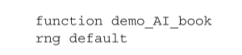
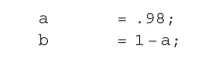

\cleardoublepage 

\renewcommand{\[}{\begin{equation}}
\renewcommand{\]}{\end{equation}}

# (APPENDIX) Apêndice{-} 

# Bases Matemáticas

## Introdução

Este apêndice oferece uma introdução (ou uma atualização) às técnicas matemáticas básicas empregadas ao longo deste livro. Fornecemos uma visão geral introdutória (mas não exaustiva) de quatro tópicos: álgebra linear, aproximação de séries de Taylor, cálculo variacional e dinâmica estocástica. Para cada uma dessas técnicas, nos referimos a onde ela entra em jogo no livro. Nosso objetivo aqui é fornecer uma introdução focada - com ênfase na construção da intuição em oposição a provas formais e rigorosas. A matemática necessária para entender e usar a Inferência Ativa não é complicada, mas sua base multidisciplinar significa que muitas vezes é difícil encontrar recursos que reúnam os pré-requisitos necessários. Esperamos que este apêndice ajude de alguma forma a remediar isso.

## Álgebra Linear

### O básico

Álgebra linear refere-se a uma notação usada para expressar de forma simples e concisa combinações de multiplicações e somatórias. Ele se baseia em matrizes e vetores que compreendem matrizes de números em estruturas com várias linhas e colunas (ou várias linhas e uma única coluna, para um vetor). O elemento de uma matriz $A$ na linha $i$ e na coluna $j$ é referido como $A_{ij}$. O produto $A$ de duas matrizes $B$ e $C$ (ou uma matriz e um vetor) é definido da seguinte forma:

$$ A = BC $$
$$\Longrightarrow \qquad (A.1)$$
$$ A_{ij} = \sum_k B_{ik} C_{kj} $$
Para que essa definição seja válida, precisamos que o número de colunas de B corresponda ao número de linhas de C. No entanto, digamos que o número de colunas de B corresponda às colunas de C e queremos expressar a seguinte soma:

$$ A_{ij} = \sum_k B_{ki} C_{kj} \qquad (A.2) $$

Como faríamos isso usando a notação algébrica linear? Precisamos apelar para outra operação que troque os índices subscritos de B (ou seja, reflita a matriz de modo que as colunas se tornem linhas e vice-versa). Esta é a operação de transposição, normalmente expressa usando um T sobrescrito:

$$B_{ik}^T \triangleq B_{ki}$$

$$A=B^TC \triangleq B \cdot C$$

$$ \Longrightarrow \qquad (A.3)$$
$$A_{ij} = \sum_k B_{ki}C_{kj}$$

A Equação A.3 mostra como podemos usar o operador de transposição para expressar a soma da equação A.2. A segunda linha destaca uma notação alternativa usando um operador de ponto. Essa notação é inspirada no fato de que, quando B e C têm apenas uma coluna cada, a equação A.3 se reduz a um produto vetorial vetorial.
Outra operação útil é o operador de rastreamento. Isso pega os elementos ao longo da diagonal de uma matriz quadrada e os soma:

$$ tr[A] \triangleq \sum_i A_{ij} \qquad (A.4)$$

Parte da utilidade de um operador de traço é proporcionada pela maneira como podemos permutar elementos no traço de um produto de matriz:

$$ tr[ABC] = \sum_i \sum_j \sum_k A_{ij} B_{jk} C_{ki}$$
$$ = \sum_k \sum_i \sum_j C_{ki} A_{ij} B_{jk} = tr[CAB] $$
$$ = \sum_j \sum_k \sum_i B_{jk} C_{ki} A_{ij} = tr[BCA] \qquad (A.5) $$
O principal uso que encontraremos para essa identidade neste livro é quando aplicada a grandezas escalares. Um escalar pode ser visto como uma matriz com apenas uma linha e uma coluna. Como tal, podemos aplicar um operador de rastreamento a ele, mas isso não fará nada - obtemos o mesmo escalar. Isso significa que, se um produto de matriz der origem a uma quantidade escalar, podemos permutar os termos como acima.

Por exemplo, se tivermos uma matriz quadrada $B$ com $N$ colunas e linhas e um vetor $c$ com $N$ linhas, podemos usar a equação A.5 para mostrar o seguinte:

$$ a = c \cdot Bc$$

$$ tr[c^T Bc] $$
$$ tr[Bcc^T] \qquad (A.6)$$
$$ tr[BC]$$
$$ C = c \otimes c \triangleq cc^T  $$
Isso reexpressa uma expressão quadrática (primeira linha) com o traço do produto de duas matrizes (penúltima linha). A linha final define o produto externo(em contraste com o produto escalar interno)

A Equação A.6 torna-se particularmente útil no contexto de distribuições normais multivariadas, como veremos na seção A.2.3. 

Os conceitos finais de álgebra linear a serem observados são o inverso e o determinante de uma matriz. Uma inversa é definida da seguinte forma:

$$ A^{-1}A = AA^{-1} = I \qquad (A.7)$$

A Equação A.7 diz que o produto de uma matriz e sua inversa é a matriz identidade — uma matriz quadrada com uns ao longo de sua principal e zeros em outros lugares. Multiplicar qualquer matriz pela matriz identidade retorna a matriz original, inalterada. É o equivalente algébrico linear da multiplicação escalar por 1 (que pode ser interpretado como uma matriz identidade unidimensional). Isso significa que se multiplicarmos algo por uma matriz e depois pela inversa dessa matriz, acabamos com a quantidade original.

O determinante é uma quantidade útil, mas para a qual é mais difícil desenvolver uma intuição clara. O único ponto em que aparece neste livro é como parte da constante normalizadora de uma distribuição normal multivariada. Como tal, vale a pena saber como é calculado, mas não nos deteremos neste conceito. O determinante é definido recursivamente da seguinte forma:

$$ |A| \triangleq \sum_i(-1)^{i-1}A_{}1i | A_{\setminus(1,i)} |  $$

Aqui, a notação ted. Por exemplo:
$A_{\setminus(1, i)}$ significa a matriz A com linha 1 e coluna i omitidas. Por exemplo:

$$ A = 
\begin{bmatrix} 
  A_{11} A_{12} \\ 
  A_{21} A_{22} 
  \end{bmatrix}
  $$

$$ A_{\setminus(1,1)} = A_{22}$$
$$ A_{\setminus(1,2)} = A_{21} \qquad (A.9)$$
$$ |A| = A_{11} \; |A_{22}| -  A_{12} \;| A_{21}|$$
$$  A_{11}A_{22} - A_{12}A_{21} $$
Isso conclui nosso esboço das operações básicas da álgebra linear.

### Derivadas

A diferenciação de grandezas matriciais e vetoriais segue diretamente da aplicação do cálculo padrão a cada elemento de uma matriz. Por exemplo, se temos uma matriz B cujos elementos são funções de um escalar x, a derivada de B em relação a x é a seguinte:

$$ A(x) = \partial_x B(x)  $$
$$ A(x)_{ij} = \partial_x B(x)_{ij} \qquad (A.10)$$
$$ \partial x \triangleq  \frac {\partial} {\partial x} $$
No entanto, algumas definições e identidades importantes serão úteis para entender os detalhes técnicos deste livro. A primeira é como obter derivadas em relação a quantidades não escalares. Se tivermos uma quantidade vetorial b que é função de outro vetor c, a derivada de b em relação a c é uma matriz:

$$ A = \partial_c b(c) \Longrightarrow A{ij} = \partial_{c_j}b(c)_i  \qquad (A.11)$$
Também faremos uso do operador gradiente, que trata de derivadas em relação a um vetor. Isso é definido da seguinte forma:

$$ \nabla_b = \begin{bmatrix} 
\partial_{b_1} &  \partial_{b_1} & \partial_{b_1} & \cdots 
\end{bmatrix}^T  $$

$$ a = \nabla_bx(b) \qquad (A.12)$$

$$ \Longrightarrow $$

$$ a_i = \partial_{b_i}x(b)$$
A definição do operador gradiente como um vetor de operadores derivativos também fornece uma definição concisa de uma quantidade relacionada - a divergência de uma função vetorial:

$$ \nabla_a \cdot b(a) = \sum_i \partial_{a_i}b(a)_i \qquad (A.13)$$

Existem muitas identidades derivadas úteis para grandezas algébricas lineares, mas não tentaremos fornecer uma visão geral abrangente; para os leitores que desejam se aprofundar mais, recomendamos The Matrix Cookbook (Petersen e Pedersen 2012). Aqui, nos limitamos a duas identidades que serão particularmente úteis. O primeiro é o gradiente de uma quantidade quadrática:

$$ d(a) = \nabla_a(b(a) \cdot Cb(a))$$
$$ \Longrightarrow$$
$$d(a)_i$$

# As equações da inferência ativa

## Introdução

Neste apêndice, fornecemos um resumo matemático da Inferência Ativa. Isso complementa as equações nos capítulos principais com detalhes sobre de onde elas vêm e visa preencher algumas das etapas intermediárias omitidas. Isso baseia-se diretamente no fundo matemático do apêndice A e lida com inferência em processos de decisão Markov parcialmente observados (POMDP) e arquiteturas de codificação preditivas, e aborda questões de aprendizagem de estrutura e redução de modelo aludidas no texto principal. Nosso objetivo é que isso seja relativamente autocontido, com foco particular em tópicos que frequentemente causam confusão. Os leitores devem ter certeza de que não é necessário entender tudo neste apêndice para poder aplicar utilmente a Inferência Ativa; isso é mais para quem quer maior
detalhe técnico.

## Processos de decisão de Markov

### Inferência do Estado

Ao resolver um problema de POMDP, nosso objetivo é selecionar o curso de ação ou política apropriado. Sob Inferência Ativa, isso é enquadrado como um problema de inferência, no qual devemos encontrar uma distribuição de probabilidade posterior sobre políticas alternativas. Para calcular uma probabilidade posterior, precisamos de duas coisas: a probabilidade anterior de políticas (abordadas na seção B.2.2) e a probabilidade de observações de uma política. Esta seção se concentra neste último.

A probabilidade de observações dada uma política não é simples de calcular. Isso ocorre porque um problema POMDP é estruturado de forma que as políticas (π) influenciem as trajetórias (indicadas por ~) dos estados (s) que influenciam os resultados (o) sem uma influência direta das políticas nos resultados. O problema então envolve uma soma sobre trajetórias de estados para marginalizá-los e encontrar
uma probabilidade marginal de observações dadas políticas:

$$P(\tilde o | \pi ) = \sum_\tilde S P(\tilde o | \tilde s)P(\tilde s | \tilde \pi ) \qquad\qquad\qquad (B.1) $$
Para qualquer espaço de estado não trivial, essa soma pode ser muito desafiadora para calcular, de uma perspectiva computacional. No entanto, como veremos no capítulo 2, podemos aproximar probabilidades marginais desse tipo usando um funcional de energia livre. Os capítulos 2-4 descrevem a energia livre como funcional de duas coisas: crenças posteriores aproximadas (
Q ) e um modelo generativo (P). Isso nos permite expressar a energia livre para uma determinada política da seguinte forma:

$$ F(\pi)=\mathbb E_{Q(\tilde S|\pi)}[\ln Q(\tilde S|\pi)-\ln P(\tilde O, \tilde S|\pi)]\ge ln P(\tilde o|\pi)  \qquad (B.2)$$
$$Q(\tilde S|\pi) = \begin{matrix}arg\; min\;\\Q \end{matrix} F(\pi) \Rightarrow F(\pi) \approx - \ln P(\tilde O|\pi)  $$

A Equação B.2 nos diz algo simples, mas importante. Para poder inferir o que fazer, precisamos aproximar uma probabilidade marginal de uma política. Para encontrar uma boa aproximação dessa probabilidade marginal, precisamos otimizar nossas crenças sobre os estados sob essa política. Em suma, a inferência perceptual é obrigatória para que o planejamento prossiga. Então, como vamos resolver esse problema na prática? A resposta é apelar para os métodos descritos na seção A.4.2. Ao escolher formas explícitas para as distribuições de probabilidade na equação B.1, podemos encontrar uma expressão simples para a energia livre:

$$Q(\tilde s|\pi) = \prod_\tau Q(S_\tau|\pi):Q(S_\tau|\pi)=Cat(\mathbf s_{\pi\tau})$$
$$P(\tilde o | \tilde S) = \prod_\tau P(o_\tau|s_\tau):P(o_\tau|s_\tau)=Cat(A) \qquad (B.3)$$
$$P(\tilde S|\pi) = P(S_1)\prod_\tau P(s_{\tau+1}|s_\tau,\pi):P(s_{\tau+1}|s_\tau,\pi)=Cat(\mathbf B_{\pi\tau}) \\P(S_1) = Cat(\mathbf D)$$

Resumidamente, a primeira linha da equação B.3 define crenças sobre estados em termos de uma aproximação de campo médio (ver equação A.41), fatorada ao longo do tempo. Cada ponto no tempo está associado a uma crença sobre o que seria o estado ao perseguir uma política, dado pelo vetor sπτ, cujos elementos são as probabilidades de cada estado alternativo. A trajetória de observações na segunda linha depende de uma trajetória de estados ocultos, com a matriz (ou tensor, se os estados forem ainda fatorados) A indicando a distribuição sobre as observações para cada estado. Da mesma forma, a trajetória anterior dos estados sob um modelo compreende as probabilidades de transição sob aquela política (Bπτ) e as probabilidades iniciais dos estados (D). Substituindo-os na expressão de energia livre na Equação B.2, chegamos à seguinte expressão para a energia livre sob uma política:

$$\bf F_\pi = \mathbf s_{\pi1}(\ln \mathbf s_{\pi1} - \ln \mathbf A\cdot o_1-\ln \mathbf D)+ \sum S_{\pi\tau} \cdot (\ln \mathbf s_{\pi\tau} - \ln \mathbf A \cdot o_{\tau} - \ln \mathbf B_{\pi\tau}\mathbf s_{\pi\tau-1} )\qquad\qquad\qquad(B.4)  $$
Observe que o produto escalar de um vetor de probabilidade com outra quantidade é equivalente à operação de expectativa. Consulte a seção A.2.1 se isso não estiver claro. A Equação B.4 trata os resultados como se fossem vetores de probabilidade, mas com um no elemento correspondente ao resultado observado e zeros em outro lugar (às vezes chamado de codificação one-hot ou vetor 1-in-k). O desafio agora é minimizar a energia livre em relação às nossas crenças sobre estados (sπτ) para garantir que a energia livre se torne uma boa aproximação de uma probabilidade marginal. Poderíamos fazer isso como na seção A.4.2 e minimizar em relação a cada fator de nossas crenças, um de cada vez, iterando até convergir. No entanto, como estamos interessados em esquemas biologicamente mais plausíveis, podemos construir um sistema dinâmico que converge na mesma solução. Essa abordagem é conhecida como gradiente descendente, pois seguimos os gradientes de energia livre para baixo até chegarmos ao mínimo.

Para atualizar crenças sobre estados, tomamos o gradiente disso em relação às crenças atuais sobre estados. Em seguida, definimos uma variável auxiliar (v) que desempenha o papel de logaritmo e a configuramos para realizar um gradiente descendente na energia livre. Este log posterior é então passado por uma função softmax[^1101] (σ ) para convertê-lo em uma distribuição de probabilidade normalizada. Esse processo garante que as crenças sobre os estados mudem de tal forma que diminuam a energia livre.

[^1101]: Uma função exponencial normalizada

$$ S_{\pi\tau} = \sigma(\mathbf V_{\pi\tau}) \mathbf V_{\pi\tau} \\
 \dot V_{\pi\tau} = - \nabla_{S_{_\pi\tau}}\mathbf F_\pi \qquad\qquad\qquad  (B.5) \\ 
 \nabla_{S{\pi\tau}}\mathbf F_\pi = \ln S_{\pi\tau} - ln A \cdot o_\tau - \ln \mathbf B_{\pi\tau}\mathbf s_{\pi\tau-1}- \ln \mathbf B_{\pi\tau+1}\mathbf \cdot s_{\pi\tau+1}$$

A Equação B.5 tem a mesma solução para o esquema variacional de passagem de mensagens descrito na equação A.42. Ele permite a computação eficiente de crenças posteriores usando apenas informações derivadas localmente (neste caso, de dados sensoriais, crenças sobre o passado imediato e crenças sobre o futuro imediato). No entanto, vale a pena notar que a aproximação de campo médio usada aqui (fatoração ao longo do tempo) muitas vezes leva a posteriores superconfiantes. Na prática, isso pode ser combatido usando um esquema modificado chamado passagem de mensagens marginal (Friston, FitzGerald et al. 2017; Parr, Markovic et al. 2019):

$$ \bf \dot V_{\pi\tau} = \pmb\epsilon_{\pi\tau} \\ 
\pmb \epsilon_{\pi\tau} = \ln \pmb A \cdot o_\tau + \frac{1}{2}(\ln (B_{\pi\tau+1}\pmb s_{\pi\tau-1} )) + \ln (B^\dagger_{\pi\tau+1}\pmb s_{\pi\tau+1} )) - \ln \pmb s_{\pi\tau} \qquad (B.6)\\ 
B^\dagger_{\pi\tau} \propto B^T_{\pi\tau} 
$$

Isso leva a inferências mais conservadoras, com maior incerteza atribuída a crenças posteriores. Outras alternativas foram exploradas, incluindo a aproximação de Bethe (Schwöbel et al. 2018). No entanto, no momento da redação deste artigo, a implementação mais amplamente utilizada do Active Inference emprega a passagem de mensagens marginal.

### Planejamento como Inferência

A seção acima trata da inferência sobre estados condicionados a alguma política para minimizar uma energia livre condicionada à política. Essa energia livre desempenha o papel de uma probabilidade marginal logarítmica negativa (evidência do modelo), em que cada política é tratada como um modelo. Equipando isso com crenças anteriores e posteriores sobre a política mais provável, podemos expressar a energia livre como um funcional de crenças sobre políticas.

$$F = \mathbb E_{Q(\pi)}[lnQ(\pi)-\ln P(\pi,\tilde o)] \\ 
\approx \mathbb E_{Q(\pi)}[lnQ(\pi) +F(\pi) -\ln P(\pi)]  \qquad (B.7)\\
P(\pi) = Cat(\pmb \pi_0) \\
Q(\pi) = Cat(\pmb \pi) \\
\pi_0 = \sigma(\ln \pmb E - \pmb G)
$$

A igualdade aproximada na segunda linha vem da equação B.2. Aqui, E é um vetor de crenças fixas sobre políticas (isso pode ser pensado como um termo de viés, ou hábito), enquanto G é a energia livre esperada para cada política. Como antes, agora podemos escrever a energia livre em termos de estatísticas suficientes:

$$F = \pmb \pi \cdot (\ln \pmb\pi - \ln \pmb E + \pmb F + \pmb G )$$

Aqui, $F$ é um vetor cujos elementos são $F_π$ conforme definido na equação B.4. Tomando os gradientes, encontramos a atualização ideal para crenças sobre políticas (ou seja, planejamento):

$$ \nabla_\pi F = 0 \Longleftrightarrow \\ \pi=\sigma(\ln \pmb E-\pmb F - \pmb G )$$

### Aprendendo

Para possibilitar o aprendizado, precisamos incorporar crenças prévias sobre os parâmetros das distribuições de probabilidade que compõem o modelo generativo. Como estes são expressos como distribuições categóricas, a escolha apropriada (conjugada) de prior é uma distribuição de Dirichlet. Tomando a priori sobre os estados iniciais como exemplo, os termos da energia livre que dependem da priori esperada (log) incluem o seguinte:

$$F = ... + D_{KL}[Q(D) ||P(D)]- \mathbb E_{Q(S_1)Q(D)}[\ln P(S_1 | D)] \\
= ... +(\pmb d - d ) \cdot \mathbb E_{Q(D)}[ln D]- \pmb s_1 \cdot \mathbb E_Q(D) [ln D]\\
E_{Q(D)}[\ln \pmb D] = \psi(\pmb d) - \psi(\pmb d_0) \qquad\qquad\qquad (B.10)\\
d_o = \sum_i\pmb d_i\\
Q(D) \triangleq Dir(\pmb d)\\
P(D) \triangleq Dir (d) 
$$

A equação B.10 destaca na terceira igualdade uma identidade útil. A expectativa do logaritmo de uma variável distribuída de Dirichlet é a diferença entre duas funções digamma $(ψ)$ —onde a função digamma é a derivada de uma função gama. Podemos usar a equação **B.10** para encontrar o mínimo de energia livre:

$$\nabla_{\mathbb E{[\ln \pmb D]}}F = \pmb d - d -s_1 = 0 \Longleftrightarrow \pmb d = d +s_1 \qquad (B.11) $$

Isso fornece um esquema simples que pode ser usado para atualizar os parâmetros Dirichlet anteriores para seus valores posteriores. Regras de atualização muito semelhantes se aplicam às outras distribuições de probabilidade que compõem o modelo generativo:

$$
\pmb a = a + \sum_\tau o_\tau \otimes \pmb s_\tau \\
\pmb b_{\pi\tau} = b_{\pi\tau} + \sum_\tau s_{\pi\tau} \otimes s_{\pi\tau-1} \\
\pmb c = c + \sum_\tau o_\tau \\
\pmb d = d + s_1 \\
\pmb e = e + \pi
$$

Estes simplesmente dizem que quando a coisa prevista pelo termo relevante na distribuição de probabilidade acontece (que pode ser uma combinação de duas coisas para probabilidades condicionais), nós simplesmente aumentamos esse elemento da matriz de probabilidade para sinalizar que é mais provável volte a acontecer no futuro. 

### Precisão

Em algumas configurações, pode ser conveniente parametrizar o modelo generativo de uma maneira ligeiramente diferente. Uma opção aqui é usar uma medida de Gibbs, onde as distribuições de probabilidade são equipadas com um parâmetro de temperatura inverso que desempenha o papel de uma precisão. Mais comumente, isso é feito para a precisão $(γ)$ sobre as políticas:

$$P(\pi | \gamma) = Cat(\pmb \pi_0) \\ 
\pmb \pi_o = \sigma(-\gamma \pmb G) \qquad (B.13)
$$

Por simplicidade, omitimos o vetor E para esta seção. No que segue, também consideraremos uma precisão para a verossimilhança (ζ) e para transições (ω). A distribuição a priori sobre os parâmetros de precisão é considerada uma distribuição gama:

$$
P(\zeta) \propto \beta_\zeta \;exp(\beta_\zeta \zeta) \\ 
P(\omega) \propto \beta_\omega \;exp(\beta_\omega \omega)  \qquad (B.14)\\
P(\gamma) \propto \beta_\gamma \;exp(\beta_\gamma \gamma) \\
$$

As distribuições posteriores aproximadas têm a mesma forma (distribuição gama), e usaremos um hiperparâmetro beta em negrito para distinguir entre as estatísticas suficientes da posterior e da anterior acima. Uma propriedade útil da distribuição gama, quando parametrizada desta forma, é a seguinte:

$$
\begin{equation}
\zeta = \mathbb E_{Q(\zeta)}[\zeta] = \pmb \beta^{-1}_{\zeta} \qquad\qquad  \\
\omega = \mathbb E_{Q(\omega)}[\omega] = \pmb \beta^{-1}_{\omega}  \qquad (B.15)\\ 
\gamma = \mathbb E_{Q(\gamma)}[\gamma] = \pmb \beta^{-1}_{\gamma} \qquad\qquad 
\end{equation}
$$

Tendo definido essas distribuições, podemos escrever a energia livre variacional:
$$
\begin{equation}
F = \mathbb E_Q[F(\pi, \zeta, \omega) + D_{KL}[Q(\pi) || P(\pi | \gamma)]] \qquad (B.16) \\ 
+ D_{KL}[Q(\gamma) || P(\gamma)] + D_{KL}[Q(\omega)||P(\omega)]+D_{KL}[Q(\zeta) || P(\zeta)] 
\end{equation}
$$

Isso pode ser expresso em termos de suas estatísticas suficientes (omitindo constantes):

$$\begin{equation}

F = \pmb \pi \cdot (F+ \ln \pmb \pi + \gamma \cdot \pmb G + \ln \pmb Z(\pmb \gamma)) + \ln \pmb \beta_\gamma + \ln \pmb \beta_\omega + \ln \pmb \beta_\zeta \\
- \ln \pmb \beta_\gamma - \ln \pmb \beta_\omega - \ln \pmb \beta_\zeta + \pmb \gamma \beta_\gamma + \pmb \omega \beta_\omega + \pmb \zeta \beta_\zeta \qquad (B.17) \\
\pmb F_\pi \approx - \sum_\tau \pmb s_{\pi\tau} \cdot(\zeta \ln \pmb A \cdot o_\tau + \pmb \omega \ln \pmb B_{\pi\tau}\pmb s_{\pi\tau -1} - \ln \pmb Z(\zeta) \cdot o_\tau - \ln Z(\pmb \omega)\pmb s_{\pi\tau-1})

\end{equation}$$

Na equação B.17, $\pmb Z$representa funções de partição (ou seja, constantes de normalização) dadas pelo seguinte:

$$ \pmb Z(\zeta)_j = \sum_i(A_{ij})^\zeta \\
\pmb Z(\omega)_j = \sum_i(B_{\pi\tau ij})^\omega \\
\pmb Z(\gamma_j = \sum_\pi exp(-\gamma \cdot \pmb G_\pi) \\
\Rightarrow \qquad\qquad\qquad\qquad (B18) \\
\partial_\zeta \ln \pmb Z(\zeta)\pmb s_\tau = o^\zeta_\tau \cdot \ln \pmb A \\
\partial_\zeta \ln \pmb Z(\omega)\pmb s_{\pi\tau-1} = s^\omega_{\pi\tau} \cdot \ln \pmb B_\pi \\
\partial_\gamma \ln \pmb Z(\gamma) = -\pi_o \cdot  \pmb G \\
\pmb o_\tau^\zeta \triangleq \sigma(\zeta \ln \pmb A)\pmb s_\tau \\
\pmb s_{\pi\tau}^\omega \triangleq \sigma( \omega \ln \pmb B_{\pi\tau}) \pmb s_{\pi\tau-1} \\
\pmb \pi_o \triangleq \sigma(-\gamma \pmb G)$$

Tomando a derivada parcial[^B172] em relação às precisões esperadas, obtém-se:

$$\begin{Bmatrix} \partial_\zeta F\\ \partial_\omega F \\ \partial_\gamma F \end{Bmatrix} = 0 
\Leftrightarrow \begin{Bmatrix} \beta_\zeta \\ \beta_\omega \\ \beta_\gamma \end{Bmatrix}
=\begin{Bmatrix} \sum_\tau(o^\zeta_\tau - o_\tau) \cdot ln \pmb A + \beta_\zeta \\ \sum_\tau \pi \cdot(s^\omega_{\pi\tau}-s_{\pi\tau}) \cdot \ln \pmb B_\pi \pmb s_{\pi\tau-1} + \beta_\omega \\ (\pi - \pi_0)\cdot G + \beta_\gamma  \end{Bmatrix} \qquad (B.19)$$

[^B172]: Para concisão, omitimos alguns termos nas derivadas das funções de partição de log. Estamos autorizados a fazê-lo pela escolha da distribuição variacional, pois quaisquer termos polinomiais de ordem superior violariam a forma dessa distribuição.

Expressar essas atualizações como descidas de gradiente biologicamente plausíveis fornece as equações resultantes:

$$\begin{Bmatrix} \pmb {\dot \beta}_\zeta \\ \pmb {\dot \beta}_\omega \\  \pmb {\dot \beta}_\gamma \end{Bmatrix}
=\begin{Bmatrix} \sum_\tau(o^\zeta_\tau - o_\tau) \cdot ln \pmb A + \beta_\zeta - \pmb \beta_\zeta \\ \sum_\tau \pi \cdot(s^\omega_{\pi\tau}-s_{\pi\tau}) \cdot \ln \pmb B_\pi \pmb s_{\pi\tau-1} + \beta_\omega - \pmb \beta_\omega \\ (\pi - \pi_0)\cdot G + \beta_\gamma - \pmb \beta_\gamma  \end{Bmatrix} \qquad (B.19)$$

Observe que a dimensionalidade implica em um vetor (linha) de precisões para A, onde cada estado (coluna de A) está associado ao seu próprio parâmetro de precisão.

### Energia Livre Esperada

A energia livre esperada é discutida extensivamente no texto principal do livro. Nesta seção, complementamos essa discussão com duas coisas. Primeiro, oferecemos um breve esboço do pensamento atual sobre por que essa é a quantidade apropriada para definir crenças anteriores sobre políticas. Em segundo lugar, abordamos os detalhes de implementação para calcular essa quantidade.

Embora simulações numéricas (do tipo ilustrado no capítulo 7) tenham estabelecido que a energia livre esperada é útil, a questão de por que ela é útil ainda é uma área de pesquisa ativa. Antecipando que esta discussão continuará a evoluir, aqui apresentamos um breve resumo da explicação mais parcimoniosa no momento da escrita (Da Costa et al. 2020; Friston, Da Costa et al. 2020). O ponto de partida é estipular que um sistema atinge algum estado estacionário (ver seção A.5.2) ou, equivalentemente, cumpre suas preferências (definidas aqui em relação aos estados latentes) em algum momento futuro (τ ):

$$ Q(S_\tau)=\mathbb E_Q(\pi)[Q(S_\tau|\pi)]=P(S_\tau|C) \qquad\qquad (B.21) $$

Nosso desafio é encontrar o $Q(\pi)$ que satisfaça a equação B.21. Para isso, notamos que a equação B.21 implica o seguinte:

$$D_KL[Q(\pi|S_\tau)Q(S_\tau) || Q(\pi|S_\tau)P(S_\tau|C)]=0 \\ 
\Longrightarrow 
\\ \mathbb E_{Q(\pi,S_\tau)}[\ln Q(\pi,S_\tau)] = \mathbb E_{Q(\pi,S_\tau)}[\ln Q(\pi|S_\tau) + \ln P(S_\tau|C)] \qquad (B.22)$$

Em seguida, fatoramos o lado esquerdo para isolar o termo Q(π) em que estamos interessados:

$$\\ \mathbb E_{Q(\pi)}[\ln Q(\pi)] = \mathbb E_{Q(\pi,S_\tau)}[\ln Q(\pi|S_\tau) + \ln P(S_\tau|C) - \ln P(S_\tau|\pi)] \qquad (B.23)$$

Definimos uma variável $\alpha$ que representa a razão de duas entropias:

$$ \alpha = \frac{\mathbb E_{Q(s_\tau)}[H[Q(\pi| S_\tau)]]}{\mathbb E_{Q(S_\tau,\pi)}[H[P(O_\tau| S_\tau)]]} \qquad (B.24)$$

Heuristicamente, $\alpha$ expressa a gama relativa de resultados comportamentais (ou seja, políticas) que são plausíveis em um determinado estado, em comparação com a gama de resultados esperados nesse mesmo estado. Se muito grande, isso pode descrever uma criatura cujo comportamento tem pouca relação com o estado de seu mundo, apesar de observações sensoriais altamente precisas sendo geradas por esse mundo. Quando muito pequeno, isso pode descrever uma criatura que sempre se comporta da mesma maneira quando conhece o estado do mundo, mas raramente recebe dados precisos sobre esse mundo. Aqui, estipularemos que estamos interessados ​​em sistemas cujo $α = 1$ – implicando uma troca relativamente equilibrada e simétrica com seu mundo. Isso torna as duas entropias na equação B.24 iguais. Voltando à equação B.23:

$$\mathbb E_{Q(\pi)}[\ln Q(\pi)] = - \mathbb E_{Q(s_\tau)}[] \\
+ \mathbb E_{Q(\pi,s_\tau)}[\ln P(S_\tau | C) - \ln Q(S_\tau |\pi)] \\
=- \mathbb E_{Q(s_\tau,\pi)}[H[P(O_\tau, S_\tau)]] \\
- \mathbb E_{Q(\pi)}[D_{KL}[Q(S_\tau|\pi)||P(S_\tau|C)]] \\$$

A segunda linha segue da primeira e da equação B.24 com $\alpha=1$. Vemos agora que a equação B.25 e, portanto, a equação B.21, é satisfeita escolhendo o seguinte:

$$\ln Q(\pi) = \underbrace{- \mathbb E_{Q(S_\tau|\pi)}[H[P(O_\tau |S_\tau]] }_{ambiguidade \; esperada} - \underbrace{D_{KL}[Q(S_\tau|\pi) || P(S\tau |C)]}_{Risco}  \qquad (B.26)\\

$$

Nosso passo final é observar a relação entre a quantidade do lado direito e a energia livre esperada – com preferências definidas em termos de observações no lugar de estados:

$$
\mathbb E_{Q(S_\tau|\pi)}[H[P(O_\tau|S_\tau)]] + D_{KL}[Q(S_\tau|\pi)||S(S_\tau|C)] \\
= \mathbb E_{Q(S_\tau|\pi)}[H[P(O_\tau|S_\tau)]]  + D_{KL}[Q(S_\tau|\pi)||S(S_\tau|C)] \\
+ \underbrace {\mathbb E_{Q(S_\tau\pi)P(O_\tau|S_\tau)}[\ln P(O_\tau|S_\tau)]-\mathbb E_{Q(S_\tau\pi)P(O_\tau|S_\tau)}[\ln P(O_\tau|S_\tau)]}_{=0} \\
=\mathbb E_{Q(S_\tau|\pi)}[H[P(O_\tau|S_\tau)]] + D_{KL}[Q(O_\tau,S_\tau|\pi)||P(O_\tau,S_\tau|C)] \qquad (B.27) \\
=\mathbb E_{Q(S_\tau|\pi)}[H[P(O_\tau|S_\tau)]] + D_{KL}[Q(O_\tau,S_\tau|\pi)||P(O_\tau|C)] \\
+ \mathbb E_{Q(O_\tau|\pi)}[D_{KL}[Q(S_\tau|O_\tau, \pi) || P(S_\tau|O_\tau, C)]] \\
\ge  \mathbb E_{Q(S_\tau|\pi)}[H[P(O_\tau|S_\tau)]]+D_{KL}[Q(O_\tau|\pi)||P(O_\tau|C)]=G(\pi) \\
$$

As etapas da equação B.27 foram (talvez um pouco tediosas) incluídas em alguns detalhes, pois nossa experiência é que as pessoas muitas vezes lutam com esse resultado. A desigualdade na linha final surge da omissão da (não negativa) KL-Divergence na linha anterior. O principal resultado aqui é que a ambiguidade e o risco minimizados para as políticas mais plausíveis na equação B.26 atuam como um limite superior da energia livre esperada usada ao longo deste livro.

Agora nos voltamos para a questão da implementação computacional. Aqui podemos simplesmente apelar para as identidades algébricas lineares que vimos na seção A.2. É simples, se expressarmos preferências como um vetor de probabilidades anteriores (C), expressar o termo pragmático da energia livre esperada da seguinte forma:

$$H[Q(O_\tau|\pi)] - \mathbb E_{Q(S_\tau|\pi)}[H[P(O_\tau|S_\tau)]] \\
=-\pmb o_\pi \cdot \ln \pmb o_\pi - \pmb H \cdot \pmb s_{\pi\tau} \qquad (B.29) \\
\pmb H \triangleq - diag(\pmb A \cdot \ln \pmb A)
$$

Veja a Seção A.2.3 para uma explicação da última linha. Juntando as equações B.28 e B.29, a energia livre esperada é esta:

$$
\pmb G_\pi = \sum_\tau \pmb G_{\pi\tau}  \qquad (B.30)\\
\pmb G_{\pi\tau} = \pmb H \cdot \pmb s_{\pi\tau} + \pmb o_{\pi\tau} \cdot(\ln \pmb o_{\pi\tau}- ln \pmb C_\tau)
$$

Quando precisamos levar em conta o aprendizado ativo, complementamos isso com ganho de informação de parâmetro. O ganho de informação associado aos parâmetros do modelo generativo (ou seja, novidade) pode ser derivado da seguinte forma. Usando a KL-Divergence entre duas distribuições de Dirichlet, podemos expressar o ganho de informação que ocorreria após uma dada combinação estado-resultado:

$$
W_{ij} \triangleq D_{KL}[P(A_{ij} | o=i, s=j) || P(A_{ij})] \\
= \underbrace{( \ln \Gamma(a_{ij}) - \ln \Gamma(a_{ij}+1) )}_{- \ln a_{ij}} + \underbrace{( \ln \Gamma(a_{oj}+1) - \ln \Gamma(a_{oj}) )}_{+ \ln a_{0j}} \qquad (B.31) \\
+ \psi(a_{ij}+1) -  \psi(a_{0j}+1) \\
a_{0j} \triangleq \sum_i a_{ij}

$$

Aqui usamos o fato de que, se soubéssemos que uma determinada combinação de estado-resultado ocorreu, adicionaríamos 1 ao parâmetro de Dirichlet associado. Isso nos permite usar uma identidade padrão de uma função log gamma (como indicado pelas chaves) para simplificar a expressão:

$$
W_{ij}=\ln \frac{a_0j}{a_ij} + \frac{\partial_{a_ij} \Gamma(a_{ij} + 1)}{\partial_{a_{ij}} \Gamma(a_{ij})} - \frac{\partial_{a_0j} \Gamma(a_{0j} + 1)}{\partial_{a_0j} \Gamma(a_{0j})} \qquad (B.32) \\
= \ln \frac{a_0j}{a_ij} + \frac{1}{a_{ij}} + \frac{\partial_{a_{ij}} \Gamma(a_{ij})}{\Gamma(a_{ij})} - \frac{1}{a_{0j}} - \frac{\partial_{a_0j} \Gamma(a_{0j} )}{\Gamma(a_{0j})}
$$

Aqui usamos a identidade $x\Gamma(x) = \Gamma(x+1)$  e uma aplicação da Regra do produto. Em seguida, usamos a identidade $ψ(x)Γ(x) = ∂xΓ(x)$ e a aproximação $ψ(x) ≈ \ln x − (2x)^{−1}$  para simplificar isso:

$$

\frac{1}{a_{ij}} - \frac{1}{a_{0j}} + \ln \frac{a_{0j}}{a_{ij}}+\psi(a_{ij})-\psi(a_{0j}) \qquad (B.33) \\
\approx \frac{1}{2{a_{ij}}} - \frac{1}{2{a_{0j}}}

$$

O ganho de informação esperado é então o seguinte:

$$ \mathbb E_{Q(O_\tau,S_\tau | \pi)}  [ D_{KL}[P(A| O_\tau, S_\tau) || P(A)] \approx \pmb o_{\pi\tau} \cdot \pmb W \pmb s_{\pi\tau} ] $$

Essa expressão simples aumenta a energia livre esperada para garantir um comportamento de busca de novidades, além de escolhas pragmáticas e salientes.

### Redução do Modelo Bayesiano

No capítulo 7, abordamos brevemente a ideia de aprendizado de estrutura e redução de modelo. Aproveitamos a oportunidade para destrinchar os princípios com um pouco mais de profundidade aqui. A redução do modelo bayesiano é uma técnica usada para comparar modelos alternativos que diferem apenas em seus anteriores. Através do teorema de Bayes (ver capítulo 2), podemos expressar a razão da probabilidade conjunta de dados ( y) e alguns parâmetros (θ ) entre dois modelos alternativos de duas maneiras diferentes:

$$ \frac{P(y|\theta)}{\tilde P(y|\theta)}
=\frac{P(y|\theta)P(\theta)}{\tilde P(y|\theta)\tilde P(\theta)}=
\frac{P(y|\theta)P(y)}{\tilde P(y|\theta)\tilde P(y)} \qquad (B.35)$$

Se a única diferença entre os dois modelos for a anterior (isto é, $P(y | \theta) = \tilde P(y | \theta)$ ), então podemos cancelar a probabilidade. Ao reorganizar, isso fornece uma expressão para a probabilidade posterior sob anteriores alternativos (reduzidos) em termos da probabilidade posterior sob os anteriores originais (completos):

$$ \tilde P(y | \theta) = \frac{P(y | \theta)P(y)\tilde P(\theta)}{\tilde P(y)P(\theta)} \qquad (B.36)$$
Integrando ambos os lados em relação aos parâmetros, obtém-se:

$$1 = \frac{P(y)}{\tilde P(y)}\mathbb E_{P(\theta|y)}\Big[\frac{\tilde P(\theta)}{P(\theta)}\Big] \Rightarrow  \qquad (B.37)\\
\ln \tilde P(y) = \ln P(y) + \ln \mathbb E_{P(\theta|y)}\Big[\frac{\tilde P(\theta)}{P(\theta)}\Big] 
$$

Substituindo de volta na equação B.36 dá isto:

$$ \ln \tilde P(\theta|y)=\ln P(\theta|y)+\ln \tilde P(\theta) - \ln P(\theta) - \ln \mathbb E_{P(\theta|y)}\Big[\frac{\tilde P(\theta)}{P(\theta)}\Big] \qquad (B.38)$$
Juntas, as equações B.37 e B.38 significam que podemos encontrar a evidência do modelo e a posterior que teríamos se tivéssemos usado uma dada priorização reduzida, usando os resultados da inversão de um modelo completo. Podemos reexpressar essas equações em termos das grandezas variacionais introduzidas no capítulo 4:

$$ F[P(\theta)]-F[\tilde P(\theta)] = \ln \mathbb E_{Q(\theta)}\Big[\frac{\tilde P(\theta)}{P(\theta)}\Big]  \qquad (B.39)\\ 
\ln \tilde Q(\theta) = \ln Q(\theta) + \ln \tilde P(\theta)  - \ln P(\theta) - \ln \mathbb E_{Q(\theta)}\Big[\frac{\tilde P(\theta)}{P(\theta)}\Big]$$

Para referência, oferecemos a forma da equação B.39 sob dois tipos diferentes de priorização. A primeira é uma distribuição normal[^2001]

[^2001]: ​O $C$ aqui é uma covariância e não deve ser confundido com uma preferência anterior, apesar da mesma notação nas seções anteriores.

$$
P(\theta) = \mathcal{N}(\eta, \Sigma) \qquad\qquad\\
\tilde P(\theta) = \mathcal{N}(\tilde\eta, \tilde\Sigma) \qquad\qquad\\
Q(\theta) = \mathcal{N}(\mu, C) \qquad\qquad\\
\tilde Q(\theta) = \mathcal{N}(\tilde\mu, \tilde C) \qquad (B.40)\\
\tilde C^{-1}=\tilde P = P + \tilde \Pi - \Pi \\
\tilde \mu = \tilde C(P\mu + \tilde\Pi\tilde\eta - \Pi\eta) \\
\Delta F = -\frac{1}{2}\ln |\tilde\Pi P \tilde C \Sigma| +\frac{1}{2}(\mu\cdot P \mu +\tilde \eta \cdot \tilde\Pi \tilde \eta - \eta \cdot \Pi\eta - \tilde \mu\cdot\tilde P\tilde \mu)$$

Na prática, isso é usado na configuração de modelos mistos, com um componente contínuo e outro categórico. Se cada resultado categórico deste último estiver associado a um anterior contínuo, podemos avaliar eficientemente a evidência para cada um desses anteriores (e, portanto, resultados categóricos) sem ter que inverter cada modelo por sua vez. Consulte o capítulo 8 para obter um exemplo.

Mais frequentemente, em uma configuração puramente POMDP, podemos estar interessados em comparar hipóteses sobre distribuições a priori de Dirichlet. Isso foi usado para simular a poda de elementos em uma matriz de probabilidade como uma metáfora para a poda sináptica durante o sono (Friston, Lin et al. 2017). A forma de redução do modelo Bayesiano para distribuições de Dirichlet é a seguinte:

$$ P(\theta)=Dir(a) \qquad\qquad\qquad\qquad\qquad\\
\tilde P(\theta) = Dir(\tilde a) 
\qquad\qquad\qquad\qquad\qquad\\
Q(\theta)=Dir(\pmb a)  
\qquad\qquad\qquad\qquad (B.41) \\
 \pmb{\tilde a} = \pmb a + \tilde a - a  
 \qquad\qquad\qquad\qquad\qquad \\
\Delta F = ln B(\pmb a) - ln B(\pmb {\tilde a} )+ \ln B(\tilde a) - \ln B(a) \qquad\qquad\qquad\qquad\qquad $$

Nesta expressão, B denota uma função beta. Resultados semelhantes podem ser derivados para uma variedade de distribuições (veja Friston, Parr e Zeidman 2018), mas as priors normal e Dirichlet são as mais comumente encontradas na Inferência Ativa.

## Filtragem Generalizada (Ativa)

Passamos agora das inferências categóricas sob um modelo POMDP para o domínio contínuo. É aqui que algumas das preliminares do apêndice A realmente começam a valer a pena. Exploraremos a aproximação de Laplace e as coordenadas generalizadas de movimento, ambas apresentadas na seção A.3. Além disso, precisaremos construir matrizes de precisão incluindo diferentes ordens de movimento generalizado, como vimos na seção A.5.2. Das equações A.33 e A.34 podemos escrever a energia livre sob a aproximação de Laplace como segue:

$$F[q,\tilde y] \approx -\frac{1}{2} \ln(2\pi)^k|\tilde \Sigma| - ln p(\tilde y, \tilde \mu) 
\qquad\qquad\qquad\qquad\qquad\qquad \\
q(x) = \mathcal N(\tilde \mu, \tilde \Sigma^{-1}) 
\qquad\qquad\qquad\qquad\qquad\qquad(B.42) \\
\tilde \Sigma^{-1} = - \nabla_{\tilde x}(\nabla_{\tilde x} \ln p(\tilde y, \tilde x))^T \Big|_{\tilde x=\tilde \mu} \qquad\qquad\qquad\qquad\qquad\qquad$$

Aqui expressamos a energia livre, usando a suposição de Laplace, para um modelo definido em coordenadas generalizadas. Sob a suposição de laplace, o único termo na primeira linha que varia com $\mu$ é o último. Este é o termo que expressa o modelo generativo. Nosso próximo passo é especificar a forma do modelo generativo:

$$p(\tilde y, \tilde x, \tilde v) = p(\tilde y | \tilde x, \tilde v)p(\tilde x|\tilde v)p(\tilde v)
\qquad\qquad\qquad\qquad\\
p(\tilde y | \tilde x, \tilde v)= \mathcal N(\tilde g(\tilde x, \tilde v), \tilde\Pi_y)
\qquad\qquad\qquad\qquad\\
p(\tilde x | \tilde v) = \mathcal N(D \cdot \tilde f(\tilde x, \tilde v), \tilde \Pi_x)
\qquad\qquad\qquad\qquad\\
p(\tilde v) = \mathcal N(\tilde \eta, \tilde \Pi_x)
\qquad\qquad\qquad\qquad (B.43)\\
D\tilde x = \tilde f(\tilde x, \tilde v) +\tilde \omega_x
\qquad\qquad\qquad\qquad\\
\tilde y = \tilde g(\tilde x, \tilde v)+\tilde \omega_y
\qquad\qquad\qquad\qquad\\$$

Observe que agora temos duas variáveis ocultas, $x$ e $v$. A diferença é que a primeira depende de uma equação de movimento $(f)$, enquanto a segunda depende de uma priori estática. O operador $D$ na penúltima linha é uma matriz com uns acima da diagonal principal. Em coordenadas generalizadas, isso equivale a tomar uma derivada temporal, pois cada elemento no vetor de derivadas temporais é deslocado para cima em um. As precisões generalizadas são construídas como na seção A.5.3. Substituindo as quantidades da equação B.43 em B.42, temos o seguinte:

$$
F[q, \tilde y] = \underbrace{\frac{1}{2} \tilde \epsilon_y \cdot \tilde \Pi_y \tilde \epsilon_y}_{- \ln p(\tilde y| \tilde \mu_x , \tilde \mu_v)} + \underbrace{\frac{1}{2} \tilde \epsilon_x \cdot \tilde \Pi_x \tilde \epsilon_x}_{- \ln p(\tilde x| \tilde \mu_x , \tilde \mu_v)} + \underbrace{\frac{1}{2} \tilde \epsilon_v \cdot \tilde \Pi_v \tilde \epsilon_v}_{- \ln p(\tilde \mu_v)} \\
\tilde \epsilon_y \triangleq \tilde y - \tilde g(\tilde \mu_x, \tilde \mu_v) \qquad (B.44)\\
\tilde \epsilon_x \triangleq D \tilde \mu_x - \tilde f(\tilde \mu_x, \tilde \mu_v)\qquad\qquad\\
\tilde \epsilon_v \triangleq  \tilde \mu_v - \tilde \eta \qquad\qquad$$
Omitimos todas as constantes em relação a μ. A partir da equação B.44, podemos encontrar os gradientes da energia livre (usando identidades introduzidas na seção A.2.2):

$$
\nabla_{\tilde \mu_x}F[q,\tilde y] = - \nabla_{\tilde \mu_x}\tilde g \cdot \tilde \Pi_y \tilde \varepsilon_y + D\cdot \tilde \Pi_x \tilde \varepsilon_x - \nabla_{\tilde \mu_x}\tilde f \cdot \tilde \Pi_x \tilde \varepsilon_x \qquad\qquad (B.45) \\
\nabla_{\tilde \mu_v}F[q,\tilde y] = - \nabla_{\tilde \mu_v}\tilde g \cdot \tilde \Pi_y \tilde \varepsilon_y + \nabla_{\tilde \mu_v} \tilde f\cdot \tilde \Pi_x \tilde \varepsilon_x + \tilde \Pi_v \tilde \varepsilon_v \qquad\qquad\qquad\qquad$$

Podemos agora especificar um gradiente descendente para encontrar os valores de μ que minimizam a energia livre. No entanto, isso implicaria que quando a energia livre é minimizada, μ se torna estático. Claramente, isso é subótimo se acreditarmos que ordens superiores de movimento são diferentes de zero. Para explicar isso, podemos expressar um gradiente descendente em um referencial em movimento, de modo que quando a energia livre é minimizada, $\mu$ continua a se mover com velocidade $\mu'$:

$$ \dot {\tilde \mu_x} - D \tilde \mu_x = \nabla_{\tilde \mu_x} \tilde g \cdot \tilde\Pi_y\tilde \varepsilon_y -D \cdot \tilde \Pi_x \tilde \varepsilon_x + \nabla_{\tilde \mu_x} \tilde f \cdot \tilde \Pi_x \tilde \varepsilon_x \qquad (B.46) \\
\dot {\tilde \mu}_v - D \tilde \mu_v = \nabla_{\tilde \mu_v} \tilde g \cdot \tilde\Pi_y\tilde \varepsilon_y + \nabla_{\tilde \mu_v} \tilde f \cdot \tilde \Pi_x \tilde \varepsilon_x - \tilde \Pi_v \tilde \varepsilon_v \qquad \qquad
$$

A Equação B.46 especifica um esquema de codificação preditivo, no qual os erros de previsão geram atualizações nas expectativas, resolvendo esses erros. Esses esquemas podem ser estendidos para incluir vários níveis hierárquicos duplicando as equações de B.46 para um nível adicional, mas substituindo $y$ por $v$ do nível inferior:

$$ \dot {\tilde \mu}^{(i)}_x - D \tilde \mu^{(i)}_x = \nabla_{\tilde \mu^{(i)}_x} \tilde g \cdot \tilde\Pi_v^{(i-1)}\tilde \varepsilon_v^{(i-1)} -D \cdot \tilde \Pi_x^{(i)} \tilde \varepsilon_x^{(i)} + \nabla_{\tilde \mu_x^{(i)}} \tilde f^{(i)} \cdot \tilde \Pi_x^{(i)} \tilde \varepsilon_x^{(i)} \qquad \qquad \\
\dot {\tilde \mu}^{(i)}_v - D \tilde \mu^{(i)}_x = \nabla_{\tilde \mu^{(i)}_x} \tilde g \cdot \tilde\Pi_v^{(i-1)}\tilde \varepsilon_v^{(i-1)} + \nabla_{\tilde \mu^{(i)}_v}\tilde f^{(i)} \cdot \tilde \Pi_x^{(i)} \tilde \varepsilon_x^{(i)} + \tilde \Pi_v^{(i)} \tilde \varepsilon_v^{(i)}\qquad (B.47) \\
\tilde \varepsilon_v^{(i)} \triangleq \tilde \mu_v^{(i)}-\tilde g^{(i+1)}(\tilde \mu_x^{(i+1)} , \tilde \mu_v^{(i+1)}) \qquad \\
\tilde \varepsilon_x^{(i)} \triangleq  D \tilde \mu_x^{(i)}-\tilde f^{(i)}(\tilde \mu_x^{(i)} , \tilde \mu_v^{(i)})

$$
Sob a Inferência Ativa, a energia livre é minimizada pela percepção, mas também pela ação. Como a única coisa que a ação muda é a entrada sensorial ( y), a maioria dos termos na equação B.44 são irrelevantes para a ação. Minimizar a energia livre em relação à ação resulta em:

$$ \dot u = - \nabla_u \tilde y(u) \cdot \tilde \Pi_y \varepsilon_y \qquad (B.48)$$

Juntas, as equações B.47 e B.48 fornecem uma descrição muito geral da Inferência Ativa para modelos de espaço de estados contínuos. Não discutiremos a questão do aprendizado ou modelos mistos nesta seção, pois eles estão resumidos nos quadros 8.2 e 8.3, respectivamente.

# Um Exemplo Comentado do Código Matlab

## Introdução

Aqui nós fornecemos um exemplo comentado do código Matlab—usando as rotinas de inversão e plotagem padrão disponíveis no SPM12—necessárias para especificar e resolver um modelo generativo. Isso reproduz o exemplo de forrageamento T-maze no capítulo 7. Este apêndice, um pouco seco por si só, será mais útil para leitores que tentarem implementar este código no Matlab para que possam vê-lo funcionando. Recomendamos tentar “quebrar” esta demonstração jogando com diferentes valores de parâmetro e alterando o modelo generativo. Somente fazendo isso se desenvolverá um senso intuitivo da mecânica da Inferência Ativa.

## Preliminares

Presumimos que os leitores tenham alguma familiaridade com o Matlab e tenham baixado com sucesso o pacote de software SPM12 de https://www​.fil​.ion​ .ucl​.ac​.uk​/spm​/. O primeiro passo é garantir que a pasta que contém as funções do SPM12 seja adicionada ao caminho do Matlab. Em seguida, abrimos um script Matlab e começamos a escrever nossa demonstração definindo uma função e dando-lhe um nome
(aqui, demo_AI_book):

A segunda linha na figura C.1 configura o gerador de números aleatórios para uma semente inicial padrão para que os mesmos números aleatórios sejam gerados toda vez que a função for usada. Normalmente fazemos isso para demonstrações, pois isso garante a reprodutibilidade. No entanto, isso pode ser omitido se estivermos executando essa função várias vezes para calcular algumas estatísticas resumidas de comportamento em várias tentativas. É uma boa prática incluir alguns comentários aqui que informem as pessoas sobre o script. Dado que este apêndice é dedicado à comentários deste script, omitimos esta documentação aqui. Em seguida, definimos algumas das constantes importantes que usaremos mais tarde. A vantagem de listá-los juntos aqui é que é fácil encontrá-los, caso queiramos alterá-las mais tarde. Definimos dois parâmetros que desempenharão o papel de probabilidades, cujo papel ficará claro na seção C.3:

Esta definição garante $a + b  =  1$. Agora estamos prontos para configurar as matrizes e vetores $A$, $B$, $C$ e $D$ que definem um modelo generativo. Nesta simulação simples, assumimos que esses parâmetros são os mesmos no modelo generativo e no processo generativo.

## A probabilidade

Nosso foco aqui é como formalizar uma matriz de verossimilhança no Matlab, então não vamos dedicar muito espaço para descrever o modelo generativo ou o paradigma que ele descreve.

(Esta descrição é dada na seção 7.2.) Nosso objetivo é traduzir as matrizes de verossimilhança das figuras 7.4 e 7.5 para uma linguagem que nossas rotinas de inversão entendam. Começamos com A1, que é escrito como A{1}, onde o termo entre colchetes { } corresponde ao sobrescrito (ou seja, modalidade de resultado); veja a figura C.3. Os elementos da matriz (ou tensor, mais tecnicamente) são endereçáveis usando três índices. Estes são o resultado, o primeiro estado oculto (localização) e o segundo estado oculto (contexto). Eles aparecem dentro de colchetes normais ( ). A matriz para o primeiro nível do segundo fator de estado oculto – o contexto no qual o estímulo atrativo está à direita – é então especificada com um índice 1 na terceira posição. O contexto em que está à esquerda é especificado com um índice 2 nesta posição:
