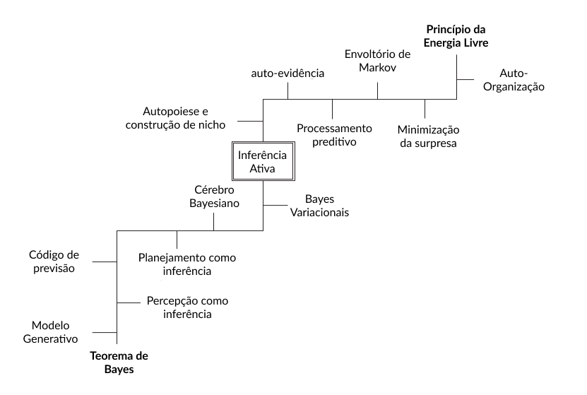

--- 
title: "Inferencia Ativa"
author: "Thomas Parr, Giovanni Pezzulo, and Karl J. Friston"
date: "`r Sys.Date()`"
output: 
  html_document: 
    theme: cosmo
documentclass: book
bibliography:
- book.bib
- packages.bib
biblio-style: apalike
link-citations: yes
description: O Princípio da Energia Livre na Mente, Cérebro e Comportamento.
site: bookdown::bookdown_site
colorlinks: yes
lot: yes
lof: yes
fontsize: 12pt
cover-image: images/Figura_1_1.png
---


```{r include=FALSE}
# automatically create a bib database for R packages
knitr::write_bib(c(
  .packages(), 'bookdown', 'knitr', 'rmarkdown'
), 'packages.bib')
```
O Princípio da Energia Livre na Mente, Cérebro e Comportamento.

# Conteúdo {-}
(I)  

1. Visão geral  
2. O caminho mais curto para a inferência ativa  
3. O caminho mais árduo para a inferência ativa  
4. Os Modelos Geradores de Inferência Ativa  
5. Passagem de mensagens e neurobiologia  

(II)

6. Uma receita para projetar modelos de inferência ativos
7. Inferência ativa em tempo discreto
8. Inferência Ativa em Tempo Contínuo
9. Análise de dados baseada em modelo
10. Inferência Ativa como uma Teoria Unificada do Comportamento Sentiente


Apêndice A: Fundamentos Matemáticos  
Apêndice B: As Equações da Inferência Ativa   
Apêndice C: Um Exemplo comentado do Código Matlab  
Notas  
Referências  
Índice  

<!--chapter:end:index.Rmd-->

# Prefácio {-}

**Karl Friston**

A Inferência Ativa é uma maneira de entender o comportamento sentiente. O próprio fato de você estar lendo estas linhas significa que você está se engajando na Inferência Ativa - ou seja, criando amostras do mundo - de uma forma particular - porque você acredita que vai aprender alguma coisa. Você está apalpando esta página com os olhos simplesmente porque esse é o tipo de ação que resolverá a incerteza sobre o que você verá a seguir e – de fato – o que essas palavras transmitem. Em suma, a Inferência Ativa coloca a ação na percepção, em que a percepção é tratada como inferência perceptiva ou teste de hipóteses. A Inferência Ativa vai ainda mais longe e considera o planejamento como uma inferência – isto é, inferir o que você faria a seguir para resolver a incerteza sobre o seu mundo vivido.


Para ilustrar a simplicidade da Inferência Ativa - e o que estamos tentando explicar - coloque a ponta dos dedos suavemente na perna. Mantenha-os lá imóveis por um segundo ou dois. Agora, sua perna está áspera ou lisa? Se você tivesse que mover os dedos para evidenciar uma sensação de aspereza ou suavidade, descobriu um fundamento da Inferência Ativa. Sentir é palpar. Ver é olhar. Ouvir é ouvir. Essa palpação não precisa necessariamente ser aberta – podemos agir disfarçadamente, direcionando nossa atenção para isso ou aquilo. Em suma, não estamos simplesmente tentando dar sentido às nossas sensações; temos que criar ativamente nosso sensório. No que se segue, veremos por que isso tem que ser o caso e por que tudo o que percebemos, fazemos ou planejamos está na bússola de um imperativo existencial – auto-evidente.

A Inferência Ativa não é apenas sobre leitura ou busca epistêmica. É, em um ponto de vista, algo que todas as criaturas e partículas fazem, em virtude de sua existência. Isso pode soar como uma afirmação forte; no entanto, fala do fato de que a Inferência Ativa herda de um princípio de energia livre que iguala existência com autoevidência e autoevidência com um tipo enativo de inferência. No entanto, este livro não está preocupado com a física dos sistemas sencientes. Seu foco está nas implicações dessa física para entender como o cérebro funciona.

Essa compreensão não é um negócio fácil, como testemunham milênios de filosofia natural e séculos de neurociência. Embora se possa encontrar as raízes da Inferência Ativa em relatos de primeiros princípios do comportamento auto-organizado (ou seja, princípios variacionais semelhantes ao princípio de ação estacionária de Hamilton), os primeiros princípios não ajudam muito quando se pergunta como um cérebro específico funciona e como ele difere de outro cérebro. Por exemplo, comprometer-se com a teoria da evolução por seleção natural não ajuda em nada quando se trata de entender por que tenho dois olhos ou falo francês. Este livro trata do uso de princípios para fundamentar questões-chave em neurociência e inteligência artificial. Para fazer isso, temos que ir além dos princípios e entender a mecânica à qual os princípios se aplicam.

Como tal, a Inferência Ativa – e sua mecânica Bayesiana que a acompanha – existe para formular questões sobre como percebemos, planejamos e agimos. Fundamentalmente, ele não visa substituir outras estruturas, como psicologia comportamental, teoria da decisão e aprendizado por reforço. Em vez disso, espera abraçar todas as abordagens que se mostraram tão bem-sucedidas dentro de uma estrutura unificada. A seguir, daremos atenção especial à ligação de construtos-chave da psicologia, neurociência cognitiva, enativismo, etologia e assim por diante ao cálculo da atualização de crenças na Inferência Ativa – e suas teorias de processo associadas.

Por teorias de processo, nos referimos a teorias sobre como a atualização de crenças é realizada por processos neuronais (e outros biofísicos) no cérebro incorporado e além. O trabalho até agora em Active Inference oferece um conjunto bastante simples de arquiteturas computacionais e ferramentas de simulação para modelar vários aspectos de um cérebro em funcionamento e permitir que as pessoas testem hipóteses sobre diferentes arquiteturas computacionais. No entanto, essas ferramentas resolvem apenas metade do problema. No coração da Inferência Ativa está um modelo generativo — ou seja, uma representação probabilística de como as causas não observáveis no mundo lá fora geram as consequências observáveis — nossas sensações. Acertar o modelo generativo – como uma explicação adequada para o comportamento senciente de qualquer sujeito ou criatura experimental – é o grande desafio.

Este livro tenta explicar como enfrentar esse desafio. A primeira parte estabelece as ideias e formalismos básicos que são invocados na segunda parte – para ilustrar como eles podem ser aplicados na prática. Resumindo, este livro é para pessoas que desejam usar a Inferência Ativa para simular e modelar o comportamento senciente, a serviço da investigação científica ou, possivelmente, da inteligência artificial. Assim, ele se concentra nas ideias e procedimentos que são necessários para entender e implementar um esquema de Inferência Ativa sem se distrair com a física dos sistemas sencientes, por um lado ou filosofia do outro.

**Uma nota de Karl Friston**

Eu tenho uma confissão a fazer. Eu não escrevi muito neste livro. Ou, mais precisamente, não me foi permitido. A agenda deste livro exige um estilo de escrita nítido e claro que está além de mim. Embora me tenham permitido colocar algumas de minhas palavras favoritas, o que se segue é uma prova de Thomas e Giovanni, sua profunda compreensão das questões em questão e, mais importante, sua teoria da mente – em todos os sentidos.

**Agradecimentos**

Agradecemos a contribuição inestimável de nossos amigos e colegas - em particular, membros anteriores e atuais do grupo de Neurobiologia Teórica do Wellcome Center for Human Neuroimaging, University College London; o Laboratório Cognição em Ação (CONAN) do Instituto de Ciências e Tecnologias Cognitivas, Conselho Nacional de Pesquisa da Itália; e numerosos colaboradores internacionais que foram essenciais para o desenvolvimento das ideias apresentadas neste livro. Esta comunidade jovem, mas em crescimento, tem sido mais do que generosa em fornecer apoio intelectual e motivação. Além disso, agradecemos a Robert Prior e Anne-Marie Bono, do MIT Press, por nos acompanharem e aconselharem durante a preparação deste livro e a Jakob Hohwy e outros revisores atenciosos por sua orientação. Finalmente, agradecemos às agências de financiamento que forneceram apoio financeiro para nossa pesquisa: KJF foi financiada por uma bolsa de pesquisa principal do Wellcome Trust (Ref: 088130/Z/09/Z); O GP foi financiado pelo Conselho Europeu de Pesquisa sob o Contrato de Subvenção Nº 820213 (ThinkAhead) e o Programa-Quadro Horizonte 2020 da União Europeia para Pesquisa e Inovação sob o Contrato de Subvenção Específico Nº 945539 (Projeto Cérebro Humano SGA3).


<!--chapter:end:00-intro.Rmd-->

# Visão Geral

O acaso favorece a mente preparada. 
—Louis Pasteur


## Introdução 

Este capítulo apresenta a principal questão que a Inferência Ativa procura abordar: Como os organismos vivos persistem enquanto se envolvem em trocas adaptativas com seu ambiente? Discutimos a motivação para abordar essa questão a partir de uma perspectiva normativa, que parte dos primeiros princípios e depois descompacta suas implicações cognitivas e biológicas. Além disso, este capítulo apresenta brevemente a estrutura do livro, incluindo sua subdivisão em duas partes: a primeira visa ajudar os leitores a entender a Inferência Ativa e a segunda visa ajudá-los a usá-la em suas próprias pesquisas.

## Como os Organismos Vivos Persistem e Agem Adaptativamente?

Os organismos vivos constantemente se envolvem em interações recíprocas com seu ambiente (incluindo outros organismos). Eles emitem ações que alteram o ambiente e recebem dele observações sensoriais, conforme ilustrado esquematicamente na **figura 1.1**


Os organismos vivos só podem manter sua integridade corporal exercendo controle adaptativo sobre o ciclo ação-percepção. Isso significa agir para solicitar observações sensoriais que correspondam a resultados ou objetivos desejados (por exemplo, as sensações que acompanham nutrientes seguros e abrigo para organismos simples, ou amigos e empregos para organismos mais complexos) ou que ajudem a entender o mundo (por exemplo, informando o organismo sobre seus arredores).

Engajar-se em loops de percepção de ação adaptativa com o ambiente apresenta desafios formidáveis ​​para os organismos vivos. Isso se deve em grande parte à natureza recursiva do ciclo, onde cada observação, solicitada pela ação anterior, muda a forma como decidimos sobre a próxima ação, para solicitar a próxima observação. As possibilidades de controle e adaptação são muitas, mas muito poucas são úteis. No entanto, durante a evolução, os organismos vivos conseguiram desenvolver estratégias adaptativas para enfrentar os desafios fundamentais da existência. Essas estratégias variam em seu nível de sofisticação cognitiva, com soluções mais simples e rígidas em organismos mais simples (por exemplo, seguindo gradientes de nutrientes em bactérias) e soluções mais cognitivamente exigentes e flexíveis em organismos mais avançados (por exemplo, planejando atingir objetivos distais em humanos). . Essas estratégias também variam de acordo com as escalas de tempo em que são selecionadas e operam - desde simples respostas a ameaças ambientais ou adaptações morfológicas que surgem em uma escala de tempo evolutiva, até padrões comportamentais estabelecidos durante o aprendizado cultural ou de desenvolvimento, até aqueles que exigem processos cognitivos que operam em escalas de tempo comparáveis à ação e percepção (por exemplo, atenção e memória).


## Inferência Ativa: Comportamento a partir dos Primeiros Princípios

Essa diversidade é uma bênção para a biologia, mas desafiadora para as teorias formais do cérebro e da mente. Em termos gerais, há duas perspectivas que poderíamos assumir sobre isso. Uma perspectiva é que diferentes adaptações biológicas, processos neurais (por exemplo, trocas sinápticas e redes cerebrais) e mecanismos cognitivos (por exemplo, percepção, atenção, interação social) são altamente idiossincráticos e requerem explicações dedicadas. Isso levaria à proliferação de teorias em campos como filosofia, psicologia, neurociência, etologia, biologia, inteligência artificial e robótica, com pouca esperança de unificação. Outra perspectiva é que, apesar de suas diversas manifestações, os aspectos centrais do comportamento, cognição e adaptação nos organismos vivos são passíveis de uma explicação coerente desde os primeiros princípios.

Essas duas possibilidades mapeiam dois programas de pesquisa diferentes e, até certo ponto, diferentes atitudes em relação à ciência: “puro” versus “desleixado” (termos devidos a Roger Shank). Os puros sempre buscam a unificação além da (aparente) heterogeneidade dos fenômenos do cérebro e da mente. Isso geralmente corresponde a projetar modelos normativos[^1] de cima para baixo que partem dos primeiros princípios e tentam derivar o máximo possível sobre cérebros e mentes. Os desleixados, em vez disso, abraçam a heterogeneidade, concentrando-se em detalhes que exigem explicações dedicadas. Isso geralmente corresponde a projetar modelos de baixo para cima que começam com dados e usam o que funciona para explicar fenômenos complexos, incluindo diferentes explicações para diferentes fenômenos.

[^1]: ​O termo normativo significa que existe algum padrão de avaliação contra o qual o comportamento pode ser pontuado. A Inferência Ativa é normativa no sentido de que a percepção e a ação são pontuadas pela energia livre — uma quantidade que iremos desvendar ao longo deste e dos próximos capítulos.

É possível explicar fenômenos biológicos e cognitivos heterogêneos a partir de primeiros princípios, como supõem os puros? É possível uma estrutura unificada para entender o cérebro e a mente?

Este livro responde a essas perguntas afirmativamente e avança a Inferência Ativa como uma abordagem normativa para entender o cérebro e a mente. Nosso tratamento da Inferência Ativa parte dos primeiros princípios e desvenda suas implicações cognitivas e biológicas.


## Estrutura do Livro

O livro compreende duas partes. Estes são voltados para leitores que desejam entender a Inferência Ativa (primeira parte) e aqueles que buscam usá-la para suas próprias pesquisas (segunda parte). A primeira parte do livro apresenta a Inferência Ativa tanto conceitualmente quanto formalmente, contextualizando-a dentro das atuais teorias da cognição. O objetivo desta primeira parte é fornecer uma introdução abrangente, formal e independente à Inferência Ativa: seus principais construtos e implicações para o estudo do cérebro e da cognição.

A segunda parte do livro ilustra exemplos específicos de modelos computacionais que usam a Inferência Ativa para explicar fenômenos cognitivos, como percepção, atenção, memória e planejamento. O objetivo desta segunda parte é ajudar os leitores a entender os modelos computacionais existentes usando a Inferência Ativa e criar novos modelos. Em suma, este livro se divide em teoria (parte 1) e prática (parte 2).


### Parte 1: Inferência Ativa na Teoria

A Inferência Ativa é uma estrutura normativa para caracterizar o comportamento e a cognição de Bayes-ótimo[^2] em organismos vivos. Seu caráter normativo é evidenciado na ideia de que todas as facetas do comportamento e da cognição nos organismos vivos seguem um imperativo único: minimizar a surpresa de suas observações sensoriais. A surpresa deve ser interpretada em um sentido técnico: ela mede o quanto as observações sensoriais atuais de um agente diferem de suas observações sensoriais preferidas – ou seja, aquelas que preservam sua integridade (por exemplo, para um peixe, estar na água). É importante ressaltar que minimizar a surpresa não é algo que pode ser feito observando passivamente o ambiente: em vez disso, os agentes devem controlar adaptativamente seus ciclos de percepção de ação para solicitar observações sensoriais desejadas. Este é o bit ativo da Inferência Ativa.

[^2]: Otimalidade de Bayes refere-se a um conjunto de conceitos relacionados que lidam com aspectos do teorema de Bayes - algo que desdobramos no capítulo 2. Em geral, refere-se a qualquer ação que minimiza (ou maximiza) o valor esperado de algum custo (ou utilidade) dada alguma observação. Isso abrange o design experimental ótimo de Bayes, em que um experimento (ação) é escolhido para maximizar o ganho de informação esperado.

Minimizar a surpresa acaba sendo um problema desafiador por razões técnicas que se tornarão aparentes mais tarde. A Inferência Ativa oferece uma solução para esse problema. Ele assume que, mesmo que os organismos vivos não possam minimizar diretamente sua surpresa, eles podem minimizar um proxy – chamado energia livre (variacional). Essa quantidade pode ser minimizada por meio de computação neural em resposta (e em antecipação) a observações sensoriais. Essa ênfase na minimização da energia livre revela a relação entre a Inferência Ativa e o (primeiro) princípio que a motiva: o princípio da energia livre (Friston 2009).

A minimização da energia livre parece um ponto de partida muito abstrato para explicar fenômenos biológicos. No entanto, é possível derivar uma série de implicações formais e empíricas a partir dele e abordar uma série de questões centrais na teoria cognitiva e neural. Estes incluem como as variáveis envolvidas na minimização da energia livre podem ser codificadas em populações neuronais; como os cálculos de energia livre minimizada mapeiam processos cognitivos específicos, como percepção, seleção de ações e aprendizado; e que tipo de comportamentos surgem quando um agente de Inferência Ativa minimiza sua energia livre.

Como a lista de tópicos acima exemplifica, neste livro estamos preocupados principalmente com a Inferência Ativa e a minimização da energia livre no nível dos organismos vivos – mais simples (por exemplo, bacterianos) ou mais complexos (por exemplo, humanos) – e seus aspectos comportamentais, cognitivos, processos sociais e neurais. Esse esclarecimento é necessário para contextualizar nosso tratamento da Inferência Ativa dentro do princípio de energia livre mais geral (FEP), que discute a minimização de energia livre em uma gama muito mais ampla de fenômenos biológicos e escalas de tempo além do processamento de informações neurais - variando de evolutivo a celular e cultural ( Friston, Levin et al. 2015; Isomura e Friston 2018; Palacios, Razi et al. 2020; Veissière et al. 2020)—que estão além do escopo deste livro.

É possível motivar a Inferência Ativa tomando um dos dois caminhos: um caminho alto e um caminho baixo; veja a figura 1.2. Esses dois caminhos fornecem duas perspectivas distintas, mas altamente complementares sobre a Inferência Ativa:

O caminho para a Inferência Ativa parte da questão de como os organismos vivos persistem e agem de forma adaptativa no mundo e motivam a Inferência Ativa como solução normativa para esses problemas. Essa perspectiva da estrada é útil para entender a natureza normativa da Inferência Ativa: o que os organismos vivos devem fazer para enfrentar seus desafios existenciais fundamentais (minimizar sua energia livre) e por quê (minimizar vicariamente a surpresa de suas observações sensoriais).




O caminho inferior para a Inferência Ativa começa com a noção do cérebro Bayesiano, que lança o cérebro como um motor de inferência tentando otimizar representações probabilísticas das causas de sua entrada sensorial. Em seguida, motiva a Inferência Ativa como uma aproximação variacional específica do problema inferencial (de outra forma intratável), que tem um grau de plausibilidade biológica. Essa perspectiva de baixo caminho é útil para ilustrar como os agentes de Inferência Ativa minimizam sua energia livre - ilustrando, portanto, a Inferência Ativa não apenas como um princípio, mas também como uma explicação mecanicista (também conhecida como teoria do processo) das funções cognitivas e seus fundamentos neuronais.

No capítulo 2, apresentamos a perspectiva do caminho mais baixo sobre a Inferência Ativa. Partimos de teorias fundamentais que lançam a percepção como um problema de inferência estatística (Bayesiana) (Helmholtz 1866) e sua encarnação moderna na hipótese do cérebro Bayesiano (Doya 2007). Veremos que para realizar tal inferência (perceptiva), os organismos vivos devem estar equipados com – ou incorporar – um modelo generativo probabilístico de como suas observações sensoriais são geradas, que codifica crenças (distribuições de probabilidade) sobre variáveis observáveis (observações sensoriais) e variáveis não observáveis (ocultas). Vamos estender essa visão inferencial além da percepção para cobrir problemas de seleção de ações, planejamento e aprendizado.

No capítulo 3, ilustramos a perspectiva complementar do caminho superior sobre a Inferência Ativa. Este capítulo apresenta o FEP e o imperativo para os organismos biológicos minimizarem a surpresa. Além disso, desvenda como esse princípio engloba a dinâmica da auto-organização e a preservação de uma fronteira estatística ou envoltório de Markov que mantém a separação do ambiente. Isso é vital para manter a integridade das criaturas biológicas e é central para sua autopoiese.

No capítulo 4, descompactamos a Inferência Ativa mais formalmente. Este capítulo se baseia na discussão do cérebro bayesiano no capítulo 2 e estabelece a relação matemática entre a dinâmica autoevidente do capítulo 3 e a inferência variacional. Além disso, este capítulo apresenta dois tipos de modelos generativos usados para formular problemas de Inferência Ativa. Estes incluem os processos de decisão Markov parcialmente observados usados para tomada de decisão e planejamento e os modelos dinâmicos de tempo contínuo que fazem interface com receptores sensoriais e músculos. Finalmente, vemos como a minimização de energia livre para cada um desses modelos se manifesta como uma atualização dinâmica de crenças.

No capítulo 5, passaremos dos tratamentos formais às implicações biológicas da Inferência Ativa. Partindo da premissa de que “tudo o que muda no cérebro deve minimizar a energia livre” (Friston 2009), discutiremos como as quantidades específicas envolvidas na minimização da energia livre (por exemplo, previsão, erro de previsão e sinais de precisão) se manifestam em dinâmica neuronal. Isso ajuda a mapear os princípios computacionais abstratos da Inferência Ativa para computações neurais específicas que podem ser executadas por substratos fisiológicos. Isso é importante na formação de hipóteses sob essa estrutura e garante que elas respondam aos dados medidos. Em outras palavras, o capítulo 5 apresenta a teoria do processo associada à Inferência Ativa.

Ao longo da primeira parte do livro, discutiremos vários aspectos característicos da Inferência Ativa. Eles destacam as maneiras pelas quais ela é diferente das estruturas alternativas que procuram explicar a regulação biológica e a cognição – algumas das quais visualizamos aqui.

- Sob a Inferência Ativa, percepção e ação são duas formas complementares de cumprir o mesmo imperativo: a minimização da energia livre. A percepção minimiza a energia livre (e a surpresa) pela crença (bayesiana) atualizando ou mudando sua mente, tornando assim suas crenças compatíveis com as observações sensoriais. Em vez disso, a ação minimiza a energia livre (e a surpresa) mudando o mundo para torná-lo mais compatível com suas crenças e objetivos. Essa unificação das funções cognitivas marca uma diferença fundamental entre a Inferência Ativa e outras abordagens que tratam a ação e a percepção isoladamente uma da outra. Aprender é mais uma maneira de minimizar a energia livre. No entanto, não é fundamentalmente diferente da percepção; ele simplesmente opera em uma escala de tempo mais lenta. A complementaridade entre percepção e ação será desvendada no capítulo 2.

- Além de direcionar a seleção de ações no presente para alterar os dados sensoriais atualmente disponíveis, a estrutura de Inferência Ativa acomoda o planejamento – ou a seleção do curso de ação ideal (ou política) no futuro. A otimalidade aqui é medida em relação a uma energia livre esperada e é distinta da noção de energia livre variacional considerada acima no contexto de ação e percepção. De fato, enquanto o cálculo da energia livre variacional depende de observações presentes e passadas, o cálculo da energia livre esperada também requer observações futuras previstas (daí o termo esperado). Curiosamente, a energia livre esperada de uma política compreende duas partes. O primeiro quantifica até que ponto se espera que a política resolva a incerteza (exploração/prospecção) e o segundo quão consistentes os resultados previstos são com os objetivos de um agente (exploração/aproveitamento). Em contraste com outras estruturas, a seleção de políticas na Inferência Ativa equilibra automaticamente a prospecção e o aproveitamento. As relações entre a energia livre variacional e a esperada serão desvendadas no capítulo 2.

- Sob a Inferência Ativa, todas as operações cognitivas são conceituadas como inferência sobre modelos generativos – de acordo com a ideia de que o cérebro realiza cálculos probabilísticos – também conhecido como a hipótese do cérebro Bayesiano. No entanto, o apelo a uma forma aproximada específica de inferência Bayesiana – isto é, um esquema variacional que é motivado por primeiros princípios – acrescenta especificidade à teoria do processo. Além disso, a Inferência Ativa estende a abordagem inferencial a domínios da cognição raramente considerados e adiciona alguma especificidade ao tipo de modelos e processos inferenciais que podem ser implementados por cérebros biológicos. Sob algumas suposições, a dinâmica que emerge dos modelos generativos usados na Inferência Ativa corresponde de perto a modelos difundidos na neurociência computacional, como a codificação preditiva (Rao e Ballard 1999) e a máquina de Helmholtz (Dayan et al. 1995). As especificidades do esquema variacional serão desvendadas no capítulo 4.

- Sob a Inferência Ativa, tanto a percepção quanto a aprendizagem são processos ativos, por duas razões. Primeiro, o cérebro é essencialmente uma máquina preditiva, que prevê constantemente os estímulos recebidos, em vez de esperar passivamente por eles. Isso é importante, pois os processos perceptivos e de aprendizado são sempre contextualizados por previsões anteriores (por exemplo, estímulos esperados e inesperados afetam a percepção e o aprendizado de maneiras diferentes). Em segundo lugar, as criaturas envolvidas na Inferência Ativa buscam ativamente observações sensoriais salientes que resolvam sua incerteza (por exemplo, orientando seus sensores ou selecionando episódios de aprendizagem que sejam informativos). O caráter ativo da percepção e do aprendizado contrasta com a maioria das teorias atuais que os tratam como processos amplamente passivos; isso será descompactado no capítulo 2.

- A ação é essencialmente direcionada a um objetivo e proposital. Ele começa a partir de um resultado ou objetivo desejado (análogo ao conceito de set-point na cibernética), que é codificado como uma previsão prévia. O planejamento prossegue inferindo uma sequência de ação que atende a essa previsão (ou equivalentemente, reduz qualquer erro de previsão entre a previsão anterior e o estado atual). O caráter da ação direcionada a objetivos na Inferência Ativa está de acordo com as primeiras formulações cibernéticas, mas é distinto da maioria das teorias atuais que explicam o comportamento em termos de mapeamentos estímulo-resposta ou políticas de ação do estado. A resposta ao estímulo ou comportamento habitual torna-se então um caso especial de uma família mais ampla de políticas em Inferência Ativa. A natureza direcionada a objetivos da Inferência Ativa será desvendada nos capítulos 2 e 3.

- Várias construções de Inferência Ativa têm análogos biológicos plausíveis no cérebro. Isso implica que – uma vez que se tenha definido um modelo generativo específico para um problema em mãos – pode-se passar da Inferência Ativa como uma teoria normativa para a Inferência Ativa como uma teoria de processo, que faz previsões empíricas específicas. Por exemplo, a inferência perceptiva e a aprendizagem correspondem à alteração da atividade sináptica e à alteração da eficácia sináptica, respectivamente. A precisão das predições (na codificação preditiva) corresponde ao ganho sináptico das unidades de erro de predição. A precisão das políticas corresponde à atividade dopaminérgica. Algumas das consequências biológicas da Inferência Ativa serão desvendadas no capítulo 5.


### Parte 2: Inferência Ativa na Prática

Enquanto a primeira parte do livro fornece aos leitores as ferramentas conceituais e formais para entender a Inferência Ativa, a segunda parte se concentra em questões práticas. Especificamente, esperamos fornecer aos leitores as ferramentas para entender os modelos existentes de Inferência Ativa de funções cognitivas (e disfunções) e projetar novos modelos. Para isso, discutimos exemplos específicos de modelos usando Inferência Ativa. É importante ressaltar que os modelos de Inferência Ativa podem variar em diferentes dimensões (por exemplo, com formulações de tempo discreto ou contínuo, inferência plana ou hierárquica). A segunda parte está estruturada da seguinte forma:

No capítulo 6, apresentamos uma receita para construir modelos de Inferência Ativa. A receita cobre as etapas essenciais para projetar um modelo eficaz, que incluem a identificação do sistema de interesse, a forma mais apropriada do modelo generativo (por exemplo, para caracterizar fenômenos de tempo discreto ou contínuo) e as variáveis específicas a serem incluídas no modelo. Este capítulo, portanto, oferece uma introdução aos princípios de design que sustentam os modelos discutidos nos capítulos seguintes.

No capítulo 7, discutimos modelos de Inferência Ativa que tratam de problemas formulados em tempo discreto; por exemplo, como modelos ocultos de Markov (HMMs) ou processos de decisão de Markov parcialmente observáveis (POMDPs). Nossos exemplos incluem um modelo de processamento perceptual e um modelo discreto de busca por escolhas  - isto é, virar à esquerda ou à direita em um ponto de decisão para garantir uma recompensa. Também introduzimos tópicos como busca de informações, aprendizado e busca de novidades, que podem ser tratados em termos de Inferência Ativa em tempo discreto.

No capítulo 8, discutimos modelos de Inferência Ativa que tratam de problemas formulados em tempo contínuo, usando equações diferenciais estocásticas. Estes incluem modelos de percepção (como codificação preditiva), controle de movimento e dinâmica sequencial. Curiosamente, é na formulação de tempo contínuo que aparecem algumas das previsões mais distintivas da Inferência Ativa, como a ideia de que a geração de movimento decorre do cumprimento de previsões e que os fenômenos atencionais podem ser entendidos em termos de controle de precisão. Também introduzimos modelos híbridos de Inferência Ativa que incluem variáveis de tempo discreto e contínuo. Estes permitem a avaliação simultânea da escolha entre opções discretas (por exemplo, alvos para sacadas) e os movimentos contínuos resultantes da escolha (por exemplo, movimentos oculomotores).

No capítulo 9, ilustramos como usar modelos de Inferência Ativa para analisar dados de experimentos comportamentais. Discutimos as etapas específicas necessárias para a análise de dados baseada em modelos, desde a coleta de dados até a formulação de um modelo e sua inversão para apoiar a análise de dados de participantes individuais ou em nível de grupo.

No capítulo 10, discutimos as relações entre a Inferência Ativa e outras teorias em psicologia, neurociência, IA e filosofia. Destacamos também os aspectos mais importantes da Inferência Ativa que a distinguem das demais teorias.

Nos apêndices, discutimos brevemente a base matemática necessária para entender as partes mais técnicas do livro, incluindo as noções de aproximação de séries de Taylor, Laplace variacional, cálculo variacional e muito mais. Para referência, também apresentamos de forma concisa as equações mais importantes usadas na Inferência Ativa.

Em suma, a segunda parte do livro ilustra uma ampla variedade de modelos de fenômenos biológicos e cognitivos que podem ser construídos usando a Inferência Ativa e uma metodologia para projetar novos. Além do interesse dos modelos específicos, esperamos que nosso tratamento esclareça o valor de usar uma estrutura normativa unificada para abordar fenômenos biológicos e cognitivos de uma perspectiva coerente. No final das contas, este é o verdadeiro apelo das estruturas normativas: fornecer uma perspectiva unificada e um princípio orientador para reconciliar fenômenos aparentemente desconexos – neste caso, fenômenos como percepção, tomada de decisão, atenção, aprendizado e controle de movimento, cada um tendo seu capítulo separado em qualquer psicologia ou manual de neurociência.

Os modelos destacados na segunda parte foram selecionados para ilustrar pontos específicos da forma mais simples possível. Embora cubramos vários modelos e domínios, desde decisões em tempo discreto até percepção de tempo contínuo e controle de movimento, estamos claramente desconsiderando muitos outros que são igualmente interessantes. Muitos outros modelos de Inferência Ativa existem na literatura que cobrem domínios tão diversos quanto a auto-organização biológica e as origens da vida (Friston 2013), morfogênese (Friston, Levin et al. 2015), robótica cognitiva (Pio-Lopez et al. 2016, Sancaktar et al. 2020), dinâmica social e construção de nicho (Bruineberg, Rietveld et al. 2018), a dinâmica das redes sinápticas (Palacios, Isomura et al. 2019), aprendizagem em redes biológicas (Friston e Herreros 2016), e condições psicopatológicas, como transtorno de estresse pós-traumático (Linson et al. 2020) e transtorno do pânico (Maisto, Barca et al. 2021). Esses modelos variam em muitas dimensões: alguns estão mais diretamente relacionados à biologia, enquanto outros menos; alguns são modelos de agente único, enquanto outros são modelos de múltiplos agentes; algumas inferências adaptativas alvo, enquanto outras inferências mal-adaptativas alvo (por exemplo, em grupos de pacientes), e assim por diante.

Essa literatura crescente exemplifica a crescente popularidade da Inferência Ativa e a possibilidade de usá-la em uma grande variedade de domínios. O objetivo deste livro é fornecer aos nossos leitores a capacidade de entender e usar a inferência ativa em sua própria pesquisa – possivelmente, para explorar suas potencialidades imprevistas.


## Resumo

Este capítulo apresenta brevemente a abordagem de Inferência Ativa para explicar problemas biológicos de uma perspectiva normativa - e prevê algumas implicações dessa perspectiva que serão desvendadas em capítulos posteriores. Além disso, este capítulo destaca a divisão do livro em duas partes, que visam auxiliar os leitores a compreender a Inferência Ativa e utilizá-la em suas próprias pesquisas, respectivamente. Nos próximos capítulos, desenvolveremos as perspectivas de baixo e alto caminho aqui descritas, antes de nos aprofundarmos na estrutura dos modelos generativos e na transmissão de mensagens resultante. Juntos, eles compreendem a Inferência Ativa em princípio e fornecem as preliminares para a Inferência Ativa na prática. Esperamos que esses capítulos convençam os leitores de que a Inferência Ativa oferece não apenas um princípio unificador sob o qual entender o comportamento, mas também uma abordagem tratável para estudar a ação e a percepção em sistemas autônomos.


<!--chapter:end:01-VisaoGeral.Rmd-->

# O Caminho de baixo para a Inferência Ativa

My thinking is first and last and always for the sake of my ­doing. —­William James


## Introdução 

Este capítulo introduz a Inferência Ativa partindo da visão helmholtziana — ou talvez kantiana — da “percepção como inferência inconsciente” (Helmholtz 1867) e ideias relacionadas que surgiram mais recentemente sob a hipótese do cérebro bayesiano. Ele explica como a Inferência Ativa engloba e estende essas ideias tratando não apenas a percepção, mas também a ação, o planejamento e o aprendizado como problemas de inferência (Bayesiana) e derivando uma aproximação baseada em princípios (variacional) para esses problemas de outra forma intratáveis.

## Percepção como Inferência

Há uma longa tradição de ver o cérebro como uma “máquina preditiva”, ou um órgão estatístico que infere e prevê estados externos do mundo. Essa ideia remonta à noção de “percepção como inferência inconsciente” (Helmholtz 1866). Mais recentemente, isso foi reformulado como a hipótese do “cérebro bayesiano” (Doya 2007). A partir dessa perspectiva, a percepção não é uma transdução puramente de baixo para cima de estados sensoriais (por exemplo, da retina) em representações internas do que está lá fora (por exemplo, como padrões de atividade neuronal). Em vez disso, é um processo inferencial que combina informações anteriores (de cima para baixo) sobre as causas mais prováveis ​​das sensações com estímulos sensoriais (de baixo para cima). Os processos inferenciais operam em representações probabilísticas de estados do mundo e seguem a regra de Bayes, que prescreve a atualização (ótima) à luz da evidência sensorial. A percepção não é um processo passivo de fora para dentro – no qual a informação é extraída de impressões em nosso epitélio sensorial de “lá fora”. É um processo construtivo de dentro para fora – no qual as sensações são usadas para confirmar ou refutar hipóteses sobre como elas foram geradas (MacKay 1956, Gregory 1980, Yuille e Kersten 2006, Neisser 2014, A. Clark 2015).

Por sua vez, realizar a inferência Bayesiana requer um modelo generativo – às vezes chamado de modelo direto. Um modelo generativo é uma construção da teoria estatística que gera previsões sobre as observações. Pode ser formulado como a probabilidade conjunta $P({\color{Red}x,\color{Orange}y)}$ das observações $\color{Orange}y$ e os estados ocultos do mundo $\color{Red}x$ que geram essas observações. Estes últimos são referidos como estados ocultos ou latentes, pois não podem ser observados diretamente. Esta probabilidade conjunta pode ser decomposta em duas partes. O primeiro é um $P({\color{Red}x)}$ prévio, que denota o conhecimento do organismo sobre os estados ocultos do mundo antes de ver os dados sensoriais. 

A segunda é a probabilidade $P( y | x)$, que denota o conhecimento do organismo de como as observações são geradas a partir de estados. A regra de Bayes nos diz como combinar esses dois elementos, essencialmente atualizando uma probabilidade anterior $P(x)$ em uma probabilidade posterior de estados ocultos após receber observações $P(x | y)$. Para os leitores que precisam de uma breve atualização sobre a teoria básica da probabilidade, o **quadro 2.1** fornece um resumo.

A inferência bayesiana é um tópico amplo que surge em disciplinas como estatística, aprendizado de máquina e neurociência computacional. Um tratamento completo dos tópicos associados está além do escopo deste livro, mas há excelentes recursos disponíveis para aqueles que desejam entendê-lo em profundidade (Murphy 2012). No entanto, tudo isso é baseado em uma regra simples. Para ilustrar essa regra, consideramos um exemplo de inferência perceptiva Bayesiana (figura 2.1). Imagine uma pessoa que acredita fortemente que está diante de uma maçã. Essa crença corresponde a uma probabilidade anterior, ou abreviada. Essa priori compreende a probabilidade atribuída à hipótese da maçã e a probabilidade atribuída às hipóteses alternativas. Neste exemplo, nossa hipótese alternativa é que não é uma maçã, mas um sapo. Numericamente, a distribuição de probabilidade anterior atribui 0,9 à maçã e 0,1 à rã. Observe que, como assumimos que existem apenas duas hipóteses plausíveis (mutuamente exclusivas), elas devem somar um. A pessoa também está equipada com um modelo de probabilidade, que atribui uma alta probabilidade ao fato de que os sapos pulam, enquanto as maçãs não. Essa probabilidade especifica o mapeamento (probabilístico) dos dois estados ocultos (sapo ou maçã) para as duas observações (pula ou não pula). Juntos, o anterior e a probabilidade formam o modelo generativo da pessoa.


| Quadro 2.1 As regras de soma e produto de probabilidade    |
|------------|
|  O raciocínio probabilístico é sustentado por duas regras principais: as regras de soma e produto de probabilidade, que são as seguintes (respectivamente):$$\sum_{x} P(x)=1$$ $$P(x)P(y|x)=P(x,y)$$ A regra da soma diz que a probabilidade de todos os eventos possíveis $(x)$ deve somar (ou integrar) a um. A regra do produto diz que a probabilidade conjunta de duas variáveis aleatórias ($x$ e $y$) pode ser decomposta no produto da probabilidade de uma variável ($P(x)$) e a probabilidade condicional da segunda variável dada a primeira ($P(y|x)$). Uma probabilidade condicional é a probabilidade de uma variável (aqui, $y$) se soubermos o valor que a outra variável (aqui, $x$) assume. Podemos desenvolver dois resultados importantes a partir dessas regras simples. A primeira é a operação de marginalização. A segunda é a regra de Bayes. A marginalização nos permite obter uma distribuição de apenas uma das duas variáveis de uma distribuição conjunta:$$\begin{matrix} \underbrace{\sum_{x}{P(x,y)}=\sum_{x}{P(y)P(x|y)}} \\ Regra\; do\; Produto \end{matrix}=\begin{matrix} \underbrace{P(x)\sum_{x}{P(x|y)}=P(y)} \\ Regra\; da\; Soma \end{matrix}$$ A probabilidade de y é chamada de probabilidade marginal, e nos referimos a essa operação como marginalização de x. A regra de Bayes pode ser obtida diretamente da regra do produto: $$\begin{matrix} \underbrace{P(x)P(y|x)}=P(x,y)=\underbrace{P(y)P(x|y)}\\regra\;do\;produto\qquad \qquad regra\;do\;produto\end{matrix}$$ Isso nos permite traduzir entre uma distribuição prévia e condicional (verossimilhança) e a marginal associada e a outra distribuição condicional (posterior). Simplificando, a regra de Bayes apenas diz que a probabilidade de duas coisas é a probabilidade da primeira, dada a segunda, vezes a probabilidade da segunda, que é o mesmo que a probabilidade da segunda, dada a primeira, vezes a probabilidade do primeiro.| 

Agora imagine que a pessoa observa que seu sapo-maçã pula. A regra de Bayes nos diz como formar uma crença posterior a partir da anterior, levando em conta a probabilidade de pular. Essa regra é expressa da seguinte forma:

$$P(x|y)=\frac{P(x)P(y|x)}{P(y)}$$

![**Figura 2.1** Um exemplo simples de inferência Bayesiana. Superior esquerdo: A crença prévia P(x) do organismo sobre o objeto que ele verá, antes de ter feito qualquer observação, ou seja, uma distribuição categórica sobre duas possibilidades, maçã (com probabilidade 0,9) e sapo (com probabilidade 0,1). Superior direito: A crença posterior do organismo P(x | y ) após observar que o objeto salta. Crenças posteriores podem ser calculadas usando a regra de Bayes sob uma função de verossimilhança P( y | x). Isso é mostrado abaixo do anterior e do posterior e específica que, se o objeto for uma maçã, há uma probabilidade muito pequena (0,01) de que ele pule, enquanto se for um sapo, a probabilidade de pular é muito maior ( 0,81). (As barras de probabilidade nesta figura não estão exatamente em escala.) Neste caso específico, a atualização de anterior para posterior é grande.](images/Figura2_1.png)

Sob o modelo de verossimilhança da figura 2.1, a probabilidade posterior atribuída ao sapo é 0,9 e a probabilidade atribuída à maçã é 0,1. Conforme destacado no quadro 2.1, o denominador da equação 2.1 pode ser calculado marginalizando o numerador. Usando nosso exemplo do sapo-maçã, aproveitamos a oportunidade para descompactar duas noções diferentes de surpresa — ambas importantes na Inferência Ativa. A primeira, a que nos referimos simplesmente como surpresa, é a evidência logarítmica negativa, onde a evidência é a probabilidade marginal das observações. Em nosso exemplo, esta é a probabilidade logarítmica negativa de observar qualquer coisa saltando sob o modelo generativo. A surpresa é uma quantidade muito importante do ponto de vista bayesiano. É uma medida de quão mal um modelo se ajusta aos dados que tenta explicar. Para colocar isso intuitivamente, podemos calcular a probabilidade do comportamento observado (pulo) sob nosso modelo. Lembre-se de que isso atribui uma probabilidade a priori muito alta às maçãs e uma probabilidade a priori baixa às rãs. Assim, nossa probabilidade marginal de pular é a seguinte:


Isso significa que, sob esse modelo, esperaríamos observar o comportamento de pulor cerca de 9 vezes em 100 observações. Como tal, deveríamos nos surpreender ao observar isso se subscrevermos o modelo da figura 2.1. Podemos quantificar isso em termos de surpresa $(ℑ)$. Isso é dado por $ℑ(y=pular) = −lnP(y=pular) = −ln(0,09) = 2,4 nats$ [^1] . Quanto maior esse número, pior o modelo como explicação adequada para as observações em questão. Isso nos permite comparar modelos em relação aos dados. Por exemplo, considere um modelo alternativo, onde temos uma crença prévia de que os sapos são vistos 100% do tempo. Seguindo os mesmos passos da equação 2.2, calculamos uma surpresa de cerca de 0,2 nats. Este é um modelo melhor desses dados, pois a observação é muito menos surpreendente. O procedimento de pontuação de modelos com base em suas evidências (ou surpresa) é frequentemente chamado de comparação de modelos bayesianos. Para modelos mais complicados, a forma da surpresa pode não ser tão simples.

[^1]: Como bits, nats são unidades de informação. A escolha da unidade depende se usamos um logaritmo de base 2 (bits) ou um logaritmo natural (nats).

A **Tabela 2.1** fornece a forma da surpresa (omitindo constantes) para uma série de distribuições de probabilidade – além da probabilidade categórica em nosso exemplo. Crucialmente, isso nos permite falar sobre surpresa para distribuições de probabilidade cujo suporte[^2] difere do exemplo simples usado aqui. Isso é importante porque a maneira pela qual os dados sensoriais são gerados pelo mundo varia com o tipo de dados. Podemos nos surpreender ao encontrar o rosto de alguém que não esperávamos ver (distribuição categórica), ou podemos nos surpreender por estar mais frio do lado de fora do que prevíamos (distribuição contínua). A Tabela 2.1 pode ser vista como um portfólio das distribuições de probabilidade à nossa disposição quando passamos a construir modelos generativos em capítulos subsequentes. De maneira mais geral, ele afirma que a surpresa é um conceito que pode ser avaliado para qualquer família de distribuições de probabilidade.

[^2]: Suporte é um termo técnico que se refere aos argumentos possíveis para uma distribuição. Por exemplo, o suporte de uma distribuição de probabilidade categórica é uma série de estados alternativos (isto é, espaço de eventos) cuja probabilidade pode ser quantificada. O suporte de uma distribuição normal univariada é toda a reta numérica real.

**Tabela 2.1 Distribuições de probabilidade e surpresa[^5]**

| Distribuição | Suporte | Surpresa$(ℑ)$ | 
|:-: |:---:|:-:|
| Gaussiana[^a] | $x\in\mathbb{R}$ | $\frac{1}{2}(x-\mu)\prod(x-\mu)$ |
| Multinomial | $$x_{i}\in\left ( 0,\cdots, N \right )$$ $${i}\in\left \{ 1 , \cdots , K \right \}$$ $$\sum_i{x_i}=N$$ | $$-\sum_i{x_i}\ln d_i$$ |
| Dirichlet[^b] | $$x_{i}\in\left ( 0,1 \right )$$ $${i}\in\left \{ 1 , \cdots , K \right \}$$ $$\sum_i{x_i}=1$$ | $\sum(1 - \alpha_i)\ln(x_i)$ |
| Gamma | $x\in(0,\infty)$| $(bx+(1-a)\ln x)$ |

[^5]: Os detalhes desta tabela não são importantes para entender conceitualmente a Inferência Ativa, mas para leitores interessados, descompactamos brevemente os pontos-chave. A coluna Suporte nos informa o conjunto de variáveis cuja surpresa pode ser quantificada usando cada distribuição. Este é o conjunto de números reais para a distribuição gaussiana. Para a distribuição multinomial, o suporte compreende um grupo de K variáveis, cada uma assumindo um valor inteiro até um máximo N, sob a restrição de que todos os elementos desse grupo somam N. Para a distribuição de Dirichlet, o suporte inclui qualquer grupo de K números reais entre 0 e 1, onde todos os elementos do grupo somam 1. A distribuição gama quantifica a surpresa de números reais não negativos. A coluna Surpresa mostra como a surpresa pode ser calculada. Isso depende de constantes (além da variável aleatória x) que controlam a forma da distribuição subjacente.
[^a]: Casos especiais incluem distribuições categóricas $(K  > 2, N  =  1)$, binomial  $(K  = 2, N  >  1)$ e Bernoulli  $(K = 2, N  =  1)$ 
[^b]: Um caso especial é a distribuição beta $(K=2)$

A segunda noção de surpresa é (um pouco confusa) referida como surpresa bayesiana. Esta é uma medida de quanto temos que atualizar nossas crenças após uma observação. Em outras palavras, a surpresa Bayesiana quantifica a diferença entre uma probabilidade anterior e uma posterior. Isso levanta a questão de como quantificamos a dissimilaridade de duas distribuições de probabilidade.

Uma resposta, da teoria da informação, é usar uma divergência de Kullback-Leibler (KL). Isso é definido como a diferença média entre duas probabilidades logarítmicas

$D_{KL}[Q(x)||P(x)] \overset{\Delta}{=} \mathbb{E_{Q(x)}}[\ln{Q(x)} - \ln{P(x)}] \quad\quad\quad\quad\quad\quad\quad\quad\quad\quad \text{(2.3)}$

O símbolo $\mathbb{E}$ aqui indica uma média (ou expectativa) conforme descrito no **quadro 2.2**. Usando o KL-Divergence, podemos quantificar a surpresa Bayesiana do nosso exemplo:


Isso pontua a quantidade de atualização de crenças, em oposição a simplesmente quão improvável era a observação. Para destacar a distinção entre surpresa e surpresa bayesiana, considere o que acontece se nos comprometermos com uma crença prévia de que sempre veremos maçãs. A surpresa bayesiana será zero, já que o prior está tão confiante que não o atualizamos seguindo nossas observações. No entanto, a surpresa é muito grande (4,6 nats), pois é altamente improvável que uma maçã salte.


| **Quadro 2.2 Expectativas** | 
|:--|
| É útil referir-se à expectativa de uma variável aleatória $x$, geralmente denotada por $\mathbb{E[x]}$. Esta é a média ponderada de todos os valores que a variável pode assumir, ponderada pela sua probabilidade. Para variáveis aleatórias discretas (que só podem receber um número contável de valores possíveis), isso é dado por uma soma ponderada: $$\mathbb{E(x)}=\sum_x{xP(x)}$$ Por exemplo, para uma variável discreta (numérica) que só pode assumir dois valores (1 e 2) com igual probabilidade de $\frac{1}{2}$, isto é $\mathbb{E(x)}=1*\frac{1}{2}+2*\frac{1}{2}=\frac{3}{2}$. Para variáveis aleatórias contínuas (que podem ter infinitos valores), as somas são substituídas por integrais. As expectativas também podem ser aplicadas a funções de variáveis aleatórias, em oposição às variáveis diretamente. Por exemplo, se tivermos uma função f (x), onde x tem alguma distribuição contínua, a expectativa é definida como segue: $$\mathbb{E[f(x)]}=\int_{}^{} f(x)p(x)\, dx$$Usaremos essa notação ao longo deste livro, onde a função $f (x)$ será frequentemente uma probabilidade logarítmica ou razão de probabilidade logarítmica.
|

Observe que, embora tenhamos ilustrado a inferência bayesiana com base em um modelo generativo muito simples, ela se aplica a modelos generativos de qualquer complexidade. No capítulo 4, destacaremos duas formas de modelo generativo que subscrevem a maioria das aplicações em Inferência Ativa.

## Inferência Biológica e Otimização

Há dois pontos importantes que conectam o esquema inferencial acima às teorias biológicas e psicológicas da percepção. Primeiro, o procedimento inferencial discutido requer a interação de processos de cima para baixo que codificam previsões (a partir do anterior) e processos de baixo para cima que codificam observações sensoriais (mediadas pela probabilidade). Essa interação de processos de cima para baixo e de baixo para cima distingue a visão inferencial de abordagens alternativas que consideram apenas processos de baixo para cima. Além disso, é central nos tratamentos biológicos modernos da percepção, como a codificação preditiva (discutida no capítulo 4), que é uma implementação algorítmica específica (ou em nível de processo) do esquema de inferência mais geral (bayesiano) discutido aqui.

Em segundo lugar, a inferência Bayesiana é ótima. A otimalidade é definida em relação a uma função de custo que é otimizada (ou seja, minimizada), que, por inferência Bayesiana, é conhecida como energia livre variacional – intimamente relacionada à surpresa. Voltamos a isso na seção 2.5. Ao considerar explicitamente a distribuição completa sobre os estados ocultos, ele lida naturalmente com a incerteza, evitando as limitações de abordagens alternativas que consideram apenas estimativas pontuais de estados ocultos (por exemplo, o valor médio de x). Uma dessas alternativas seria a estimativa de máxima verossimilhança, que simplesmente seleciona o estado oculto mais provável de ter gerado os dados disponíveis. O problema com isso é que tais estimativas ignoram tanto a plausibilidade prévia do estado oculto quanto a incerteza em torno da estimativa. A inferência bayesiana não sofre essas limitações. No entanto, apesar do uso da surpresa para avaliar objetivamente se o modelo é adequado ao propósito, é importante apreciar que a inferência em si é subjetiva. Os resultados da inferência não são necessariamente precisos em nenhum sentido objetivo (ou seja, a crença do organismo pode não corresponder à realidade) por pelo menos duas razões importantes. Primeiro, as criaturas biológicas operam com base em recursos computacionais e energéticos limitados, que tornam a inferência Bayesiana exata intratável[^6] . Isso requer aproximações que excluem garantias de otimalidade Bayesiana exata. Essas aproximações incluem a noção de uma posterior variacional - baseada em algo chamado aproximação de campo médio - que é central para o capítulo 4.


[^6]: Curiosamente, as limitações de recursos não são a única barreira para a inferência Bayesiana exata. Na presença de modelos complexos, a inferência exata pode ser analiticamente intratável, de modo que nenhum recurso adicional poderia ajudar a resolver o problema exato.

A segunda razão pela qual a otimalidade pode ser pensada como subjetiva é que os organismos operam com base no modelo generativo de um sujeito de como suas observações são geradas, o que pode ou não corresponder ao processo generativo real que gera suas observações. Isso não quer dizer que o modelo generativo deva corresponder ao processo generativo. De fato, pode haver modelos que forneçam explicações melhores (por exemplo, mais simples) dos dados disponíveis do que os processos que realmente os geraram – conforme quantificado por sua relativa surpresa. Um bom exemplo disso são as ilusões, para as quais alguém encontra uma explicação mais simples para sua entrada visual em relação a como os estímulos visuais foram cuidadosamente projetados por um psicofísico malicioso.

O próprio modelo generativo pode ser otimizado à medida que novas experiências são adquiridas. Isso pode ou não convergir para o processo generativo.

A **Figura 2.2** ilustra esse ponto e a diferença entre as verdadeiras contingências ambientais, ou o processo generativo, que é inacessível ao organismo e o modelo generativo do organismo do mundo. Neste exemplo em particular, o processo generativo está em um verdadeiro estado $x*$ que é inacessível ao organismo. No entanto, o organismo e o mundo estão mutuamente acoplados, e $x*$ gera uma observação $y$, que o organismo sente. O organismo pode usar esta observação $y$ e a regra de Bayes para inferir a (probabilidade posterior de) alguma variável explicativa ou estado oculto no modelo generativo. Na figura, nos referimos a $x*$ e $x$ como estados ocultos, enfatizando que nenhum deles é observável. No entanto, eles são sutilmente diferentes: o primeiro faz parte do modelo generativo do organismo, enquanto o último faz parte do processo generativo e inacessível ao organismo. Além disso, $x*$ e $x$ não vivem necessariamente no mesmo espaço. Pode ser que os estados ocultos no mundo externo assumam valores que estão fora do espaço de explicações disponíveis ao cérebro. Por outro lado, pode ser que as explicações do cérebro incluam variáveis que não existem no mundo exterior. Por exemplo, o primeiro pode ser de 5 dimensões e o último de 2 dimensões, ou um pode ser contínuo e o outro categórico.

![**Figura 2.2** Processo generativo e modelo generativo. Ambos representam maneiras pelas quais os dados sensoriais $(y)$ podem ser gerados dados estados ocultos $(x)$ e são representados por setas de $x$ a $y$ para indicar causalidade. A diferença é que o processo é a verdadeira estrutura causal pela qual os dados são gerados, enquanto o modelo é uma construção usada para fazer inferências sobre as causas dos dados (ou seja, usar observações para derivar estados inferidos). Os estados ocultos do modelo generativo e do processo generativo não são os mesmos. O modelo do organismo inclui uma série de hipóteses $(x)$ sobre o estado oculto, que não necessariamente incluem o verdadeiro valor do estado oculto $x∗$ do processo generativo. Em outras palavras, os modelos que usamos para explicar nosso sensório podem incluir estados ocultos que não existem no mundo exterior e vice-versa. A ação $(u)$ é gerada com base nas inferências feitas sob um modelo generativo. A ação é mostrada aqui como parte do processo generativo, fazendo mudanças no mundo, apesar de ser selecionada a partir das inferências traçadas sob o modelo.](images/Figura2_2.png)
A distinção entre o modelo generativo e o processo é importante para contextualizar as afirmações psicológicas sobre a otimalidade da inferência – na medida em que essas afirmações são válidas – que, em uma visão bayesiana, é sempre contingente aos recursos do organismo. Por recursos, queremos dizer seu modelo generativo específico e recursos computacionais e mnemônicos limitados.

## Ação como Inferência

A discussão até este ponto é comum a todas as teorias do cérebro Bayesianas. No entanto, agora apresentamos o avanço simples, mas fundamental, oferecido pela Inferência Ativa. Isso parte da mesma perspectiva inferencial discutida acima, mas a estende para considerar a ação como inferência. Essa ideia decorre do conceito de que a inferência bayesiana minimiza a surpresa (ou, equivalentemente, maximiza a evidência do modelo bayesiano). Até agora, consideramos o que acontece quando computamos a surpresa realizando inferências – e selecionamos entre os modelos com base em sua capacidade de minimizar a surpresa. No entanto, a surpresa não depende apenas do modelo. Também depende dos dados. Ao agir no mundo para mudar a maneira como os dados são gerados, podemos garantir que um modelo seja adequado ao propósito, escolhendo os dados que são menos surpreendentes em nosso modelo. 

Equipado com um mecanismo para produzir ações, um organismo pode se engajar em trocas recíprocas com seu ambiente; veja a figura 2.2. Nos animais, esse mecanismo assume a forma de um loop reflexo motor. Essencialmente, para cada ciclo de ação-percepção, o ambiente envia uma observação ao organismo. O organismo usa (uma aproximação da) inferência Bayesiana para inferir seus estados ocultos mais prováveis. Em seguida, gera uma ação e a envia para o ambiente na tentativa de tornar o ambiente menos surpreendente. O ambiente executa a ação, gera uma nova observação e a envia ao organismo. Em seguida, inicia-se um novo ciclo. A descrição sequencial aqui é escrita para fins didáticos; é importante perceber que estes não são realmente passos discretos, mas são processos dinâmicos contínuos.

A Inferência Ativa vai além do reconhecimento de que percepção e ação têm a mesma natureza (inferencial). Também pressupõe que tanto a percepção quanto a ação cooperam para realizar um único objetivo – ou otimizar apenas uma função – em vez de ter dois objetivos distintos, como mais comumente se supõe. Na literatura de Inferência Ativa, esse objetivo comum foi descrito de várias maneiras (informais e formais), incluindo a minimização de surpresa, entropia, incerteza, erro de previsão ou energia livre (variacional). Esses termos estão relacionados entre si, mas às vezes suas relações não são imediatamente claras, causando alguma confusão. Além disso, esses termos são usados em diferentes contextos; por exemplo, a minimização de erros de previsão é usada em contextos biológicos onde o objetivo é explicar os sinais cerebrais, enquanto a minimização de energia livre variacional é usada em aprendizado de máquina. 

Nas próximas duas seções, esclareceremos que a única quantidade que os agentes de Inferência Ativa minimizam por meio da percepção e da ação é a energia livre variacional. No entanto, sob algumas condições, pode-se reduzir a energia livre variacional a outras noções, como a discrepância entre o modelo generativo e o mundo, ou a diferença entre o que se espera e o que se observa (ou seja, um erro de previsão). Introduziremos formalmente a energia livre variacional na seção 2.5. Para simplificar, a seção 2.4 concentra-se nas maneiras pelas quais a percepção e a ação minimizam a discrepância entre o modelo generativo e o mundo.

## Minimizando a discrepância entre o modelo e o mundo

Tendo estabelecido percepção e ação em termos de inferência bayesiana, agora nos voltamos para a questão de qual é o objetivo da inferência. Em outras palavras, o que está sendo otimizado por inferência? Na ciência cognitiva, é comum supor que diferentes funções cognitivas, como percepção e ação, otimizam objetivos diferentes. Por exemplo, poderíamos supor que a percepção maximiza a precisão da reconstrução enquanto a seleção de ação maximiza a utilidade. Em vez disso, um insight fundamental da Inferência Ativa é que tanto a percepção quanto a ação servem ao mesmo objetivo. Como primeira aproximação, esse objetivo comum de percepção e ação pode ser formulado como uma minimização da discrepância entre o modelo e o mundo. Às vezes, isso é operacionalizado em termos de erro de previsão.

Para entender como a percepção e a ação reduzem a discrepância entre o modelo e o mundo, considere novamente o exemplo de uma pessoa que espera ver uma maçã (figura 2.3). Ela gera uma previsão visual de cima para baixo (por exemplo, sobre ver algo vermelho e não pular). Essa previsão visual é comparada com uma sensação (por exemplo, algo pulando) – e essa comparação resulta em uma discrepância.


A pessoa pode resolver essa discrepância de duas maneiras. Primeiro, ela pode mudar de ideia sobre o que está vendo (ou seja, um sapo) para se adequar ao mundo, resolvendo assim a discrepância. Isso corresponde à percepção. Segundo, ela poderia fovear a macieira mais próxima e ver algo que se parece muito com uma maçã. Isso também resolve a discrepância inicial, mas de uma maneira diferente. Isso implica mudar o mundo – incluindo a direção do olhar – e as sensações subsequentes para se adequar ao que está em sua mente, não mudar sua mente para se adequar ao mundo. Esta é a outra direção de ajuste. Isso é ação.

Embora mudar a direção do olhar pareça menos atraente do que mudar de ideia no mundo das maçãs e sapos, vamos considerar outro caso: uma pessoa que espera que sua temperatura corporal esteja em uma certa faixa que sente uma temperatura alta por meio de termorreceptores centrais. Isso é surpreendente e apresenta uma discrepância significativa para resolver. Como no exemplo anterior, ele tem duas formas de minimizar essa discrepância, correspondendo à percepção (mudança de mente) e ação (mudança do mundo), respectivamente. Nesse caso, simplesmente mudar de ideia não parece muito adaptativo, mas agir para diminuir a temperatura do corpo (por exemplo, abrindo a janela) é.

Isso fala do fato de que, na Inferência Ativa, a noção de probabilidades marginais ou surpresa (por exemplo, sobre a temperatura corporal) tem um significado que vai além dos tratamentos Bayesianos padrão para absorver noções como pontos de ajuste homeostáticos e alostáticos. Tecnicamente, os agentes de Inferência Ativa vêm equipados com modelos que atribuem altas probabilidades marginais aos estados que preferem visitar ou às observações que preferem obter. Para um peixe, isso significa uma alta probabilidade marginal de estar na água. Isso implica que os organismos esperam implicitamente que as observações que eles amostram estejam dentro de sua zona de conforto (por exemplo, limites fisiológicos).

Em suma, discutimos como, a qualquer momento, podemos minimizar a discrepância entre nosso modelo e nosso mundo por meio da percepção e da ação. Se ajustamos nossas crenças ou nossos dados depende da confiança com que mantemos essas crenças. Em nosso exemplo da maçã, a crença é mantida com incerteza suficiente de que isso será atualizado em vez de posto em prática. Em contraste, no exemplo da temperatura, estamos consideravelmente mais confiantes sobre nossa temperatura central porque ela garante nossa existência. Essa confiança significa que atualizamos nosso mundo para cumprir nossas crenças. Ainda, na Inferência Ativa, percepção e ação agem de forma mais cooperativa do que o sugerido por este tratamento. Para entender por que esse é o caso, a próxima seção passa da noção restrita de discrepância (ou erro de previsão) para a noção mais geral de energia livre variacional - que é a quantidade que a Inferência Ativa realmente minimiza e que inclui o erro de previsão como um caso especial.

## Minimizando a Energia Livre Variacional

Até agora, discutimos percepção e ação dentro de um esquema bayesiano que visa minimizar a surpresa. No entanto, a inferência Bayesiana exata que suporta a percepção e a ação é computacionalmente intratável na maioria dos casos, porque duas quantidades – a evidência do modelo ($P( y)$) e a probabilidade posterior ($P(x | y)$) – não podem ser computadas por duas razões possíveis. A primeira é que, para modelos complexos, pode haver muitos tipos de estados ocultos que precisam ser marginalizados, tornando o problema computacionalmente intratável. A segunda é que a operação de marginalização pode exigir integrais analiticamente intratáveis. A Inferência Ativa apela a uma aproximação variacional da inferência Bayesiana que é tratável.

O formalismo da inferência variacional será desvendado no capítulo 4. Aqui, basta dizer que realizar inferência Bayesiana variacional implica substituir as duas quantidades intratáveis - probabilidade posterior e evidência do modelo (log) - por duas quantidades que as aproximam, mas podem ser calculadas eficientemente - a saber, um Q posterior aproximado e uma energia livre variacional F, respectivamente. A posterior aproximada às vezes é chamada de distribuição variacional ou de reconhecimento. A energia livre variacional negativa também é conhecida como um limite inferior de evidência (ELBO), especialmente em aprendizado de máquina.

Mais importante ainda, o problema da inferência bayesiana agora se torna um problema de otimização: a minimização da energia livre variacional F. A energia livre variacional é uma quantidade com raízes na física estatística que desempenha um papel fundamental na Inferência Ativa. Na equação 2.5, é denotado como F [Q, y], pois é um funcional (função de uma função) do Q posterior aproximado e uma função dos dados y:

$$F[Q,y]=
\begin{matrix}  \underbrace{  -\mathbb{E_{Q(x)}}[\ln P(x,y) }[\\ Energia \end{matrix}
\begin{matrix}  \underbrace{  -\mathbb{H_{Q(x)}}) } \\ Entropia \end{matrix}$$
$$=
\begin{matrix}  \underbrace{  D_{KL}{[Q(x)||P(x)]}}\\ Complexidade \end{matrix}
\begin{matrix}  \underbrace{  -\mathbb{E_{Q(x)}}[\ln P(y|x)]}\\ Acurácia \end{matrix}$$
$$=\begin{matrix} \underbrace{ D_{KL}{[Q(x) || P(x|y)]} } \\ Divergência \end{matrix}
\begin{matrix} \underbrace{-\ln P(x)} \\ Evidência \end{matrix} \qquad\qquad (2.5)
$$

A energia livre variacional pode parecer, a primeira vista, um conceito abstrato, mas sua natureza e o papel que desempenha na Inferência Ativa tornam-se aparentes quando decompostas em quantidades que são mais intuitivas e familiares na ciência cognitiva. Cada uma dessas perspectivas sobre energia livre variacional oferece intuições úteis sobre o que significa minimização de energia livre. Esboçamos brevemente essas intuições aqui, pois elas se tornarão importantes quando discutirmos exemplos na segunda parte do livro.

A primeira linha da equação 2.5 mostra que a minimização em relação a $Q$ requer consistência com o modelo generativo (energia), mantendo também uma alta entropia posterior.[^7] A última significa que, na ausência de dados ou crenças prévias precisas (que apenas influenciam o termo de energia), devemos adotar crenças maximamente incertas sobre os estados ocultos do mundo, de acordo com o princípio de entropia máxima de Jaynes ( Jaynes 1957). Simplificando, devemos ser incertos (adotar uma crença de alta entropia ) quando não temos informações. O termo energia herda da física estatística. Especificamente, sob uma distribuição de Boltzmann, a probabilidade logarítmica média de um sistema adotar alguma configuração é inversamente proporcional à energia associada a essa configuração - ou seja, a energia necessária para mover o sistema para essa configuração a partir de uma configuração de linha de base.

[^7]:Como o KL-Divergence, a entropia é uma quantidade da teoria da informação. É uma medida da dispersão (ou incerteza) de uma distribuição de probabilidade. Tecnicamente, é a média da probabilidade logarítmica negativa ou surpresa média.

A segunda linha enfatiza a interpretação da minimização da energia livre como encontrar a melhor explicação para os dados sensoriais, que deve ser a explicação mais simples (minimamente complexa [^8]) capaz de explicar com precisão [^9] os dados (cf. navalha de Occam) . O trade-off complexidade-precisão ocorre em vários domínios, normalmente no contexto de comparação de modelos para análise de dados. Em estatística, às vezes são usadas outras aproximações para a evidência do modelo, como o critério de informação Bayesiano ou o critério de informação de Akaike. A compensação complexidade-precisão se tornará importante quando descrevermos como usar a energia livre para comparação de modelos durante a análise de dados baseada em modelo - e no contexto de aprendizado de estrutura e redução de modelo. Inferir explicações que tenham complexidade mínima também é importante do ponto de vista cognitivo. Isso porque pode-se supor que atualizar o que se sabe (o anterior) para acomodar os dados acarreta um custo cognitivo (Ortega e Braun 2013, Zénon et al. 2019); portanto, uma explicação que diverge minimamente da anterior é preferível.

[^8]:A complexidade, conforme usada aqui, pontua o grau em que devemos nos afastar de nossas crenças anteriores sobre o mundo para explicar os dados.


[^9]:Isso é chamado de precisão porque a precisão de uma explicação aumenta quando uma alta probabilidade logarítmica de resultados, esperada sob os estados ocultos inferidos, é atribuída a dados observados - ou seja, quando a distribuição prevista de resultados captura com precisão a distribuição medida.

Nesta visão, o custo da complexidade é apenas uma surpresa bayesiana. Em outras palavras, o grau em que “mudo de ideia” é quantificado pela divergência entre o anterior e o posterior. Isso significa que toda explicação precisa para minhas sensações incorre em um custo de complexidade, e esse custo pontua o grau de atualização da crença bayesiana. A energia livre variacional, então, marca a diferença entre precisão e complexidade.

A linha final expressa a energia livre como um limite na evidência logarítmica negativa (veja a figura 2.4). Como a parte esquerda da figura ilustra, a energia livre é um limite superior na evidência logarítmica negativa, onde o limite é a divergência entre $Q$ e a probabilidade posterior que teria sido obtida se fosse possível realizar exatamente (em oposição a variacional) inferência. A parte direita da figura mostra que, à medida que a divergência diminui, a energia livre se aproxima da evidência logarítmica negativa (surpresa) - e se torna igual a surpresa, se o Q posterior aproximado corresponder ao posterior exato $P(x | y)$. Isso oferece uma motivação formal para a inferência perceptiva como uma maneira de diminuir a energia livre otimizando nosso Q posterior aproximado o máximo possível.


A linha final da equação 2.5 mostra que a inferência perceptual não é a única maneira de minimizar a energia livre. Também poderíamos alterar o termo de evidência de log agindo para alterar os dados sensoriais. Essa decomposição é interessante do ponto de vista cognitivo, pois minimizar a divergência e maximizar a evidência mapeiam os dois subobjetivos complementares de percepção e ação, respectivamente; veja a figura 2.5. Observe que todas as expressões acima se tornam formas de caracterizar a evidência logarítmica negativa se substituirmos $Q$ por $P( x| y)$, generalizando para o caso de inferência exata.

Em suma, a Inferência Ativa equivale a minimizar a energia livre variacional por percepção e ação. Essa minimização permite que um organismo ajuste seu modelo generativo às observações que amostra. Esse ajuste é uma medida tanto da adequação perceptual (como expressa pelo termo de divergência) quanto do controle ativo sobre os estados externos – no sentido de que permite que o organismo se mantenha em um conjunto adequado de estados preferidos, conforme definido pelo modelo generativo. Outra maneira de expressar isso é apelar para a divergência versus decomposição de evidências da energia livre. Igualando a evidência logarítmica negativa com surpresa e notando que a menor divergência possível é zero, vemos que a energia livre é um limite superior da surpresa. Isso significa que só pode ser maior ou igual a surpresa. Quando o organismo minimiza sua divergência (através da percepção), então a energia livre torna-se uma aproximação da surpresa. Quando um organismo altera adicionalmente as observações que reúne (atuando) para torná-las mais semelhantes às previsões anteriores, minimiza a surpresa.


A energia livre variacional tem um aspecto retrospectivo, pois é uma função de observações passadas e presentes, mas não futuras. Embora facilite inferências sobre o futuro com base em dados passados, não facilita diretamente formas prospectivas de inferência com base em dados futuros previstos. Isso é importante no planejamento e na tomada de decisões. Aqui, inferimos as melhores ações ou sequências de ações (políticas) com base nas observações futuras que se espera que elas tragam. Fazer isso requer que complementemos nossos modelos generativos com a noção de energia livre esperada.

## Energia Livre Esperada e Planejamento como Inferência

A energia livre esperada estende a Inferência Ativa para incluir uma forma de cognição essencialmente prospectiva: planejamento. Planejar uma sequência de ações, como a série de movimentos necessários para escapar de um labirinto, requer considerar as observações futuras que se espera reunir. Por exemplo, as consequências de possíveis cursos de ação incluem ver um beco sem saída depois de virar à direita ou ver a saída após uma sequência de três curvas à esquerda. Cada sequência possível de ações é chamada de política. Isso destaca uma importante distinção feita na Inferência Ativa entre uma ação e uma política. O primeiro é algo que influencia diretamente o mundo exterior, enquanto o segundo é uma hipótese sobre um modo de se comportar. A implicação é que a Inferência Ativa trata o planejamento e a tomada de decisão como um processo de inferir o que fazer. Isso traz o planejamento firmemente para o domínio da inferência bayesiana e significa que devemos especificar prioritários e probabilidades como antes (seção 2.1). No entanto, no lugar de rãs e maçãs, as alternativas são políticas comportamentais (é mais provável que eu olhe para o lago ou para a árvore?). Nesta seção, primeiro lidamos brevemente com a probabilidade - isto é, as consequências de seguir uma política - e depois nos voltamos para o anterior. É aqui que entra a energia livre esperada.

Os resultados dependentes de políticas não estão imediatamente disponíveis (eles estão no futuro), mas podem ser previstos encadeando dois componentes do modelo generativo. A primeira são nossas crenças sobre como os estados ocultos mudam em função das políticas. Entraremos em detalhes disso no capítulo 4. Por enquanto, usamos a notação $x\sim$ para denotar uma sequência ou trajetória de estados ocultos ao longo do tempo, e condicionamos as trajetórias às políticas $(π)$ que uma criatura segue. Isso significa que a parte dinâmica do nosso modelo é dada por $P(x\sim{}|π)$. Com base em nosso exemplo anterior da maçã-rã, a política pode ser a decisão de ir a um lago ou a um pomar, o que altera a probabilidade de encontrar rãs versus maçãs.

O segundo componente do modelo é a distribuição de verossimilhança usual. Isso descreve quais observações esperar em todos os estados possíveis (por exemplo, pulando ou não, condicionado ao sapo ou à maçã). Ao combinar esses dois componentes, um organismo pode engajar seu modelo generativo indiretamente para executar “e se” ou simulações contrafactuais das consequências de suas possíveis ações ou políticas – por exemplo, “O que aconteceria se eu fosse ao lago?” Marginalizando sobre os estados, isso nos dá a probabilidade marginal ou evidência para uma política $(P(y\sim|π))$, ou uma aproximação de energia livre para essa quantidade. Em outras palavras, saber como as políticas influenciam as transições de estado nos permite calcular a probabilidade de uma sequência de observações sob essa política. Como vimos na equação 2.1, precisamos combinar essa probabilidade com uma probabilidade anterior para calcular a probabilidade posterior de seguir uma política.

A Inferência Ativa decompõe esse problema de planejamento em duas operações sucessivas. A primeira é calcular uma pontuação para cada política. A segunda é formar crenças posteriores sobre as quais perseguir. A primeira define a crença prévia sobre as políticas a serem seguidas, onde as melhores políticas têm alta probabilidade e as piores políticas têm baixa probabilidade. Sob a Inferência Ativa, a qualidade de uma política é pontuada pela energia livre esperada negativa associada – assim como a qualidade de um ajuste de modelo é pontuada pela energia livre negativa desse modelo. A energia livre esperada $(G)$ da política é diferente da energia livre variacional $(F)$, uma vez que o cálculo da primeira requer a consideração de observações futuras dependentes da política. Em contraste, este último considera apenas observações presentes e passadas. O cálculo da energia livre esperada, portanto, envolve o modelo generativo para prever observações futuras que resultariam de cada política – se ela fosse executada – até algum horizonte de planejamento. Além disso, como uma política se desdobra em várias etapas de tempo, a medida final da energia livre esperada para cada política deve ser integrada em todas as etapas de tempo futuras dessa política.

A energia livre esperada de cada política pode ser convertida em um índice de qualidade (tomando seu negativo) e é disponibilizada diretamente como a priori pelos agentes envolvidos na Inferência Ativa. Isso ocorre porque - consistente com a noção de energia potencial na física - a energia livre esperada é expressa no espaço de probabilidades logarítmicas. Convertê-lo em uma crença (ou distribuição de probabilidade) sobre políticas é então uma questão de exponenciar (para desfazer o log) e normalizar (para garantir consistência com a regra da soma no quadro 2.1). As políticas que estão associadas a uma menor energia livre esperada recebem maior probabilidade e se tornam as políticas que o organismo espera seguir.

Em última análise, inferir que estamos seguindo uma política específica tem consequências para os dados sensoriais que prevemos. Por exemplo, uma política que inclui flexionar o cotovelo implica em previsões sobre a entrada proprioceptiva dos músculos bíceps e tríceps. Isso fornece a ligação entre planejamento e ação, pois as previsões associadas a um plano se traduzem em ação que resolve discrepâncias com dados proprioceptivos medidos (consulte a seção 2.3).

## O que é energia livre esperada?

Até agora, assumimos que durante o planejamento, o organismo pontua suas políticas de acordo com sua energia livre esperada. No entanto, evitamos o que a energia livre esperada realmente é. Como a energia livre variacional, a energia livre esperada pode ser decomposta de várias maneiras matematicamente equivalentes. Cada um deles fornece uma perspectiva alternativa sobre essa quantidade.

$$G(x)=\begin{matrix} \underbrace{-\mathbb{E_{Q(\tilde x,\tilde y|\pi)}}[ D_{KL}[Q(\tilde x|\tilde y,\pi)||Q(\tilde x|\pi)] }\\ ganho\; de\; informação  \end{matrix} -  \begin{matrix} \underbrace{\mathbb{E_{Q(\tilde y|\pi)}} \ln P(\tilde y|C)])} \\ valor\;pragmático \end{matrix} $$
$$ =  \begin{matrix} \underbrace{\mathbb{E_{Q(\tilde x,\tilde y | \pi)}}[H[P(\tilde y, \tilde x)]]} \\ ambiguidade\; esperada \end{matrix} + \begin{matrix} \underbrace{D_{KL}[Q(\tilde y | \pi) \;||\; P(\tilde y | C)]} \\ risco(resultados) \end{matrix} $$
$$ \le  \begin{matrix} \underbrace{\mathbb{E_{Q(\tilde x,\tilde y | \pi)}}[ H[P(\tilde y, \tilde x)]]} \\ ambiguidade\; esperada \end{matrix} + \begin{matrix} \underbrace{D_{KL}[Q(\tilde x | \pi) \;||\; P(\tilde x | C)]} \\ risco(estados) \end{matrix} $$
$$ =  \begin{matrix} \underbrace{-\mathbb{E_{Q(\tilde x,\tilde y | \pi)}}[\ln P(\tilde y, \tilde x|C)]} \\ energia\; esperada \end{matrix} - \begin{matrix} \underbrace{H[Q(\tilde x | \pi)]} \\ entropia \end{matrix} \;\;\;\;\;\; (2.6)$$

$$ Q(\tilde x,\tilde y | \pi) \overset{\Delta}{=}  Q(\tilde x | \pi)P(\tilde y | \tilde x) $$ 

O primeiro deles é talvez o mais útil, intuitivamente, pois expressa o valor de buscar novas informações (ou seja, exploração(“/ prospecção”) exatamente nas mesmas unidades (nats) que o valor de buscar observações preferidas (ou seja, exploração(“/aproveitamento”), dissolvendo o clássico Dilema explorar-explorar em psicologia comportamental. Ao minimizar a energia livre esperada, o equilíbrio relativo entre esses termos determina se o comportamento é predominantemente exploratório ou explorador. Observe que o valor pragmático surge como uma crença prévia sobre observações, onde o parâmetro C inclui preferências.
A ligação (potencialmente não intuitiva) entre crenças anteriores e preferências é descompactada no capítulo 7; por enquanto, notamos que esse termo pode ser tratado como uma utilidade ou valor esperado, sob a suposição de que resultados valiosos são os tipos de resultados que caracterizam cada agente (por exemplo, uma temperatura corporal de 37°C).

O termo ganho de informação herda da divergência que consideramos na seção 2.5, que garante que a energia livre seja um limite superior da surpresa. No entanto, há uma reviravolta: em vez de minimizar a divergência, queremos selecionar políticas que maximizem a divergência esperada – portanto, ganho de informação. Essa mudança se deve ao fato de que agora estamos obtendo uma média das probabilidades logarítmicas sobre os resultados que ainda não foram observados. Este é um ponto sutil que pode ser entendido em termos de resultados mudando seus papéis. Ao avaliar a energia livre dos resultados, os resultados são as consequências. No entanto, ao avaliar a energia livre esperada, os resultados desempenham o papel de causas no sentido de que são variáveis que estão ocultas no futuro, mas explicam as decisões no presente.

O ganho de informação resultante penaliza as observações para as quais há um mapeamento de muitos para um de observações para estados - no sentido de que se pode obter as mesmas observações em diferentes estados - pois isso impede a atualização precisa da crença. Em inteligência artificial e robótica, os estados que trazem a mesma observação (por exemplo, duas junções em T de um labirinto que parecem idênticos) às vezes são chamados de alias e geralmente são difíceis de lidar usando métodos simples (ou seja, estímulo-resposta, sem inferência ou memória).
O problema é que não podemos saber qual estado ocupamos apenas a partir de observações atuais. A Inferência Ativa evita entrar em tais situações em primeiro lugar, dado seu baixo potencial de ganho de informação.

Um exemplo simples pode ajudar a desfazer a distinção entre ganho de informação (ou valor epistêmico) e valor pragmático e destacar por que, na maioria das situações realistas, os valores pragmáticos e epistêmicos precisam ser perseguidos em conjunto. Imagine uma pessoa que quer um expresso e sabe que existem dois bons cafés na cidade: um que abre apenas de segunda a sexta e outro que abre apenas durante o fim de semana. Se ele não sabe que dia da semana é, ele deve primeiro selecionar uma ação que tenha valor epistêmico e resolva sua incerteza (ou seja, uma ação epistêmica para olhar o calendário) – e somente depois disso selecione uma ação que carrega valor pragmático e traz a recompensa (ou seja, uma ação pragmática para ir ao café correto). Esse cenário ilustra o fato de que, na maioria das situações incertas, deve-se primeiro realizar ações epistêmicas para resolver a incerteza antes de selecionar com confiança uma ação pragmática. Os métodos de seleção de políticas que não consideram a possibilidade epistêmica das escolhas só podem selecionar políticas usando geradores de números aleatórios – e muitas vezes perderão seu café expresso. Portanto, esquemas que consideram apenas valor pragmático são geralmente restritos a situações sem incerteza epistêmica, como no caso de uma pessoa que já sabe o dia da semana e, portanto, pode dirigir-se diretamente ao café correto.

A segunda decomposição na equação 2.6 é em termos de risco e ambiguidade esperada. Esses termos são análogos de complexidade e imprecisão: risco é a complexidade esperada e ambiguidade é a imprecisão esperada. Risco, uma noção comum em economia, corresponde ao fato de que pode haver um mapeamento um-para-muitos entre políticas e suas consequências – no sentido de que se pode obter vários resultados diferentes (por acaso) sob a mesma política. Um exemplo é um cenário de jogo com recompensas estocásticas (por exemplo, um bandido de um braço só, também conhecido como caça-níqueis), em que se pode conhecer a distribuição de recompensas - digamos, que obteremos recompensa 10% das vezes. Isso é chamado de situação de risco em economia porque, após o mesmo movimento (puxar uma alavanca), pode-se obter duas observações diferentes (recompensa ou nenhuma recompensa). Isso significa que é preciso escolher políticas ou planos que acomodem a incerteza. Em esquemas sensíveis ao risco – como inferência ativa – o jogo é escolher políticas cujos resultados probabilísticos correspondam, no sentido de uma KL-Divergência, às preferências anteriores. Em suma, minimizar o custo da complexidade torna-se minimizar o risco quando ambos são medidas de afastamento de crenças anteriores.

Da mesma forma, a ambiguidade corresponde à imprecisão esperada devido a um mapeamento ambíguo entre estados e resultados. Um mapeamento é ambíguo se a distribuição dos resultados previstos for altamente dispersa (ou entrópica), mesmo que conheçamos os estados que os geram com total confiança. Por exemplo, a probabilidade de cara ou coroa no lançamento de uma moeda, condicionada pelo sol ou pela chuva, será extremamente ambígua, pois não há relação entre o clima e a chance de 50% de cara ou coroa. Como tal, não seria possível obter informações sobre o clima observando as caudas. Observe que a maioria das situações é dotada de risco e ambiguidade – o que implica um mapeamento de muitos para um entre estados e resultados e entre políticas e resultados. Lembre-se de que os resultados (observações) são o único tipo de variável que pode ser observada. A Inferência Ativa lida automaticamente com essas situações, porque a energia livre esperada compreende termos de risco e ambiguidade.

A terceira linha da equação 2.6 destaca uma formulação alternativa da energia livre esperada ao reexpressar o risco como uma divergência entre crenças sobre estados e preferências definidas em termos de estados. Uma característica atraente dessa forma é que ela pode ser rearranjada em uma energia e entropia esperadas em analogia com a energia livre variacional (equação 2.5). Embora essa relação seja atraente, uma desvantagem dessa formulação é que ela assume que o espaço de estados é conhecido a priori, de modo que as preferências anteriores podem ser associadas aos estados. Na maioria dos cenários, isso não é um problema, e a escolha entre definir preferências em termos de estados ou resultados tem pouca relevância prática. No entanto, a prática comum é especificar preferências em termos de resultados – permitindo que o próprio espaço de estados seja aprendido enquanto preserva a motivação extrínseca.

Em resumo, a energia livre esperada pode ser decomposta em termos de risco e ambiguidade e em termos de valores pragmáticos e epistêmicos. Essas decomposições são interessantes, pois permitem uma compreensão formal da ampla variedade de situações com as quais a Inferência Ativa lida. Além disso, eles facilitam uma apreciação de como a Inferência Ativa inclui vários esquemas de decisão – que podem ser obtidos ignorando um ou mais componentes da energia livre esperada (figura 2.6). Se removermos as preferências anteriores, o valor pragmático torna-se irrelevante e toda ação é motivada por affordances epistêmicas – portanto, tais esquemas só podem lidar com a resolução da incerteza. Uma vez que as preferências anteriores são removidas, a energia livre esperada (negativa) é conhecida como surpresa Bayesiana esperada (no contexto da exploração atencional) ou motivação intrínseca (no contexto da aprendizagem autônoma). Se a ambiguidade for removida, o esquema resultante corresponde ao controle sensível ao risco ou KL na teoria do controle. Finalmente, se removermos tanto a ambiguidade quanto às preferências anteriores, o único imperativo restante é maximizar a entropia das observações (ou estados, se estiver usando a formulação da terceira linha da equação 2.6). Isso pode ser interpretado como amostragem de incerteza (ou manter as opções em aberto). A Inferência Ativa evidencia as relações formais entre esses esquemas e as situações (limitadas) em que eles se aplicam.

![**Figura 2.6** Vários esquemas que podem ser derivados removendo termos da equação da energia livre. O painel superior mostra os termos que contribuem para a energia livre esperada. Os painéis inferiores mostram os esquemas resultantes da remoção de preferências anteriores (1), ambiguidade (2) ou tudo, exceto as preferências anteriores. Cada uma dessas quantidades aparece em vários campos diferentes sob uma variedade de nomes, mas todas podem ser vistas como componentes de a mesma energia livre esperada.](images/Figura_2_6.png)

Embora tenhamos decomposto cuidadosamente a energia livre esperada de forma que pessoas diferentes possam ler esse funcional, não há maneira certa ou errada de dividi-la. Veremos na segunda metade deste livro por que sistemas autônomos de um certo tipo devem, em virtude de existir, escolher ações que pareçam minimizar a energia livre esperada. Essa perspectiva significa que não há papel privilegiado para imperativos epistêmicos (explorativos) versus pragmáticos (exploradores) – ou para risco versus ambiguidade. Essas (possivelmente falsas) dicotomias são apenas dois lados da mesma moeda existencial.


## No final da estrada baixa

Tendo introduzido as duas noções distintas de energia livre variacional e energia livre esperada, estamos agora em condições de considerar o que elas alcançam juntas. Isso representa um ponto final para o caminho inferior da Inferência Ativa, a partir da noção de inferência inconsciente, via cérebro Bayesiano, a dualidade de percepção e ação e, finalmente, planejamento como inferência.

A energia livre variacional está no centro da Inferência Ativa. Ele mede o ajuste entre o modelo generativo interno e as observações (atuais e passadas). Ao minimizar a energia livre variacional, as criaturas maximizam sua evidência de modelo. Isso garante que o modelo generativo se torne um bom modelo do ambiente e que o ambiente esteja em conformidade com o modelo.

A energia livre esperada é uma forma de pontuar políticas alternativas para o planejamento. Isso é fundamentalmente prospectivo – considera possíveis observações futuras – e contrafactual – as possíveis observações futuras estão condicionadas às políticas que se podem adotar. A energia livre esperada mede a plausibilidade das políticas de ação em relação aos estados e observações preferidos (futuros). Ao pontuar as políticas em termos de sua energia livre negativa esperada, as criaturas envolvidas na Inferência Ativa efetivamente acreditam que seguem o curso de ação para o qual essa quantidade é mais baixa. Em termos psicológicos, isso implica que a crença de uma criatura sobre as políticas corresponde diretamente à sua intenção – que ela cumpre agindo.

Do ponto de vista conceitual, podemos associar a minimização da energia livre variacional e da energia livre esperada com dois laços inferenciais, um aninhado no outro. A minimização variacional de energia livre é o ciclo chave (externo) da Inferência Ativa, que é suficiente para otimizar a percepção e as crenças sobre as políticas. Um agente de Inferência Ativa também pode ser dotado de um modelo generativo das consequências de sua ação que envolve uma avaliação da energia livre esperada (o loop interno). Essa capacidade de planejar o futuro suporta formas prospectivas de seleção de ações, fornecendo valores de probabilidade para políticas (Friston, Samothrakis e Montague 2012; Pezzulo 2012).


## Resumo

A Inferência Ativa é uma teoria de como os artefatos vivos sustentam sua existência minimizando a surpresa – ou um proxy tratável para surpreender, energia livre variacional – via percepção e ação. Neste capítulo, buscamos motivar essa ideia partindo de um tratamento bayesiano da percepção como inferência e estendendo-o ao domínio da ação. A inferência bayesiana baseia-se em um modelo generativo de como as observações sensoriais são geradas, que codifica (probabilisticamente) o conhecimento implícito do organismo do mundo – formalizado como crenças anteriores e os resultados esperados sob estados e políticas alternativas.

A tomada específica da Inferência Ativa nos força a revisitar a semântica usual de um prior na inferência Bayesiana. Os estados esperados são preferidos e incluem as condições do organismo para a sobrevivência (por exemplo, estados objetivos específicos de nicho), enquanto seus opostos – estados surpreendentes – são despreferidos. Dessa forma, ao atender suas expectativas, os agentes de Inferência Ativa garantem sua própria sobrevivência. Dadas as importantes ligações entre a noção de a priori e as condições que sustentam a existência de um organismo, também podemos dizer que, na Inferência Ativa, a identidade de um agente é isomórfica com suas a priori. Essa terminologia se tornará mais familiar mais adiante no livro.

Observe que, nessa visão, surpresa (ou às vezes surpresa ) é uma construção formal da teoria da informação e não necessariamente equivalente a uma construção psicológica (popular). Grosso modo, quanto mais o estado do organismo difere do estado anterior (que codifica os estados preferidos), mais surpreendente é – portanto, a Inferência Ativa equivale à ideia de que um organismo (ou seu cérebro) tem que minimizar ativamente sua surpresa para permanecer vivo. Sob certas condições, a minimização da surpresa pode ser interpretada como a redução da discrepância entre o modelo e o mundo. Mais geralmente, a quantidade que é realmente minimizada na Inferência Ativa é a energia livre variacional. A energia livre variacional é uma aproximação (limite superior) da surpresa e pode ser minimizada de forma eficiente usando a passagem de mensagens químicas ou neuronais e informações que estão disponíveis para o modelo generativo do organismo.

É importante ressaltar que tanto a percepção quanto a ação minimizam a energia livre variacional de maneiras complementares: refinando sua estimativa (crença posterior ) e realizando ações que amostram seletivamente o que é esperado. Além disso, o Active Inference também minimiza a energia livre esperada seguindo políticas associadas a ambiguidade e risco mínimos. A energia livre esperada então estende a Inferência Ativa para formas de inferência prospectivas e contrafactuais. Isso completa nossa jornada ao longo da estrada secundária para a Inferência Ativa. No capítulo 3, percorreremos a estrada principal, que chega à mesma conclusão com base nos primeiros princípios e na auto-organização.


<!--chapter:end:02-O-caminho-de-Baixo.Rmd-->

# O caminho para a inferência ativa

Máquinas de sobrevivência que podem simular o futuro estão um salto à frente das máquinas de sobrevivência que só podem aprender com base em tentativa e erro evidentes. O problema com o julgamento aberto é que leva tempo e energia. O problema com o erro evidente é que muitas vezes é fatal. A simulação é mais segura e mais rápida.
—Richard Dawkins

## Introdução

No capítulo 2, motivamos a introdução da energia livre como meio de realizar inferência Bayesiana aproximada (ou seja, o caminho inferior para a Inferência Ativa). Aqui, introduzimos a energia livre de outra perspectiva, a da estrada principal, que inverte esse raciocínio: ela parte dos primeiros princípios da física estatística e do imperativo central de que os organismos devem manter sua existência - ou seja, evitar estados surpreendentes - e então introduz a minimização da energia livre como uma solução computacionalmente tratável para este problema. O capítulo revela a equivalência formal entre a minimização da energia livre variacional e a maximização da evidência do modelo (ou auto-evidência) em inferência Bayesiana aproximada, revelando uma conexão entre energia livre e perspectivas Bayesianas em sistemas adaptativos. Finalmente, discute como a Inferência Ativa fornece uma nova perspectiva de primeiro princípio para entender o comportamento (ótimo).

A Inferência Ativa é uma teoria de como os organismos vivos mantêm sua existência minimizando a surpresa – ou um substituto tratável para surpreender, energia livre variacional – via percepção e ação. Partindo dos primeiros princípios, avança um novo esquema baseado em crenças para entender o comportamento e a cognição, que tem inúmeras implicações empíricas.

O caminho para a Inferência Ativa parte da premissa de que, para sobreviver, qualquer organismo vivo precisa se manter em um conjunto adequado de estados preferidos, evitando outros estados não preferidos do ambiente. Esses estados preferidos são definidos em primeiro lugar por adaptações evolutivas específicas de nicho. No entanto, como veremos mais tarde, em organismos avançados, isso também pode se estender a objetivos cognitivos aprendidos. Por exemplo, para sobreviver, um peixe tem que ficar em uma zona de conforto que corresponde a um pequeno subconjunto de todos os estados possíveis do universo: tem que ficar na água. Da mesma forma, um ser humano precisa garantir que seus estados internos (por exemplo, variáveis ​​fisiológicas como temperatura corporal e frequência cardíaca) permaneçam sempre dentro de faixas aceitáveis ​​- caso contrário, eles morrerão (ou, mais precisamente, se tornarão outra coisa, como um cadáver). Essa faixa aceitável ou zona de conforto define estipulativamente os estados característicos em que algo deve estar para ser essa coisa.

Os organismos vivos resolvem esse problema biológico fundamental exercendo controle ativo sobre seus estados (por exemplo, da temperatura corporal) em muitos níveis, que variam de mecanismos reguladores automáticos, como sudorese (fisiologia), a mecanismos cognitivos, como comprar e consumir uma bebida (psicologia). ) a práticas culturais como a distribuição de sistemas de ar condicionado (ciências sociais).

De uma perspectiva mais formal, a Inferência Ativa apresenta o problema biológico da – ou explicação para – a sobrevivência como minimização de surpresas. Essa formulação se baseia em uma definição técnica de estados surpreendentes da teoria da informação – essencialmente, estados surpreendentes indexam aqueles fora da zona de conforto dos organismos vivos. Em seguida, propõe a minimização da energia livre como uma maneira prática e biologicamente fundamentada para que organismos ou sistemas adaptativos minimizem a surpresa dos encontros sensoriais.

## Envoltórios de Markov

Uma pré-condição importante para qualquer sistema adaptativo é que ele deve desfrutar de alguma separação e autonomia do ambiente – sem o qual ele simplesmente se dissiparia, dissolveria e, assim, sucumbiria à dinâmica ambiental. Na ausência dessa separação, não haveria surpresa a minimizar; deve haver algo para se surpreender e algo para se surpreender. Em outras palavras, há pelo menos duas coisas – sistema e ambiente – e elas podem ser desambiguações uma da outra. Uma maneira formal de expressar uma separação entre um sistema e o resto do ambiente é a construção estatística de um envoltório de Markov (Pearl 1988); ver quadro 3.1

 | quadro 3.1 Envoltórios de Markov | 
 | --- | 
 | Um envoltório de Markov é um importante conceito recorrente neste livro (Friston 2019a, Kirchhoff et al. 2018, Palacios et al. 2020). Tecnicamente, um envoltório (b) é definido da seguinte forma: $$ \mu \perp x|b \Longleftrightarrow p(\mu, x|b) = p(\mu|b)p(x|b)$$ Isso diz (de duas maneiras diferentes, mas equivalentes) que uma variável μ é condicionalmente independente de uma variável x se b for conhecido. Em outras palavras, se conhecemos b, conhecer x não nos daria informações adicionais sobre μ. Um exemplo comum disso é uma cadeia de Markov, onde o passado causa o presente causa o futuro. Nesse cenário, o passado só pode influenciar o futuro por meio do presente.  Isso significa que nenhuma informação adicional sobre o futuro é obtida descobrindo sobre o passado (assumindo que conhecemos o presente). Para identificar um envoltório de Markov em um sistema em que conhecemos as dependências condicionais, podemos seguir uma regra simples. O envoltório para uma determinada variável inclui seus pais (as variáveis das quais ela depende), seus filhos (as variáveis que dependem dela) e, em algumas configurações, os outros pais de seus filhos.| 
 
 Em resumo, um envoltório de Markov é o conjunto de variáveis que medeiam todas as interações (estatísticas) entre um sistema e seu ambiente. A Figura 3.1 ilustra uma interpretação de um envoltório de Markov em um cenário dinâmico. Aqui as independências condicionais foram complementadas com restrições dinâmicas, de modo que os fluxos não dependam de estados no lado oposto do envoltório.
 
 O envoltório de Markov na figura 3.1 distingue estados internos ao sistema adaptativo (ou seja, atividade cerebral) de estados externos do ambiente. Além disso, identifica dois estados adicionais, estados sensoriais rotulados e estados ativos, que formam o envoltório que (estatisticamente) separa os estados internos e externos. A separação estatística significa que, se soubéssemos sobre os estados ativo e sensorial, os estados externos não ofereceriam informações adicionais sobre os estados internos (e vice-versa). Em uma configuração dinâmica, isso é frequentemente interpretado como dizendo que os estados internos não podem alterar diretamente os estados externos, mas podem fazê-lo vicariamente alterando os estados ativos. Da mesma forma, os estados externos não podem alterar diretamente os estados internos, mas podem fazê-lo indiretamente, alterando os estados sensoriais.
 
Esta é uma reafirmação do ciclo clássico de percepção de ação, em que um sistema adaptativo e seu ambiente podem interagir (apenas) por meio de ações e observações, respectivamente. Esta reformulação tem dois benefícios principais.

![**Figura 3.1** Um envoltório de Markov dinâmico, que separa um sistema adaptativo (aqui, o cérebro) do ambiente. A dinâmica de cada conjunto de estados é determinada por um fluxo determinístico especificado como uma função $(f)$ fornecendo a taxa média de variação e flutuações estocásticas adicionais (aleatórias) $(ω)$. As setas indicam a direção da influência de cada variável sobre as taxas de variação de outras variáveis (tecnicamente, os elementos não nulos dos jacobianos associados). Isso é apenas um exemplo; pode-se usar um envoltório de Markov para separar um organismo inteiro do ambiente ou aninhar vários envoltórios de Markov um dentro do outro. Por exemplo, cérebros, organismos, díades e comunidades podem ser concebidos em termos de diferentes envoltórios de Markov que estão aninhadas umas nas outras (veja Friston 2019a; Parr, Da Costa e Friston 2020 para um tratamento formal). Confusamente, campos diferentes usam notações diferentes para as variáveis; às vezes, os estados sensoriais são denotados por $s$, estados externos $η$ e estados ativos $a$. Aqui escolhemos variáveis para consistência com os outros capítulos deste livro.](images/Figura_3_1.png)

Primeiro, formaliza o fato de que os estados internos de um sistema adaptativo são autônomos da dinâmica ambiental e, portanto, podem resistir às suas influências. Em segundo lugar, ela estrutura a maneira pela qual os sistemas adaptativos minimizam sua surpresa: destaca os estados internos, sensoriais e ativos aos quais eles têm acesso. Especificamente, a surpresa é definida em relação aos estados sensoriais, enquanto a dinâmica dos estados internos e ativos são os meios pelos quais a surpresa dos estados sensoriais pode ser minimizada.

O ponto-chave a ser observado aqui é que os estados internos de um sistema adaptativo têm uma relação formal com os estados externos. Isso se deve a um tipo de simetria em toda o envoltório de Markov, pois tanto influenciam quanto são influenciadas por estados do envoltório. Uma consequência disso é que podemos construir distribuições de probabilidade condicional para os estados internos e externos, dados os estados gerais. Como eles estão condicionados aos mesmos estados gerais, podemos associar pares de estados internos e externos esperados entre si. Em outras palavras, em média, os estados interno e externo adquirem uma espécie de sincronia (generalizada) – exatamente como poderíamos antecipar ao prender um pêndulo a cada extremidade de uma viga de madeira. Com o tempo, à medida que se sincronizam, cada pêndulo torna-se preditivo do outro através da influência vicária do feixe (Huygens 1673).

A Figura 3.2 oferece uma intuição gráfica para essa relação. Isso significa que, se pudermos escrever distribuições independentes sobre estados externos e internos, dado seu envoltório de Markov, os dois estados se tornarão informativos um sobre o outro por meio desse envoltório.

![Figura 3.2 Associação entre estados internos médios de um envoltório de Markov e distribuições de estados externos. Topo: Assumindo uma forma gaussiana linear para as probabilidades condicionais, esses gráficos mostram amostras da distribuição condicional sobre estados externos e internos, respectivamente, dados estados gerais. As linhas pretas grossas indicam a média dessas variáveis, dado o estado do envoltório associado. Inferior esquerdo: Os mesmos dados são plotados para ilustrar a sincronização de estados internos e externos proporcionada pelo compartilhamento de um envoltório de Markov – aqui, uma sincronização inversa. As linhas tracejadas e a cruz preta ilustram que se conhecêssemos o estado médio interno (linha vertical), poderíamos identificar o estado médio externo (linha horizontal) e a dispersão em torno deste ponto. Inferior direito: Podemos associar o estado interno médio com uma distribuição sobre o estado externo.](images/Figura_3_2.png)

Essa sincronia dá aos estados internos a aparência de representar (ou modelar) estados externos — o que remete à ideia de minimização da surpresa apresentada no capítulo 2. Isso porque a surpresa depende de um modelo interno de como os dados sensoriais são gerados. Para recapitular, minimizar a surpresa (probabilidade logarítmica negativa) de observações sensoriais torna-se idêntica a maximizar a evidência (probabilidade marginal) para o modelo, que é apenas a probabilidade de observações sensoriais sob esse modelo. Essa noção de minimização de surpresas pode ser entendida a partir de duas perspectivas equivalentes – bayesiana e de energia livre –, que discutiremos a seguir.

## Minimização de surpresa e auto-evidência

Sob uma perspectiva bayesiana, um agente com um envoltório de Markov parece modelar o ambiente externo no sentido de que estados internos correspondem (em média) a uma representação probabilística – uma crença posterior aproximada – de estados externos do sistema (figura 3.2). A dinâmica dos estados internos corresponde a uma forma de inferência bayesiana (aproximada) de estados externos, pois seu movimento altera a distribuição de probabilidade associada, que é proporcionada por um modelo generativo implícito de como as sensações (ou estados sensoriais no jargão do envoltório de Markov) são gerados. Se restabelecermos a noção de um agente como constituído por estados internos e gerais, podemos falar sobre o modelo generativo de um agente.

É importante ressaltar que o modelo generativo do agente não pode simplesmente imitar a dinâmica externa (caso contrário, o agente simplesmente seguiria a dinâmica dissipativa externa). Em vez disso, o modelo também deve especificar as condições preferenciais para a existência do agente, ou as regiões de estados que o agente deve visitar para manter sua existência, ou satisfazer os critérios de sua existência em termos de ocupação de estados característicos. Esses estados preferidos (ou observações) podem ser especificados como os anteriores do modelo - o que implica que o modelo assume implicitamente que suas sensações preferidas (anteriores) são mais prováveis de ocorrer (ou seja, são menos surpreendentes) se satisfizer os critérios de existência . Isso significa que tem um viés de otimismo implícito. Esse viés de otimismo é necessário para que o agente vá além da mera duplicação de dinâmicas externas para prescrever estados ativos que subscrevem seus estados preferenciais ou característicos.

Sob essa formulação, pode-se definir o comportamento ótimo (com relação às preferências anteriores) como a maximização da evidência do modelo por percepção e ação. De fato, a evidência do modelo resume quão bem o modelo generativo se ajusta ou explica as sensações. Um bom ajuste indica que o modelo explica com sucesso suas sensações (este é o lado descritivo da inferência); ao mesmo tempo, realiza suas sensações preferidas, já que são menos surpreendentes (este é o lado prescritivo da inferência). Esse bom ajuste é uma garantia de minimização da surpresa, pois maximizar a evidência do modelo $P( y)$ é matematicamente equivalente a minimizar a surpresa: $ℑ( y)  =  −ln P( y).$

Uma forma de reformular os argumentos acima de forma mais sucinta consiste em dizer que qualquer sistema adaptativo se engaja em “auto-evidência” (Hohwy 2016). Autoevidenciar aqui significa agir para reunir dados sensoriais consistentes com (ou seja, que fornece evidência para) um modelo interno, maximizando assim a evidência do modelo.

### Minimização de surpresa como um princípio hamiltoniano de menor ação


Nas seções anteriores, afirmamos que a surpresa deve ser minimizada, mas não detalhamos por que isso acontece. Embora os detalhes da física subjacente da autoevidência estejam fora do escopo deste livro (consulte Friston 2019b para obter detalhes), fornecemos aqui uma breve visão geral dos princípios. Estes são sustentados pela ideia de que criaturas biológicas – com envoltórios de Markov – persistem ao longo do tempo, resistindo aos efeitos dispersivos das flutuações ambientais. A persistência de uma envoltório de Markov implica que a distribuição de estados do envoltório permanece constante ao longo do tempo. Simplificando, isso significa que qualquer desvio de estados sensoriais (ou ativos) de regiões que são altamente prováveis ​​sob essa distribuição deve ser corrigido pelo fluxo médio de estados (que é apenas a parte determinística do fluxo na figura 3.1). Expressando isso como um físico poderia, sistemas estocásticos (aleatórios) em estado estacionário se envolvem em dinâmicas que (em média) descem uma função de energia (ou Hamiltoniana) que é interpretável como uma evidência de log negativo ou surpresa. Isso é como uma bola rolando morro abaixo de alta energia potencial gravitacional no topo da colina para baixa energia em uma bacia. Veja a figura 3.3.

Para o sistema mostrado à esquerda da figura 3.3, toda vez que uma flutuação causa um movimento para um estado menos provável, isso é corrigido por um movimento para cima no gradiente de probabilidade, de modo que o sistema ocupe regiões com densidade de probabilidade maior parte do tempo . O principal insight aqui é que esse sistema mantém os estados sensoriais dentro de uma faixa estreita, minimizando a surpresa (em média) – em contraste com o sistema da direita, para o qual a surpresa cresce indefinidamente.

![**Figura 3.3** Esquerda: Caminho tomado por um sistema dinâmico aleatório bidimensional com um estado estacionário (não-equilíbrio [^10]). Isso pode ser interpretado como minimizando sua surpresa, que é mostrada no gráfico de contorno à direita. Direita: O centro é a região menos surpreendente; os círculos que se afastam do centro representam regiões progressivamente mais surpreendentes.  Meio: Em contraste, este gráfico mostra a trajetória de um sistema começando no mesmo lugar (5, 5), com flutuações aleatórias de mesma amplitude, cuja dinâmica não guarda relação com surpresa. Não só entra em regiões mais surpreendentes do espaço; também não consegue atingir qualquer tipo de estado estacionário, dissipando-se de forma irrestrita ao longo do tempo. O escopo da Inferência Ativa é restrito a sistemas como o da esquerda – que contrariam flutuações aleatórias com seu fluxo médio e, assim, mantêm sua forma ao longo do tempo.](images/Figura_3_3.png)

[^10]:Desequilíbrio aqui se refere à ausência de equilíbrio detalhado. O equilíbrio detalhado é a invariância de um sistema sob reversão no tempo, uma vez que atingiu o estado estacionário. Podemos ver que o sistema da esquerda da figura 3.3 não possui equilíbrio detalhado, pois a trajetória tende a se curvar no sentido anti-horário em torno dos contornos de surpresa. Se fôssemos reproduzir isso ao contrário, o sistema pareceria girar no sentido horário. 


A minimização da surpresa permite que os organismos vivos resistam (temporariamente) à segunda lei da termodinâmica, que afirma que a entropia – ou a dispersão de estados sistêmicos – sempre cresce. Isso porque, em média, a entropia é a média de longo prazo da surpresa e, em média, a maximização de uma probabilidade logarítmica de observações é equivalente à minimização da entropia (Shannon) [^11]

[^11]:Isso não é o mesmo que dizer que sistemas que minimizam surpresas devem minimizar sua entropia. Como vemos na figura 3.3, o sistema não tende a uma distribuição (ponto) infinitamente precisa que minimizaria a entropia, mas mantém uma dispersão consistente ao longo do tempo – limitando a entropia de cima e de baixo.


$H[P(y)]=\mathbb{E_{P(y)}[ℑ(y)]}=-\mathbb{E_{P(y)}[\ln P(y)]}\qquad\qquad\qquad (3.1)$

Garantir que uma pequena proporção de estados sensoriais seja ocupada com alta probabilidade é equivalente a manter uma entropia particular. Essa é uma característica definidora dos sistemas auto-organizados, há muito reconhecida pelas teorias cibernéticas.

Do ponto de vista de um fisiologista, a minimização de surpresas formaliza a ideia de homeostase. À medida que um valor de sensor sai de sua faixa ideal, mecanismos de feedback negativo entram em ação que revertem esses desvios. De uma perspectiva de controle, podemos interpretar o comportamento ótimo em relação a alguma densidade de probabilidade de estado estacionário desejada. Em outras palavras, se definirmos uma distribuição de resultados preferidos, o comportamento ótimo envolverá a evolução do sistema em direção a essa distribuição e sua manutenção.

Como vimos no capítulo 2, a energia livre é um limite superior para a surpresa, sugerindo que o comportamento ótimo pode ser obtido minimizando a energia livre em face de flutuações aleatórias. Lembre-se de que a diferença entre energia livre e surpresa é a divergência entre uma probabilidade posterior exata (isto é, a distribuição de estados externos dados estados envoltórios) e uma probabilidade posterior aproximada (isto é, a distribuição sobre estados externos dados estados internos médios). Como tal, o movimento dos estados internos pode ser pensado como minimizando a divergência, o que permite que os estados ativos, em média, minimizem a surpresa que acompanha os estados sensoriais. Em outras palavras, o comportamento ótimo resultante da minimização da energia livre é aquele que é menos surpreendente e segue um caminho de menor Ação [^12] do estado atual para o estado desejado – ou seja, o princípio hamiltoniano de menor Ação aplicado ao comportamento .


[^12]: O A maiúsculo é usado para distinguir Ação como uma integral de caminho de uma Lagrangiana da ação como a dinâmica dos estados ativos de um envoltório de Markov.

A Figura 3.3 mostra um exemplo muito simples de um sistema equipado com um atrator aleatório. Isso é análogo a um termostato, que (no jargão cibernético) tem um único ponto de ajuste e não pode aprender ou planejar. A Inferência Ativa visa usar o mesmo aparato explicativo para cobrir sistemas muito mais complexos e adaptativos. Aqui, a diferença entre sistemas mais simples e mais complexos pode ser reduzida às diferentes formas de seus atratores – de pontos fixos a dinâmicas cada vez mais complexas e itinerantes. A partir dessa perspectiva, pode-se entender os organismos vivos como buscando constantemente um compromisso entre estabilidade excessiva e dispersão excessiva – e a Inferência Ativa visa explicar como esse compromisso é alcançado.


## Relações entre Inferência, Cognição e Dinâmica Estocástica

O físico E. T. Jaynes ficou famoso por argumentar que a inferência, a teoria da informação e a física estatística são perspectivas diferentes sobre a mesma coisa ( Jaynes 1957). Nas seções anteriores, discutimos como as perspectivas Bayesiana e da física estatística oferecem duas maneiras equivalentes de entender a minimização de surpresas e o comportamento ideal – adicionando efetivamente uma forma de cognição à tríade de Jaynes. Essa equivalência entre várias escolas de pensamento é atraente, mas pode ser confusa para quem não está familiarizado com os respectivos formalismos, onde muitas palavras diferentes são usadas para se referir às mesmas quantidades. Para ajudar a desmistificar isso, nesta seção elaboramos as principais equivalências entre as perspectivas Bayesiana e Física Estatística e suas interpretações cognitivas; veja a tabela 3.1 para um resumo e o quadro 3.2.

**Tabela 3.1** Física estatística, inferência bayesiana e teoria da informação - e suas interpretações cognitivas

| Física estatística| Inferência Bayesiana e Teoria da Informação | Interpretação cognitiva | 
|:-:	|:-:	|:-:	|
|Minimize a energia livre variacional| Maximize a evidência do modelo (ou probabilidade marginal); minimizar a surpresa (ou auto-informação)| Percepção e ação|
| Minimize a energia livre esperada; Hamiltoniano princípio da menor ação| Inferir o curso de ação mais provável (ou menos surpreendente) | Planejamento como inferência| 
|Atingir o estado estacionário de não equilíbrio | Realizar inferência Bayesiana aproximada | Auto-evidência |
|Fluxos de gradiente em funções de energia; gradiente descendente em energia livre | Ascensão do gradiente na evidência do modelo; descida gradiente na surpresa | Dinâmica neuronal | 


|Quadro 3.2 Energia livre em física estatística e inferência ativa|
| -- |
|A noção de energia livre é amplamente utilizada em física estatística para caracterizar (por exemplo) sistemas termodinâmicos. Embora a Inferência Ativa use exatamente as mesmas equações, ela as aplica para caracterizar o estado de crença de um agente (em relação a um modelo generativo). Assim, quando falamos de um agente de Inferência Ativa minimizando sua energia livre (variacional), estamos nos referindo a processos que mudam seu estado de crença, não (por exemplo) as partículas de seu corpo. Para evitar mal-entendidos, usamos o termo energia livre variacional, adotando uma terminologia mais comum em aprendizado de máquina. Outro ponto mais sutil é que o conceito de energia livre é frequentemente usado no contexto da termodinâmica estatística de equilíbrio. A Inferência Ativa tem como alvo organismos vivos – ou sistemas de estado estacionário de não equilíbrio que são abertos – que apresentam trocas contínuas e recíprocas com o meio ambiente. Este é um campo de romance emocionante (Friston 2019a).|

### Energia Livre Variacional, Evidência Modelo e Surpresa

Uma primeira equivalência importante é entre a maximização da evidência do modelo (ou probabilidade marginal) na inferência Bayesiana e a minimização da energia livre variacional – ambas minimizam a surpresa. Essa equivalência torna-se evidente quando se apela para uma solução aproximada específica para problemas intratáveis de inferência – inferência variacional. A inferência variacional reformula o problema de inferência como um problema de otimização minimizando a energia livre. O mínimo da energia livre é o ponto em que a aproximação da solução exata está no seu melhor. Expressar isso formalmente esclarece as relações entre as três quantidades:

$$\begin{matrix} \underbrace {ℑ(y|m)} \\ Surpresa \end{matrix} = \begin{matrix}\underbrace{-ln\;P(y|m)} \\ Evidência\; do \; modelo\end{matrix} \le \begin{matrix} \underbrace{D_{KL}[Q(x)||P(x|y,m)]- \ln P(y|m)} \\ Energia \; Livre\; Variacional \end{matrix} \qquad (3.2)$$
Na equação 3.2, diferentemente do capítulo 2, condicionamos explicitamente todas as quantidades em um modelo, m, para enfatizar que elas dependem do modelo que temos (ou somos) sobre como y são gerados, e as quantidades irão variar se modelos diferentes são usados. A equivalência dessas quantidades levanta a questão de por que é útil distingui-las. A principal razão é que, ao contrário da evidência do modelo, a energia livre variacional pode ser minimizada de forma eficiente.

Lembre-se do capítulo 2 que a energia livre variacional só é exatamente equivalente à evidência negativa do modelo ou surpresa quando o termo KL-Divergência se torna zero. Isso nem sempre é possível, mas pode ser feito próximo de zero. Assim, no processo de encontrar valores cada vez melhores para $Q(x)$, a energia livre variacional também se aproxima mais da surpresa. Já dissemos isso algumas vezes porque é importante enfatizar a relação central entre energia livre e surpresa que é a base deste livro. Especificamente, a energia livre é um limite superior para a surpresa. Pode ser o mesmo ou maior que a surpresa – onde o que é maior do que é quantificado pela KL-Divergence.

Um aspecto interessante disso é que qualquer sistema que minimize sua surpresa, incluindo o sistema muito simples da figura 3.2, também está minimizando uma energia livre, onde $Q(x)$ é sempre igual à probabilidade a posteriori exata - isto é, definindo o KL-Divergence como zero. Uma perspectiva sobre a diferença entre sistemas cognitivos e não cognitivos é que os últimos sempre têm uma divergência KL zero, enquanto os sistemas cognitivos devem passar pelo processo (perceptual) de minimizar esse termo antes que suas ações sejam garantidas para minimizar a surpresa. Observe que minimizar a divergência é a única coisa que a percepção pode fazer.

Isso dá muita ênfase ao movimento dos estados internos, de modo que a distribuição que eles parametrizam (figura 3.2) é o mais próximo possível da posterior exata. No entanto, a percepção não pode minimizar o segundo componente (evidência) da energia livre variacional que corresponde à surpresa real, porque não pode alterar as sensações que foram coletadas. Somente agindo de maneira que mude as sensações, um agente pode minimizar o segundo componente (evidência) da energia livre variacional e resolver sua surpresa – ou, equivalentemente, maximizar sua evidência de modelo. Isso coloca ênfase no movimento de estados ativos, dados estados internos, em auto-evidência.

Um exemplo ajuda a ilustrar este ponto. Imagine que seu modelo generativo preveja uma distribuição dos níveis de glicose em seu sangue, de acordo com os níveis de fome, com níveis de glicose relativamente altos versus baixos relacionados à saciedade e à fome, respectivamente. Além disso, imagine que esse modelo atribua uma probabilidade anterior mais alta à saciedade e, portanto, a níveis relativamente altos de glicose – tornando os níveis baixos de glicose surpreendentes. Imagine que você está inicialmente incerto sobre seus níveis de fome e sente a glicemia baixa. A percepção leva à inferência de que você está com fome e à experiência da fome – fechando a KL-Divergence. No entanto, a percepção não pode ir além disso para reduzir sua surpresa – e a discrepância entre o alto nível de glicose que você espera a priori e o baixo nível de glicose que você sente – porque ela não pode agir em suas sensações (baixa glicose) ou em suas sensações. causas (fisiologia). Você só pode minimizar sua surpresa agindo para mudar (a fonte oculta de) as sensações que você reúne – por exemplo, comendo uma sobremesa.

Em suma, a percepção pode minimizar a energia livre variacional ao reduzir a discrepância entre o posterior aproximado e o verdadeiro, mas não pode ir além na minimização da surpresa. O próximo passo da minimização da surpresa envolve a mudança das sensações que se obtém ao agir, que é onde a inferência vai além da percepção e se torna ativa.


### Energia Livre Esperada e Inferência da Trajetória Mais Provável

Outra equivalência importante é entre a minimização da energia livre esperada e a inferência do curso de ação ou política mais provável. Isso vai além de especificar a parte menos surpreendente do espaço de estados e trata de quão surpreendentes podem ser as rotas alternativas para essa parte ou local. Esses caminhos alternativos são expressos em termos de políticas, que são essencialmente trajetórias entre estados. É importante ressaltar que na Inferência Ativa a probabilidade de log

Outra equivalência importante é entre a minimização da energia gratuita esperada e a inferência do curso de ação ou política mais provável. Isso vai além de especificar a parte menos surpreendente do espaço de estados e lida com o quão surpreendentes podem ser as rotas alternativas para essa parte ou local. Esses caminhos alternativos são expressos em termos de políticas, que são essencialmente trajetórias entre estados. É importante ressaltar que na Inferência Ativa a probabilidade logarítmica de uma política é definida proporcionalmente à energia livre esperada se essa política for seguida. Isso implica que o caminho mais provável ou menos surpreendente é (definido para ser) aquele que minimiza a energia livre esperada. Esta formulação é equivalente à forma como Ação é definida na física, onde pontua a probabilidade de um caminho por uma integral (ou soma) de uma energia. Enquanto um sistema físico pode perseguir um espaço de trajetórias hipotéticas, o caminho que ele realmente segue é aquele para o qual Ação é minimizada – ou seja, o princípio da menor Ação de Hamilton. Essa analogia entre a Inferência Ativa e o princípio da menor Ação de Hamilton é descompactada na próxima seção.

## Inferência ativa: uma nova base para entender o comportamento e a cognição

Em campos como controle ótimo, aprendizado por reforço e economia, a otimização do comportamento resulta de uma função de valor de estados, seguindo a equação de Bellman (Sutton e Barto 1998). Essencialmente, a cada estado (ou par estado-ação) é atribuído um valor, que representa quão bom é um estado para um agente estar. O valor dos estados (ou pares estado-ação) é geralmente aprendido por tentativa e erro, por contando quantas vezes - e depois de quanto tempo - se obtém recompensa partindo desses estados. O comportamento consiste em otimizar a aquisição de recompensas alcançando estados de alto valor, portanto, capitalizando o histórico de aprendizado.

Em contraste, na Inferência Ativa, o comportamento é resultado da inferência e sua otimização é uma função das crenças. Essa formulação une noções de crença (prévia) e preferência. Como discutido acima, usar a noção de energia livre esperada equivale a dotar o agente de uma crença prévia implícita de que ele realizará suas preferências. Assim, a preferência do agente por um curso de ação torna-se simplesmente uma crença sobre o que ele espera fazer e encontrar no futuro – ou uma crença sobre futuras trajetórias de estados que ele visitará. Isso substitui a noção de valor pela noção de crença (prévia). Este é um movimento aparentemente estranho, se alguém tem experiência em aprendizado por reforço (onde valor e crença são separados) ou estatística Bayesiana (onde crença não implica nenhum valor). No entanto, é um movimento poderoso, por pelo menos três razões.

Primeiro, implica automaticamente um modelo de processo autoconsistente de comportamento intencional (ou teleológico), que é semelhante a formulações cibernéticas. Se dotarmos um agente de Inferência Ativa com alguma preferência prévia, ele agirá para realizar tais preferências - porque esse é o único curso de ação consistente com sua crença anterior de que ele agirá para cumprir suas expectativas. Observe que o curso de ação ou política resultante (preferido) é diretamente mensurável em ambientes experimentais, enquanto uma função de valor ou crença anterior precisa ser inferida e, portanto, é uma medida mais indireta, se não tautológica.

Em segundo lugar, colocar o comportamento como um funcional de crenças (distribuições de probabilidade) automaticamente implica noções como grau de crença e incerteza. Essas noções sustentam facetas importantes da ação adaptativa, mas não estão diretamente disponíveis na formulação de Bellman. Da mesma forma, essa formulação dá mais flexibilidade na modelagem de dinâmicas sequenciais e comportamentos itinerantes, que são mais difíceis de modelar em termos de uma função de valor de estados (Friston, Daunizeau e Kiebel 2009).

Terceiro, nesta formulação, o comportamento ótimo vem a seguir um princípio hamiltoniano de menor ação em física estatística. De fato, a Inferência Ativa vai um passo adiante em direção à ideia de que o comportamento é uma função de crenças: ela também assume que se torna uma função de energia – e o curso de ação mais provável de um agente de Inferência Ativa é aquele que minimiza a energia livre. Uma consequência profunda é que os organismos vivos se comportam de acordo com o princípio de Hamilton da menor ação: eles seguem um caminho de menor resistência até atingirem um estado estacionário (ou uma trajetória y de estados), como exemplificado pelo comportamento de um sistema dinâmico aleatório (mostrado na figura 3.3). Esta é uma suposição fundamental que distingue a Inferência Ativa de teorias alternativas de comportamento e cognição baseadas na formulação de Bellman.

Vale a pena esboçar brevemente o que queremos dizer ao traçar analogias entre a física hamiltoniana e a Inferência Ativa. Isto destina-se a três níveis. A primeira é que o avanço oferecido pela Inferência Ativa às ciências do comportamento e da vida é comparável ao avanço das formulações lagrangeanas [^13] e hamiltonianas oferecidas aos relatos da mecânica de Newton. Enquanto a mecânica newtoniana foi originalmente formulada em termos de equações diferenciais – incluindo a famosa terceira lei de Newton que expressa a proporcionalidade entre aceleração e força – uma perspectiva complementar sobre a mecânica foi oferecida considerando o que é conservado pelos sistemas dinâmicos. A dinâmica newtoniana pode então ser derivada dessas leis de conservação.


[^13]:Uma Lagrangiana é uma função de uma posição e velocidade que dá a diferença entre as energias cinética e potencial. Um hamiltoniano está relacionado (através de uma transformada de Legendre) e expressa a energia total do sistema em termos de posição e momento.

O segundo ponto de conexão entre a física Hamiltoniana e a Inferência Ativa surge de uma associação mais direta entre um Hamiltoniano e medidas de probabilidade. A ideia aqui é associar o Hamiltoniano conservado com a energia do sistema. Lembre-se de que as quantidades às quais nos referimos como energias até agora (aqui e no capítulo 2) tiveram todas a forma de um logaritmo de probabilidade negativo. Isso reflete uma interpretação de energia como simplesmente uma medida da improbabilidade de qualquer configuração de um sistema. Nesta visão, conservação de energia e de probabilidade são leis equivalentes. À medida que os sistemas dissipativos – acoplados a estados externos por meio de um envoltório de Markov – se movem para estados de baixa energia ou alta probabilidade, podemos associar diretamente a energia ou o Hamiltoniano à surpresa. Como tal, a Inferência Ativa é a física Hamiltoniana aplicada a um certo tipo de sistema (sistemas que apresentam um envoltório de Markov).

A terceira associação entre essas formulações é o cálculo variacional que subscreve a associação entre energias e dinâmicas. Isso é mais aparente quando a física hamiltoniana é expressa como um princípio de menor Ação, onde Ação se refere à integral de uma Lagrangiana ao longo de um caminho. Crucialmente, esta Ação é um funcional de um caminho. Aqui, um caminho é uma função do tempo cuja saída é a posição e a velocidade de uma partícula naquele caminho naquele momento. O caminho seguido por uma partícula (determinística) minimiza esta Ação. Da mesma forma, a Inferência Ativa baseia-se na ideia de que as crenças (funções de estados ocultos) devem minimizar um funcional de energia livre. O ponto chave de contato aqui é que em ambos os casos, as funções (caminhos ou crenças) devem ser otimizadas em relação aos funcionais (Ação ou energia livre, respectivamente). Isso coloca ambos no contexto do cálculo variacional, que é um ramo da matemática dedicado a encontrar extremos de funcionais. Na física, isso leva às equações de Euler-Lagrange. Na Inferência Ativa, chegamos a procedimentos de inferência variacional.


## Modelos, Políticas e Trajetórias

Na seção 3.2, destacamos que o escopo da Inferência Ativa pertence àqueles sistemas que desfrutam de alguma separação de seu ambiente e vimos que isso se traduz na presença de um envoltório de Markov. Na seção 3.3, destacamos que a persistência desse envoltório requer dinâmicas que (em média) minimizem a surpresa dos estados (sensoriais). Como isso pode ser interpretado como autoevidente, chegamos à conclusão de que o comportamento é determinado por uma distribuição de estado estacionário que pode ser interpretada como um modelo generativo de como os dados (sensoriais) são gerados.

Isso nos diz algo muito importante. Cada modelo generativo deve estar associado a diferentes tipos de comportamento. Como tal, diferentes tipos de comportamento podem ser explicados especificando diferentes modelos generativos – e implicitamente o que esse sistema acharia surpreendente. Além disso, diferentes tipos de modelo generativo podem corresponder a criaturas adaptativas ou cognitivas com vários níveis de complexidade (Corcoran et al. 2020). Modelos generativos muito simples do tipo que conduzem a dinâmica na Figura 3.3 oferecem um tipo mínimo de cognição, pois não podem considerar a possibilidade de trajetórias alternativas (ou contrafactuais). Além disso, esses modelos são superficiais, no sentido de que permitem inferência em apenas uma escala de tempo. Em contraste, os modelos generativos hierárquicos permitem inferência em múltiplas escalas de tempo. Em modelos hierárquicos ou profundos, a dinâmica em níveis hierárquicos mais altos geralmente codifica coisas que mudam mais lentamente (por exemplo, a frase que estou lendo) e que contextualizam coisas que mudam mais rapidamente (por exemplo, a palavra que estou lendo), que são representadas em níveis mais baixos. níveis hierárquicos (Kiebel et al. 2008; Friston, Parr e de Vries 2017).

O que precisamos incluir em um modelo para derivar comportamentos mais complexos do tipo que associaríamos à agência e aos sistemas sencientes? Uma resposta para isso é a capacidade de modelar futuros alternativos, ou diferentes maneiras pelas quais os eventos podem se desenrolar – e selecionar entre eles. Por sua vez, considerar futuros possíveis requer um modelo generativo que tenha alguma profundidade temporal e represente explicitamente as consequências das ações. Trabalhar isso no modelo garantirá um comportamento que esteja de acordo com o mais provável desses futuros. A capacidade (contrafactual) de entreter essas alternativas pode ser o que separa o estado estacionário associado aos sistemas sencientes das criaturas mais simples. Quando futuros alternativos dizem respeito a coisas sobre as quais temos controle, nos referimos a eles como políticas ou planos. Como vimos no capítulo 2, uma forma de desambiguar esses planos é incorporar uma crença prévia em um modelo que diz que as políticas com a menor expectativa de energia livre são as mais plausíveis. Isso oferece uma maneira de caracterizar um certo tipo de sistema com um envoltório de Markov em estado estacionário – o que parece corresponder bem a sistemas como o nosso.

## Reconciliação das Teorias Enativa, Cibernética e Preditiva sob Inferência Ativa

Ao enfatizar a minimização da energia livre, a Inferência Ativa une e estende três perspectivas teóricas aparentemente desconexas.

Primeiro, a Inferência Ativa está de acordo com as teorias enativas da vida e da cognição, que enfatizam a auto-organização do comportamento e as interações autopoiéticas com o ambiente, que garantem que os organismos vivos permaneçam dentro de limites aceitáveis (Maturana e Varela 1980). A Inferência Ativa fornece uma estrutura formal que explica como os organismos vivos conseguem resistir à dispersão de seus estados por meio da auto-organização de uma estrutura estatística – o envoltório de Markov – que permite trocas recíprocas entre organismo e ambiente, ao mesmo tempo em que separa (e, em certo sentido, protege a integridade de ) os estados dos organismos a partir de dinâmicas ambientais externas.

Em segundo lugar, a Inferência Ativa está de acordo com as teorias cibernéticas, que descrevem o comportamento como intencional e teleológico. Teleologia significa que o comportamento é regulado internamente por um mecanismo que continuamente testa se um objetivo é alcançado e, se não, orienta ações corretivas (Rosenblueth et al. 1943, Wiener 1948, Ashby 1952, G. Miller et al. 1960, Powers 1973 ). Da mesma forma, os agentes de Inferência Ativa usam tanto a percepção quanto a ação para minimizar a discrepância entre os estados preferidos e detectados. A Inferência Ativa fornece uma descrição normativa e viável do processo de minimização, especificando que o que é realmente minimizado é uma quantidade estatística que o agente pode medir – energia livre variacional – que sob certas condições corresponde a um erro de previsão, ou a diferença entre o que é esperado e o que é sentido. Isso implica uma formulação do controle cibernético como um processo prospectivo – o que nos leva ao próximo ponto.

Terceiro, a Inferência Ativa está de acordo com as teorias que descrevem o controle como um processo prospectivo que se baseia em um modelo do ambiente – possivelmente implementado fisicamente no cérebro (Craik 1943). A Inferência Ativa assume que os agentes usam um modelo (generativo) para construir previsões que orientam a percepção e a ação e para avaliar suas possibilidades de ação futuras (e contrafactuais). Essa suposição é coerente com o teorema do bom regulador (Conant e Ashby 1970), que diz que qualquer controlador deve ter – ou ser – um bom modelo do ambiente. A Inferência Ativa reconcilia essas perspectivas baseadas em modelos sobre cérebro e comportamento sob uma caracterização rigorosa em termos de inferência Bayesiana (aproximada) e minimização de energia livre (variacional e esperada). Além disso, a Inferência Ativa é amplamente coerente com a teoria ideomotora (Herbart 1825, James 1890, Hoffmann 1993, Hommel et al. 2001), que afirma que a ação começa com um processo imaginativo, e é uma representação preditiva (das consequências da ação) que desencadeia ações – não um estímulo, como na teoria estímulo-resposta (Skinner 1938). A Inferência Ativa lança essa ideia em uma estrutura inferencial, na qual uma ação decorre de uma crença (sobre o futuro); isso tem várias implicações, como o fato de que, para desencadear a ação, é preciso atenuar temporariamente a evidência sensorial (o que, de outra forma, falsificaria a crença que desencadeia a ação) (H. Brown et al. 2013).

A reconciliação dessas estruturas é interessante, pois muitas vezes são consideradas em desacordo. Por exemplo, a auto-organização e a teleologia são muitas vezes vistas como incompatíveis na biologia. Além disso, as teorias enativas tendem a não enfatizar a representação e o controle, que é, em vez disso, uma construção central da maioria das teorias de inferência baseada em modelos. A Inferência Ativa formaliza a dinâmica autopoiética de agentes adaptativos a partir de um ângulo incomum, que considera simultaneamente a auto-organização e a previsão. Ao conectar diferentes perspectivas, a Inferência Ativa pode nos ajudar a entender como elas iluminam umas às outras.

## Inferência Ativa, da Emergência da Vida para a atuação

A Inferência Ativa parte dos primeiros princípios e os desdobra para explicar o comportamento e a cognição expressos desde as formas mais simples até as mais complexas de sistemas adaptativos e vivos. No continuum entre criaturas mais simples e mais complexas, a Inferência Ativa traça uma linha entre aquelas que minimizam a energia livre variacional e aquelas que também minimizam a energia livre esperada.

Qualquer sistema adaptativo que ativamente amostra sensações para minimizar a energia livre variacional é (equivalentemente) um agente que reúne ativamente evidências para seu modelo generativo, também conhecido como agente de autoevidência (Hohwy 2016). Esses sistemas são capazes de evitar a dissipação, autorregular-se e sobreviver alcançando os pontos de ajuste fornecidos pelos processos homeostáticos básicos. Esses sistemas podem gerar formas complexas e diversas de comportamento e também podem ter níveis de aptidão muito altos (como já é aparente no caso dos vírus). Alguns podem ter modelos generativos hierárquicos que permitem inferir eventos que mudam em diferentes escalas de tempo, de mais rápido (em níveis hierárquicos mais baixos) a mais lentos (em níveis mais altos) – e, portanto, podem desenvolver estratégias sofisticadas para lidar com o que vivenciam. No entanto, essas criaturas também são fundamentalmente limitadas porque seus modelos generativos carecem de profundidade temporal – ou a capacidade de planejar e considerar o futuro explicitamente (embora possam fazê-lo implicitamente, por exemplo, como resultado da evolução genética) – e, portanto, sempre vivem no presente.

Um modelo generativo dotado de profundidade temporal abre a porta para a minimização da energia livre esperada – ou em termos psicológicos, planejamento. Na Inferência Ativa, isso envolve muito mais do que uma maior adaptabilidade: envolve pelo menos uma forma primitiva de atuação. Para um sistema adaptativo, minimizar a energia livre esperada é equivalente a ter o (implícito) anterior que é um agente de minimização de energia livre - mas atua para minimizar a energia livre no futuro. Quando essa crença (prévia) entra no modelo generativo, o sistema adaptativo torna-se capaz de formar crenças sobre como deve se comportar no futuro e quais trajetórias seguirá. Em outras palavras, torna-se capaz de selecionar entre futuros alternativos ao invés de simplesmente selecionar como lidar com o presente percebido, como nos agentes mais simples descritos acima. Essa profundidade temporal se traduz, portanto, em uma profundidade psicológica. Perguntar sobre as maneiras pelas quais as criaturas vivas povoam o continuum entre os sistemas adaptativos mais simples e os mais complexos – e quais formas de Inferência Ativa eles podem expressar – é uma questão empírica.


## Resumo

Os principais tópicos deste capítulo podem ser resumidos da seguinte forma: Os organismos vivos devem garantir que eles visitem apenas seus estados característicos ou preferidos. Se definirmos esses estados preferidos como estados esperados, podemos dizer que os organismos vivos devem minimizar a surpresa de suas observações sensoriais (e manter uma entropia ótima; veja o quadro 3.3).

Fazer isso requer que os agentes exerçam alguma autonomia da dinâmica ambiental e sejam equipados com um envoltório de Markov que separe (ou seja, expresse uma independência condicional entre) seus estados internos e os estados externos do ambiente. Agentes dentro do envoltório de Markov podem se engajar em trocas recíprocas (ação-percepção) com o ambiente. Essas trocas são formalmente descritas pela teoria da Inferência Ativa, onde tanto a percepção quanto a ação minimizam a surpresa. Eles podem fazer isso sendo equipados com um modelo generativo probabilístico de como suas observações sensoriais são geradas. Este modelo define surpresa – ou melhor, um proxy tratável, energia livre variacional, que pode ser medida e minimizada com eficiência.

Um agente de Inferência Ativa parece realizar inferência Bayesiana (aproximada) sob um modelo generativo e maximizar a evidência para seu modelo – isto é, é um agente autoevidente. A parte prospectiva da inferência é realizada pela seleção de cursos de ações ou políticas que se espera que minimizem a energia livre no futuro. Esse formalismo leva a uma nova visão do comportamento (ótimo) em termos do princípio hamiltoniano da menor ação – um (primeiro) princípio que conecta a Inferência Ativa aos domínios da física estatística, termodinâmica e estados estacionários de não equilíbrio.

| **Quadro 3.3** Minimização de entropia e comportamento aberto | 
| -- |
| A Inferência Ativa é baseada na premissa de que os organismos vivos se esforçam para manter uma ordem relativa (ou entropia negativa), controlabilidade e previsibilidade, apesar de estarem imersos em um ambiente cujas forças naturais geram flutuações contínuas – e uma ameaça sem fim de erosão entrópica. A manifestação mais básica dessa busca ativa da ordem é a homeostase fisiológica, com parâmetros fisiológicos críticos que precisam ser mantidos dentro de regiões viáveis. No entanto, minimizar a entropia não deve ser equiparado a um repertório rígido de respostas (por exemplo, respostas homeostáticas autonômicas), mas sim o oposto, especialmente em organismos avançados. Podemos desenvolver repertórios abertos de novos comportamentos para perseguir nossos imperativos homeostáticos originais — por exemplo, produzir e comprar um bom vinho para satisfazer a sede e outras necessidades. Isso às vezes é chamado de “alostase” (Sterling 2012).Mais amplamente, buscamos ativamente alguma ordem e controlabilidade per se, sem referência necessária a um imperativo homeostático específico – talvez porque preservar a ordem facilite muitos desses imperativos. Esculpimos ativamente nossos nichos ecológicos para torná-los mais previsíveis e menos surpreendentes. Isso fica evidente nas formas como construímos nossos espaços físicos (por exemplo, refúgios e cidades que abrigam forças naturais descontroladas) e espaços culturais (por exemplo, sociedades com leis e normas deônticas que abrigam forças sociais anárquicas). Em todos esses exemplos, geralmente precisamos aceitar algum aumento de entropia ou surpresa de curto prazo (por exemplo, quando construímos algo novo ou mudamos posições sociais) para garantir sua diminuição no longo prazo. Isso nos ajuda a entender como o requisito básico para a minimização de surpresas não está em desacordo, mas promove os imperativos epistêmicos e o comportamento de busca de novidades, curiosidade e exploração que reconhecemos como centrais para muitas espécies. Uma primeira maneira pela qual os imperativos epistêmicos se tornam aparentes é durante a minimização da energia livre variacional. Uma das maneiras de decompor a energia livre é expressá-la como uma energia de Gibbs esperada sob o posterior aproximado menos a entropia do posterior aproximado. Em outras palavras, o agente está se esforçando para aumentar a entropia. Embora isso pareça paradoxal, o paradoxo desaparece se considerarmos que esta é a entropia da crença do agente (aproximadamente posterior). Isso pode ser entendido como o imperativo de explicar as coisas com a maior precisão possível, mas também “manter as opções em aberto” e evitar se comprometer com qualquer explicação específica, a menos que isso seja necessário – ou seja, o princípio da entropia máxima ( Jaynes 1957). Uma segunda maneira pela qual a dinâmica epistêmica se torna aparente é durante a minimização da energia livre esperada, onde – curiosamente – existem duas entropias com sinais opostos. Estes incluem a entropia preditiva posterior (quão incerto eu estou sobre quais resultados eu encontraria dada uma escolha) que deve ser maximizada – como para crenças sobre estados na energia livre variacional – e a entropia condicional de resultados dados estados (a ambiguidade implicada por uma política) que deve ser minimizada. Enquanto durante a minimização da energia livre variacional o imperativo é maximizar a entropia das crenças (presentes), durante a maximização da energia livre esperada o imperativo é selecionar ações que minimizem a ambiguidade das crenças (futuras). Isso dá origem a comportamentos epistêmicos, curiosos, de busca de novidades e de busca de informações, que suportam a resolução de incertezas ou a melhoria do modelo generativo – o que, por sua vez, minimiza a surpresa a longo prazo (Seth 2013; Friston, Rigoli et al. 2015; Seth e Friston 2016; Schwartenbeck, Passecker et ai. 2019).|


<!--chapter:end:03-O-caminho-para-a-inferencia-ativa.Rmd-->

---
output:
  pdf_document: default
  html_document: default
editor_options: 
  markdown: 
    wrap: 72
---

# Os Modelos Geradores de Inferência Ativa

Every­thing should be made as ­simple as pos­si­ble, but not simpler.
---­Albert Einstein

## Introdução

Este capítulo complementa o tratamento conceitual da Inferência Ativa
dos capítulos anteriores com um tratamento mais formal. Especificamente,
estabelece a relação entre energia livre e inferência Bayesiana, a forma
dos modelos generativos tipicamente usados na Inferência Ativa, e a
dinâmica obtida da minimização da energia livre para esses modelos. Um
foco principal é como o tempo é representado em um modelo generativo.
Veremos a distinção entre modelos generativos formulados em tempo
contínuo e aqueles que tratam o tempo como uma sequência de eventos.
Finalmente, apresentamos a ideia de passagem de mensagens inferenciais,
que subscreve teorias proeminentes em neurobiologia --- incluindo
codificação preditiva.

## Da Inferência Bayesiana à Energia Livre

Nos dois capítulos anteriores, delineamos algumas das conexões
importantes entre a Inferência Ativa e outros paradigmas estabelecidos
nas neurociências. No capítulo 2, nos concentramos na noção de cérebro
bayesiano (Knill e Pouget 2004, Doya 2007) -- um de seus parentes mais
próximos -- que fornece uma maneira útil de pensar sobre algumas das
consequências da inferência ativa de uma perspectiva mais formal.

Especificamente, ele nos ajuda a enquadrar os problemas que um agente
envolvido na Inferência Ativa deve resolver. Em termos gerais, esses são
o problema de inferir estados do mundo (percepção) e inferir um curso de
ação (planejamento). Embora seja tentador igualar a otimalidade de Bayes
com a inferência Bayesiana exata, a inferência exata geralmente é
computacionalmente intratável ou mesmo inviável. Em aplicações de
psicologia cognitiva e inteligência artificial, é comum considerar
formas limitadas de inferência e racionalidade. Destacamos alguns
exemplos no capítulo 3. Sob uma estrutura bayesiana, isso se traduz no
uso de inferência aproximada. Esses métodos compreendem métodos de
amostragem e métodos variacionais -- nos quais se baseia a inferência
ativa. Nesta seção, recapitulamos os elementos básicos da inferência
bayesiana e suas manifestações variacionais (Beal 2003, Wainwright e
Jordan 2008). Ao fazê-lo, esperamos fornecer alguma intuição para o
papel da energia livre e enfatizar a importância dos modelos generativos
na elaboração de inferências sobre o mundo.

Este capítulo é mais técnico do que os capítulos 1 a 3, apelando para um
pouco de álgebra linear, diferenciação e expansão em série de Taylor. Os
leitores interessados nos detalhes ou que precisem de uma atualização
podem recorrer aos apêndices para obter os antecedentes necessários.
Aqueles que não querem se aprofundar nos fundamentos teóricos podem
pular este capítulo. Ao longo, explicamos as principais implicações de
cada equação - para que seja possível desenvolver uma compreensão dos
pontos conceituais importantes aqui, mesmo sem seguir o argumento
formal.

Um bom ponto de partida é o teorema de Bayes. Lembre-se do capítulo 2
que esse teorema expressa uma igualdade entre o produto de uma
verossimilhança a priori e o produto de uma verossimilhança a
posteriori. Isso é reproduzido na equação 4.1:

$$P(x)P(y|x) = P(x|y)P(y)$$
$$ P(y) = \sum_x P(y|x) = \sum_x P(y|x)P(x) \qquad\qquad (4.1)$$

A primeira linha da equação 4.1 é o teorema de Bayes. A segunda linha
mostra que a verossimilhança marginal (ou evidência do modelo), $P(y)$,
pode ser calculada diretamente a partir do anterior e da
verossimilhança.[^1] Isso mostra que a anterior e a verossimilhança -
que juntas compõem o modelo generativo - são suficientes para
calcularmos a evidência do modelo e a probabilidade posterior. Apesar
disso, nem sempre é fácil fazê-lo. A soma (ou integração, se lidar com
variáveis contínuas) na equação 4.1 pode ser computacionalmente ou
analiticamente intratável. Uma maneira de resolver isso -- o ponto de
partida da inferência variacional -- é converter esse problema de
integração potencialmente difícil em um problema de otimização. Para
entender como isso funciona, precisamos recorrer à desigualdade de
Jensen, que diz que "o log [^2] de uma média é sempre maior ou igual à
média de um log". A Figura 4.1 fornece uma intuição gráfica de por que
esse é o caso.

[^1]: Aqui e ao longo do capítulo, o condicionamento ao modelo é deixado
    implícito; portanto, a evidência do modelo é escrita como $P(y)$ e
    não $P(y|m)$.

[^2]: Tecnicamente, isso é verdade para qualquer função côncava, mas
    estamos preocupados apenas com logaritmos aqui.

![**Figura 4.1** Função logarítmica fornecendo intuição para a
desigualdade de Jensen. Se tivéssemos apenas dois pontos de dados ($x1$
e $x2$), ou poderíamos pegar sua média ($\mathbb E[x]$) e encontrar seu
log, ou poderíamos pegar o log de cada ponto de dados e então tirar a
média desses ($\mathbb {E}[ln x]$). Este último ($\mathbb{E}[ln x]$)
estará sempre abaixo do primeiro ($ln \mathbb{E}[x]$), devido à
concavidade da função logarítmica, a menos que os pontos de dados sejam
os mesmos (onde o logaritmo da média e a média de o log são iguais).
Essa desigualdade vale para qualquer número de pontos de
dados.](images/Figura_4_1.png)

Para tirar proveito dessa propriedade, podemos reescrever a equação 4.1
multiplicando o termo dentro da soma na segunda linha por uma função
arbitrária ($Q$) dividida por ela mesma (isso é equivalente a
multiplicar por um, então a igualdade ainda é válida) e tomando o
logaritmo de cada lado. Matematicamente, isso não muda nada. No entanto,
agora podemos interpretar a expressão como uma expectativa
($\mathbb{E}$)[^3]: de uma razão entre duas probabilidades e assim
explorar a desigualdade de Jensen:

[^3]: Uma expectativa é uma soma ponderada ou integral do termo dentro
    dos colchetes; cada termo é ponderado pela probabilidade indicada
    pelo índice (ver quadro 2.2).

$$ \ln P(y) = \ln \sum_x P(y,x){Q(x)\over Q(x)}= \ln \mathbb{E_{Q(x)}[{P(y,x)\over Q(x)}]} \ge \mathbb{E}_{Q(x)} [\ln {P(y,x) \over Q(x)}] \triangleq -F[Q,y] \qquad(4.2)$$

A segunda linha desta equação usa o fato de que temos uma expectativa
logarítmica e que, pela desigualdade de Jensen, esta deve ser sempre
maior ou igual à expectativa logarítmica. Esse movimento às vezes é
chamado de amostragem de importância. O lado direito dessa desigualdade
é conhecido como energia livre variacional (negativa):[^4] quanto menor
a energia livre, mais próxima está da evidência do modelo logarítmico
negativo. Com isso em mente, podemos reescrever o teorema de Bayes
(equação 4.1) na forma logarítmica, tomar sua média sob a distribuição
posterior e divulgar a relação entre isso e as quantidades da equação
4.2:

[^4]: Neste livro, seguimos a convenção do físico em que a energia livre
    é um limite superior na evidência de log negativo. No entanto,
    outras disciplinas (incluindo estatística e aprendizado de máquina)
    usam a energia livre negativa como um limite inferior de evidência
    (ou ELBO). Estes são completamente equivalentes, mas podem causar
    alguma confusão na pesquisa interdisciplinar.

$$ \ln P(x,y) = \ln P(y) + \ln P(x|y) \Longrightarrow  $$
$$ \mathbb{E}_{P(x|y)} [\ln P(x,y)] = \ln P(y) + \mathbb{E}_{P(x|y)}[\ln P(x|y)] \qquad\qquad (4.3) $$

$$ \mathbb{E}_{Q(x)} [\ln P(x,y)] = \ln -F[Q,y] + \mathbb{E}_{Q(x)}[\ln Q(x)]$$
A segunda linha decorre do fato de que a probabilidade logarítmica de y
não é uma função de x, portanto, tomar uma expectativa sob a
distribuição a posteriori não altera essa quantidade. A Equação 4.3
fornece alguma intuição para os papéis da energia livre e da
distribuição Q --- as duas quantidades que eram difíceis de calcular sem
a aproximação variacional. A primeira desempenha o papel de evidência do
modelo logarítmico negativo, enquanto a segunda atua como se fosse a
probabilidade posterior. Mais formalmente, podemos reorganizar a energia
livre como fizemos no capítulo 2 para quantificar a relação entre a
energia livre e a evidência do modelo:

$$ F[Q,y] = \begin{matrix} \underbrace {D_{KL}[Q(x) ||P(x|y) ] } \\ divergência \end{matrix} - \begin{matrix} \underbrace {\ln P(y)} \\ Log\;da\;Evidência\;do\;modelo \end{matrix} $$

$$D_{KL}[Q(x) ||P(x|y) ] = \mathbb{E}_{Q(x)}[\ln Q(x)-\ln P(x|y)]$$ A
primeira linha da equação 4.4 mostra a energia livre expressa em termos
de KL-Divergence e uma evidência de log negativo. A KL-Divergence é
definida na segunda linha como a diferença esperada entre duas
probabilidades logarítmicas. Isso é frequentemente usado como uma medida
de quão diferentes duas distribuições de probabilidade são uma da outra.

Às vezes, o uso de energia livre é motivado diretamente em função dessa
divergência. O argumento é que, se nosso objetivo é realizar inferência
Bayesiana aproximada, precisamos encontrar um posterior aproximado que
melhor corresponda ao posterior exato. Como tal, podemos selecionar uma
medida da divergência entre os dois -- da qual o KL-Divergence na
equação 4.4 é um exemplo -- e minimizá-lo. Como não sabemos o posterior
exato, não podemos usar essa divergência diretamente. Uma solução é
adicionar o termo de evidência logarítmica, que pode ser combinado com o
logaritmo posterior para formar a probabilidade conjunta (que sabemos
porque este é o modelo generativo). O resultado é a energia livre.

Uma consequência interessante dessa perspectiva é que há alguma
ambiguidade sobre qual medida de divergência usar. Se quisermos fazer o
posterior aproximado e exato o mais próximo possível, poderíamos usar o
outro KL-Divergence, onde Q e P são trocados, ou escolher entre uma
grande família de divergências, cada uma das quais enfatizando
diferentes aspectos da diferença entre distribuições. No entanto, as
ideias expostas no capítulo 3 destacam a importância da autoevidência
para os sistemas envolvidos na Inferência Ativa. Portanto, estamos
procurando principalmente um esquema de maximização de evidências
tratável e apenas secundariamente procurando minimizar a divergência.
Nessa perspectiva, não há ambiguidade quanto à medida de divergência a
ser usada. Isso emerge do uso da desigualdade de Jensen.

## Modelos Geradores

Para calcular a energia livre, precisamos de três coisas: dados, uma
família de distribuições variacionais e um modelo generativo
(compreendendo uma a priori e uma probabilidade). Nesta seção,
descrevemos dois tipos muito gerais de modelos generativos usados para
Inferência Ativa e a forma que a energia livre assume em relação a cada
um. A primeira trata de inferências sobre variáveis categóricas (por
exemplo, identidade do objeto) e é formulada como uma sequência de
eventos. O segundo trata de inferências sobre variáveis contínuas (por
exemplo, contraste de luminância) e é formulado em tempo contínuo usando
equações diferenciais estocásticas. Antes de especificar os detalhes
desses modelos, revisamos um formalismo gráfico que expressa as
dependências implícitas em um modelo generativo.

A Figura 4.2 mostra vários exemplos de modelos generativos expressos
como gráficos de fatores, escolhidos para fornecer alguma intuição para
os tipos de coisas que podem ser articuladas dessa maneira. Estes
representam os fatores (por exemplo, anterior e probabilidade) de um
modelo generativo como quadrados e as variáveis nesse modelo (estados ou
dados ocultos) em círculos. As setas indicam a direção da causalidade
entre essas variáveis. O gráfico superior esquerdo mostra a forma mais
simples que esses modelos podem assumir, com um estado oculto $(x)$
causando dados $(y)$. A priori neste modelo é mostrada como fator 1, e a
probabilidade é fator 2. Os outros gráficos estendem essa ideia
introduzindo variáveis adicionais. No canto superior direito, z
desempenha o papel de um segundo estado oculto, de modo que y depende
dos estados de x e z.

Como exemplo, considere um teste de diagnóstico clínico. Nesse cenário,
o gráfico simples no canto superior esquerdo pode ser interpretado como
a presença ou ausência de uma doença $(x)$ e o resultado do teste $(y)$.
O prior é então a prevalência da doença, enquanto a probabilidade
especifica as propriedades do teste. Estes incluem sua especificidade (a
probabilidade de um resultado negativo na ausência da doença) e a
sensibilidade (a probabilidade de um resultado positivo na presença da
doença). Podemos então pensar no modelo em termos do mecanismo pelo qual
um resultado de teste é obtido -- indo de cima para baixo no gráfico de
fatores. Primeiro, amostramos uma pessoa de uma população com
prevalência conhecida de uma doença. Se eles tiverem a doença, eles
gerarão um resultado de teste positivo verdadeiro com probabilidade dada
pela sensibilidade do teste e um falso negativo caso contrário. Caso não
tenham a doença, gerarão um verdadeiro negativo com probabilidade dada
pela especificidade, e um falso positivo caso contrário.

![**Figura 4.2** Dependências entre variáveis em um modelo
probabilístico (gráfico). Os círculos representam variáveis aleatórias
(ou seja, as coisas sobre as quais temos crenças); os quadrados
representam as distribuições de probabilidade que descrevem as relações
entre essas variáveis. Uma seta de um círculo para outro através de um
quadrado indica que a variável do segundo círculo depende daquela do
primeiro círculo e que essa dependência é capturada na distribuição de
probabilidade representada pelo quadrado.](images/Figura_4_2.png)

Seguindo o mesmo exemplo, podemos interpretar os outros gráficos de
fatores. No painel superior direito, $x$ e $z$ poderia ser a presença ou
ausência de duas doenças diferentes, qualquer uma das quais poderia dar
um resultado de teste positivo. No canto inferior esquerdo, $w$
desempenha o papel de dados. Ambos $y$ e $w$ são gerados por $x$ e podem
representar (por exemplo) dois testes diagnósticos diferentes que são
informativos sobre o mesmo processo de doença. Finalmente, o gráfico
inferior direito trata $x$ e $v$ como estados ocultos, mas introduz uma
estrutura hierárquica na qual $v$ causa $x$ causa $y$. Aqui poderíamos
pensar em $v$ como fornecendo um contexto ou um fator predisponente (por
exemplo, polimorfismo genético) para a presença ou ausência da doença x,
que pode ser testada medindo y. Em princípio, podemos adicionar um
número arbitrário de variáveis a essa hierarquia.

Modelos generativos desse tipo são frequentemente usados para tarefas
perceptivas estáticas, como reconhecimento de objetos ou integração de
pistas. Os modelos generativos usados para inferência ativa diferem de
uma maneira importante: eles evoluem ao longo do tempo à medida que
novas observações são amostradas, e as observações que são adicionadas
dependem (via ação) de crenças sobre variáveis no modelo. Isso tem duas
implicações principais. Primeiro, as dependências condicionais incluem
as dependências de variáveis ocultas em um determinado momento daquelas
em momentos anteriores. Em segundo lugar, esses modelos às vezes incluem
hipóteses sobre "como estou agindo" como variáveis ocultas.

A Figura 4.3 ilustra as duas formas básicas do modelo generativo
dinâmico usado na inferência ativa (Friston, Parr e de Vries 2017) na
forma de gráfico fatorial (Loeliger 2004, Loeliger et al. 2007). O
gráfico superior mostra um Processo de Decisão Markov Parcialmente
Observável (POMDP), que expressa um modelo no qual uma sequência de
estados evolui ao longo do tempo. A cada passo de tempo, o estado atual
é condicionalmente dependente do estado no momento anterior e da
política (π ) que está sendo seguida. As políticas aqui podem ser
pensadas como indexadoras de trajetórias alternativas, ou sequências de
ações, que poderiam ser seguidas. Cada ponto no tempo está associado a
uma observação (o) que depende apenas do estado naquele momento. Esse
tipo de modelo é muito útil para lidar com tarefas de planejamento
sequencial -- por exemplo, navegar em um labirinto (Kaplan e Friston
2018) -- ou processos de tomada de decisão que envolvem a seleção entre
alternativas (por exemplo, categorização de uma cena [Mirza et al. 2016
]).


O gráfico inferior na figura 4.3 mostra um modelo gráfico muito
semelhante, mas expresso em tempo contínuo. Em vez de representar uma
trajetória como uma série de estados, este modelo representa a posição
atual, velocidade e aceleração (e sucessivas derivadas temporais) de um
estado (x). Esses valores (referidos como coordenadas generalizadas de
movimento) podem ser usados ​​para reconstruir uma trajetória usando uma
expansão em série de Taylor (consulte o apêndice A para uma introdução
às aproximações em série de Taylor neste contexto). A relação entre um
estado e sua derivada temporal aqui depende de (lentamente variando)
causas (v) que desempenham um papel semelhante às políticas acima. Como
antes, os estados geram observações ( y). A diferença de notação (s, π,
o vs. x, v, y) é usada para enfatizar a diferença entre variáveis
​​categóricas que evoluem em tempo discreto e variáveis ​​contínuas que
evoluem em tempo contínuo. Da mesma forma, daqui em diante, usaremos p e
q minúsculo para densidades de probabilidade sobre variáveis ​​contínuas
e P e Q maiúsculo para distribuições sobre variáveis ​​categóricas. As
Seções 4.4 e 4.5 descompactarão esses modelos com mais detalhes e
mostrarão como a minimização da energia livre em cada caso leva a um
conjunto de equações que descrevem a dinâmica dos processos
inferenciais.

## Inferência ativa em tempo discreto

Nesta seção, focamos no modelo de tempo discreto descrito acima. Isso é
importante para entender uma série de processos cognitivos que lidam com
inferências categóricas e seleção entre hipóteses alternativas. Esse
formalismo também facilita o exame do problema clássico de
prospecção-aproveitamento e ilustra como a inferência ativa resolve
isso.

### Processos de Decisão Markov Parcialmente Observáveis

Conforme mostrado na figura 4.3, um POMDP expressa a evolução ao longo
do tempo de uma sequência de estados ocultos que dependem de uma
política. Para especificar formalmente esse processo, precisamos levar
em conta a forma de cada um dos nós de fator quadrado na figura.
Primeiro, descrevemos cada um desses fatores. Em seguida, nós os
combinamos para expressar a distribuição conjunta que constitui o modelo
generativo.

Assim como no exemplo simples da regra de Bayes dado no capítulo 2,
podemos separar os fatores entre aqueles que representam uma
probabilidade e aqueles que se combinam para formar uma a priori. A
probabilidade é semelhante à usada anteriormente e expressa a
probabilidade de um resultado (observável) dado um estado (oculto). Se
os resultados e os estados são variáveis categóricas, a probabilidade é
uma distribuição categórica, parametrizada por uma matriz, A:

$$P(o_\tau|s_\tau)=Cat(A)$$
$$A_{ij}=P(o_\tau=i | s_\tau = j) \qquad \qquad (4.5)$$ A segunda linha
aqui detalha o que significa a notação Cat (ou seja, especificação de
uma distribuição categórica). Isso representa os nós rotulados como "2"
na figura 4.3. A prioridade sobre a sequência (expressa usando o símbolo
\~) de estados ocultos depende de duas coisas: a anterior sobre o estado
inicial (especificado por um vetor, D) e crenças sobre como o estado em
um momento transita para o estado seguinte ( especificado como uma
matriz, B):

$$P(\tilde S|\pi)=P(S_1)\prod P(S_{\tau+1 | S_{\tau}}, \pi)$$
$$P(S_1)=Cat(D) \qquad\qquad\qquad\qquad(4.6)$$
$$P(S_{\tau+1}|S_\tau,\pi)=Cat(B_{\pi\tau})$$

Juntos, eles representam os "3" nós na figura 4.3. Observe que as
transições são condicionalmente dependentes da política escolhida.
Assim, podemos interpretar as prioris da equação 4.6, combinadas com a
verossimilhança da equação 4.5, como expressando um modelo (π ) de uma
sequência comportamental. Para nos permitir selecionar entre esses
modelos (ou seja, para formar um plano), precisamos de uma crença prévia
sobre a sequência mais provável. Para uma criatura minimizadora de
energia livre, uma priorização autoconsistente é que as políticas mais
prováveis são aquelas que levarão à menor energia livre esperada (G) no
futuro:

$$P(\pi)=Cat(\pi_0)$$
$$\pi_0=\sigma(-G) \qquad\qquad\qquad\qquad\qquad (4.7)$$
$$G_\pi = G(\pi)=-\mathbb{E_\tilde Q[D_{KL}[Q(\tilde s|\tilde o, \pi) || Q(\tilde s| \pi)]]}-\mathbb{E_\tilde Q[\ln P(\tilde o|C)]}$$
$$\tilde Q(o_\tau, s_\tau | \pi) \triangleq P(o_\tau |s_\tau)Q(s_\tau | \pi)$$

Esta equação, sendo de fundamental importância para a Inferência Ativa,
vale a pena descompactar com mais profundidade. As duas primeiras linhas
expressam a probabilidade a priori para cada política, conforme
parametrizada por $\pi_0$, como sendo relacionada à energia livre
esperada negativa associada àquela política . A função softmax
$(\sigma)$ impõe normalização (ou seja, garante que a probabilidade
sobre as políticas soma um)

As duas linhas finais da equação 4.7 expressam a forma da energia livre
esperada.

Observe a semelhança entre isso e a forma funcional da energia livre
(equação 4.4) - com uma probabilidade logarítmica de resultados e uma
KL-Divergência. A principal diferença aqui é que a expectativa é tomada
em relação à densidade preditiva posterior conforme definida pela
igualdade final. Essa distribuição expressa uma probabilidade conjunta
sobre estados e observações futuras. Fundamentalmente, isso significa
que podemos calcular a energia livre esperada no futuro -- algo que não
poderíamos fazer com a energia livre variacional, que depende de
observações (presentes e passadas). Além disso, observe que a
distribuição sobre os resultados depende dos parâmetros (C ) e da
reversão do sinal da KL-Divergência, que é consequência da expectativa
sob a probabilidade preditiva posterior. Este último ponto pode causar
alguma confusão, por isso vale a pena explicar explicitamente por que
isso acontece. No contexto da energia livre variacional, a
KL-Divergência foi a diferença esperada entre a probabilidade
logarítmica do posterior aproximado e a probabilidade logarítmica do
posterior exato (equação 4.4). O termo análogo na energia livre esperada
é a diferença esperada entre o posterior aproximado e o posterior exato
que obteríamos com base em toda a trajetória de resultados, usando
crenças posteriores atuais como se fossem anteriores. Descompactando
isso, temos o seguinte:

$$\mathbb E[\ln Q(\tilde s | \pi) - \ln Q(\tilde s | \tilde o, \pi) ]$$
$$= \mathbb E_{Q(\tilde o|\pi)}[ \mathbb E_{Q(\tilde s | \tilde o,\pi)}[\ln Q(\tilde s|\pi) - \ln Q(\tilde s|\tilde o, \pi) ] ]$$

$$= \mathbb E_{Q(\tilde o|\pi)}[ \mathbb E_{Q(\tilde s | \tilde o,\pi)}[\ln Q(\tilde s|\tilde o,\pi) - \ln Q(\tilde s| \pi) ] ] \qquad\qquad\qquad\qquad (4.8)$$

$$= - \mathbb E_{Q(\tilde o|\pi)}[D_{KL}[Q(\tilde s | \tilde o, \pi) || Q(\tilde s| \pi)]]$$

Aqui vemos que a ordem em que as expectativas devem ser tomadas é
importante.

Ele provoca uma inversão de sinal em relação ao termo análogo na energia
livre variacional. Isso subscreve uma diferença importante entre as duas
quantidades. A energia livre esperada é minimizada selecionando aquelas
observações que causam uma grande mudança nas crenças, em contraste com
a energia livre variacional que é minimizada quando as observações
obedecem às crenças atuais. Essa é a diferença entre otimizar as crenças
em relação aos dados que já foram coletados (minimização variacional de
energia livre) e selecionar os dados que melhor otimizarão as crenças
(minimização de energia livre esperada).

Isso reitera que a Inferência Ativa usa dois construtos, energia livre
variacional (F ) e energia livre esperada (G), que são matematicamente
relacionados, mas desempenham papéis distintos e complementares. A
energia livre variacional é a quantidade primária que é minimizada ao
longo do tempo. Ele é otimizado em relação a um modelo generativo, que
pode incluir políticas (ou sequências de ações). Assim como em todos os
outros estados ocultos, o agente precisa atribuir uma probabilidade
anterior às políticas - porque as políticas são apenas mais uma variável
aleatória no modelo generativo. A Inferência Ativa usa uma priori que é
(vagamente falando) equivalente à crença de que se minimizará a energia
livre no futuro: ou seja, a energia livre esperada. Em outras palavras,
a energia livre esperada fornece uma prioridade sobre as políticas e,
portanto, é um pré-requisito para minimizar a energia livre variacional.

No capítulo 2 vimos que, assim como a energia livre variacional, a
energia livre esperada pode ser rearranjada de várias maneiras para
revelar várias interpretações. Aqui, nos concentramos em uma
interpretação como a diferença entre o risco e a ambiguidade associada a
uma política. Isso é equivalente à expressão na equação 4.7:

\$\$\$\$

$$G(\pi)=\begin{matrix} \underbrace{-\mathbb{E_\tilde Q}[D_{KL}[Q(\tilde S | \tilde o, \pi)||Q(\tilde S | \pi)]]} \\ ganho\;de\;informação  \end{matrix} - \begin{matrix} \underbrace{-\mathbb{E_\tilde Q}[\ln P(\tilde o | C)]} \\ valor\;pragmático \end{matrix} \qquad \qquad \qquad (4.9)$$

$$\begin{matrix} \underbrace{\mathbb{E_\tilde Q}[H[P(\tilde o|\tilde s)]]} \\ ambiguidade\;esperada  \end{matrix} +  \begin{matrix} \underbrace{D_{KL}[Q(\tilde o | \pi) || P(\tilde o | C)]} \\ risco \end{matrix}$$

Lembre-se do capítulo 2 que o primeiro deles expressa o trade-off entre
buscar novas informações (ou seja, prospecção) e buscar observações
preferidas (ou seja, aproveitamento). Ao minimizar a energia livre
esperada, o equilíbrio relativo entre esses termos determina se o
comportamento é predominantemente exploratório ou explorador. Observe
que o valor pragmático surge como uma crença prévia sobre observações,
onde os parâmetros C dessa distribuição podem ser escolhidos para
refletir o tipo de sistema que estamos interessados em caracterizar (em
termos de suas características ou estados de resultado preferidos).
Seguindo a segunda linha da equação 4.9, podemos reescrever a equação
4.7 na forma algébrica linear da seguinte forma:

$$\pi_o = \sigma(-G)$$
$$G_\pi = H\cdot  s_{\pi\tau} + o_{\pi\tau} \cdot \varsigma_{\pi\tau}$$

$$\varsigma_{\pi\tau} = \ln o_{\pi\tau} - \ln C_\tau $$
$$H = -diag(A \cdot \ln A)$$

$$P(o_\tau | C) = Cat(C_\tau) \qquad \qquad (4.10)$$

$$Q(o_\tau | \pi) = Cat(o_{\pi\tau}) , o_{\pi\tau} = As_{\pi\tau} $$

$$Q(S_\tau|\pi)=Cat(s_{\pi\tau})$$
$$Q(S_\tau)=Cat(S_\tau) , s_\tau = \sum_\pi \pi_\pi s_{\pi\tau} $$ A
primeira linha da equação 4.10 usa um operador softmax (exponencial
normalizado) para construir uma distribuição de probabilidade
(parametrizada com estatísticas suficientes $π_0$ que soma um do vetor
de energia livre esperado. As linhas dois a quatro expressam os
componentes da energia livre esperada em notação algébrica linear. A
quinta linha mostra que a crença prévia sobre as observações é uma
distribuição categórica (cujas estatísticas suficientes são dadas no
vetor C). A sexta a oitava linhas especificam a relação entre as
quantidades algébricas lineares e as distribuições de probabilidade
associadas. Concluída a especificação do modelo generativo, podemos
agora expressar a energia livre em função das variáveis acima:

$$F = \pi \cdot F $$
$$F_\pi = \sum_\tau F_{\pi\tau} \qquad\qquad\qquad (4.11)$$
$$F_{\pi\tau}=s_{\pi\tau} \cdot (\ln s_{\pi \tau} - ln A \cdot o_\tau - \ln B_{\pi\tau}s_{\pi\tau-1})$$
A decomposição disso em uma soma ao longo do tempo é devido à
aproximação implícita de campo médio que assume que podemos fatorar o
posterior aproximado em um produto de fatores:

$$Q(\tilde s | \pi) = \prod_\tau Q(s_\tau|\pi)$$ Na forma logarítmica,
isso se torna uma soma, assim como na equação 4.11. Essa fatoração é uma
das muitas possibilidades na inferência variacional -- e representa a
opção mais simples. Na prática, isso é muitas vezes ligeiramente
matizado, conforme detalhado no apêndice B.

### Inferência ativa em um POMDP

Até agora, definimos os quatro ingredientes principais para um modelo
generativo de tempo discreto. Estas são a probabilidade $(A)$,
probabilidades de transição $(B)$, crenças anteriores sobre observações
$(C)$ e crenças anteriores sobre o estado inicial $(D)$. Uma vez que
essas distribuições de probabilidade são especificadas, um esquema
genérico de passagem de mensagens pode ser empregado para minimizar a
energia livre e resolver o POMDP. Para fazer inferências sobre estados
ocultos sob uma determinada política, definimos a taxa de variação de
uma variável auxiliar $(v)$, que representa o log posterior $(s)$, igual
ao gradiente de energia livre negativo. Uma função softmax (exponencial
normalizada) é então usada para calcular $s$ de $v$.

$$s_{\pi\tau}=\sigma(v_{\pi\tau})$$

$$\dot v_{\pi\tau} =\epsilon_{\pi\tau} \triangleq - \nabla F_{\pi\tau} \qquad (4.13)$$

$$ =\ln A \cdot o_\tau + ln B_{\pi\tau}s_{\pi\tau-1} + \ln B_{\pi\tau+1} \cdot s_{\pi\tau-1} - \ln s_{\pi\tau}  $$

A Equação 4.13 pode ser considerada como um exemplo de passagem de
mensagens variacional (ver caixa 4.1). Para atualizar crenças sobre
políticas, encontramos a posterior que minimiza a energia livre:

$$ \nabla_\pi F = 0 \Longleftrightarrow  \qquad \qquad (4.14)$$

$$ \pi = \sigma(-G-F)$$

Para a forma mais simples de POMDP, as equações 4.13 e 4.14 podem ser
usadas para resolver um problema de Inferência Ativa para qualquer
conjunto de matrizes de probabilidade; estes podem ser pensados como
descrevendo percepção e planejamento, respectivamente. Vamos destrinchar
isso com mais detalhes na segunda parte do livro, onde forneceremos
exemplos trabalhados de Inferência Ativa para percepção e planejamento
(e outras funções cognitivas).

As representações gráficas da Figura 4.4 das equações 4.10, 4.13 e 4.14
sugerem possíveis implementações neuronais de minimização de energia
livre no cérebro -- se interpretarmos nós como populações neuronais,
bordas como sinapses e mensagens como trocas sinápticas. Em capítulos
posteriores, consideraremos a extensão disso para espaços de estados
fatorados, modelos temporais profundos e a otimização dos parâmetros do
próprio modelo generativo (aprendizagem).

## Inferência Ativa em Tempo Contínuo

Na seção anterior, tratamos da forma que a Inferência Ativa assume sob
uma escolha particular de modelo generativo. Esses POMDPs são uma
maneira útil de articular uma série de problemas de inferência,
incluindo aqueles que subscrevem o planejamento e a tomada de decisões.
No entanto, quando se trata de interagir com um ambiente real, os
modelos descritos em tempo discreto com variáveis categóricas ficam
aquém. Isso ocorre porque as entradas sensoriais e as saídas motoras são
variáveis em constante evolução. Para explicar isso, agora nos voltamos
para um tipo diferente de modelo generativo. Aplicamos exatamente a
mesma ideia, um gradiente descendente na energia livre variacional, a
esses modelos para encontrar os esquemas de passagem de mensagens
análogos.

| Quadro 4.1 Transmissão e inferência de mensagens                                                                                                                                                                                                                                                                                                                                                                                                                                                                                                                                                                                                                                                                                                                                                                                                                                                                                                                                                                                                                                                                                                                                                                                                                                                                                                                                                                                                                                                                                                                                                                                                                                                                                                                                                                                                                                                                                                                                                                                                                                                                                                                                                                                                                                                                                                                                                                                                                                                                                                                                                                                                                     |
|------------------------------------------------------------------------|
| **Envoltórios de Markov** <br> Encontramos o conceito de um envoltório de Markov no capítulo 3. No entanto, vale a pena revisar brevemente a ideia aqui. Refere-se a um sistema de múltiplas variáveis que interagem. Um envoltório de Markov para uma determinada variável compreende um subconjunto daquelas que interagem com ela. Se sabemos tudo sobre esse subconjunto, o conhecimento de qualquer coisa fora desse subconjunto não aumenta nosso conhecimento da variável de interesse. A relevância aqui é que podemos fazer inferências sobre uma variável em um modelo gráfico com base em informações locais sobre seu envoltório de Markov. O envoltório de uma variável $x$ são aquelas variáveis que causam $x$ ( pais, $ρ(x)$), as variáveis que são causadas por $x$ (filhos, $κ (x)$) e os pais dos filhos de $x$. Usando esta notação, dois dos esquemas Bayesianos de passagem de mensagens mais comuns usados para inferência aproximada são definidos da seguinte forma:<br>**Passagem de mensagem variacional**$$ \ln Q(x)=\mathbb{E}_{Q(\rho(x))}[\ln P(x|\rho(x))]+\mathbb{E}_{\frac {Q(\kappa (x))Q(\rho(\kappa (x)))}{Q(x)}}[\ln P( \kappa (x) | \rho(\kappa (x)))]$$Isso envolve mensagens de todos os constituintes do envoltório de Markov de $x$, incluindo os pais (através da probabilidade condicional de $x$ dado seus pais) e os filhos. O último depende da probabilidade condicional dos filhos de $x$ dados todos os seus pais -- que incluem $x$. Observe que a expectativa inclui os filhos e os pais das crianças. Como os pais das crianças incluem $x$, dividimos por $Q(x)$ para garantir que a expectativa inclua apenas o envoltório.<br>**Propagação de crenças**$$\ln Q(x) = \ln \mu_\kappa(x) + \ln \mu_\rho(x) $$ $$\mu_\kappa(x)=\mathbb{E_{\frac{\mu_\kappa(\kappa(x))\mu_\rho(\kappa(x))}{\mu_x(\kappa(x))}}}[P( \kappa(x) | \rho(\kappa(x)) )]$$$$\mu_\rho(x)=\mathbb{E_{\frac{\mu_\rho(\rho(x))\mu_\kappa(\rho(x))}{\mu_x(\rho(x))}}}[P( x | \rho(x) )]$$Isso tem basicamente a mesma estrutura que a passagem de mensagens variacional, mas usa uma definição recursiva de mensagens tal que cada mensagem  $μ_a(b)$ sendo a mensagem de $a$ para $b$ ) depende de outras mensagens (as mensagens para $a$). Há um aspecto direcional nisso, de modo que a mensagem de $a$ para $b$ depende de todas as mensagens para $a$, exceto a de $b$ (daí a divisão nas expectativas). NB: O uso ligeiramente fora do padrão do operador de expectativa aqui nos permite (1) cobrir variáveis discretas e contínuas e (2) destacar as semelhança entre a passagem de mensagens variacional e a propagação de crenças. |

![**Figura 4.4** Passagem de mensagens bayesianas. Direita: Dependências
entre diferentes variáveis ​​no esquema de atualização de crenças
descrito no texto principal. Intuitivamente, as crenças atuais sobre os
estados (sob cada política) em cada momento são comparadas com aquelas
que seriam previstas dadas as crenças sobre os estados em outros
momentos (1) e os resultados atuais para calcular os erros de previsão.
Esses erros então impulsionam a atualização dessas crenças (2); dadas
crenças sobre estados sob cada política, podemos então calcular os
gradientes da energia livre esperada (3). Estes são combinados com os
resultados previstos em cada política (omitidos da figura) para calcular
as crenças sobre as políticas (4). Usando uma média do modelo Bayesiano,
podemos então calcular as crenças posteriores sobre os estados
calculados sobre as políticas (5). Este resumo de alto nível da passagem
de mensagens omite algumas conexões intermediárias que podem ser
incluídas (por exemplo, a conexão (4) pode ser descompactada para
incluir explicitamente o cálculo da energia livre esperada). Esquerda:
Este esquema pode ser expandido hierarquicamente (reduzindo ao longo de
etapas de tempo e políticas para simplificar). A ideia-chave é que uma
rede de nível superior pode prever os estados e políticas no nível
inferior e usá-los para fazer inferências sobre o contexto em que
ocorrem. Descompactaremos essa ideia mais adiante no capítulo
7.](images/Figura_4_4.png)

### Um modelo generativo para codificação preditiva

Para motivar a forma de modelo generativo usado para estados contínuos,
começamos com o seguinte par de equações:

$$ \begin{matrix} \dot x = f(x,v) + \omega_x \\
 y = g (x,v) + \omega_y  \end{matrix}  \qquad\qquad\qquad\qquad (4.15) $$
A primeira delas expressa a evolução de um estado oculto ao longo do
tempo, segundo uma função determinística $( f (x, v))$ e flutuações
estocásticas $(ω)$. A segunda equação expressa a maneira pela qual os
dados são gerados a partir do estado oculto. Em cada caso, as flutuações
são assumidas normalmente distribuídas, dando as seguintes densidades de
probabilidade para a dinâmica e a probabilidade:

$$ \begin{matrix}  
\rho(\dot x | x,v) = N(f(x,v, \prod_x)) \\
 \rho(y | x,v) = N(g(x,v, \prod_y)) 
 \end{matrix}  \qquad\qquad\qquad\qquad (4.16) $$

Os termos de precisão $(\prod)$ são a covariância inversa das
flutuações. Essas duas equações formam o modelo generativo que escreve
os filtros de Kalman-Bucy na engenharia. No entanto, esquemas desse tipo
são limitados pela suposição de flutuações não correlacionadas ao longo
do tempo (ou seja, suposições de Wiener). Isso é inadequado para
inferência em sistemas biológicos, onde as próprias flutuações são
geradas por sistemas dinâmicos e têm um grau de suavidade. Podemos
explicar isso considerando não apenas a taxa de mudança do estado oculto
e o valor atual dos dados, mas também suas velocidades, acelerações e
derivadas temporais subsequentes -- isto é, coordenadas generalizadas de
movimento (Friston, Stephan et al. 2010; ver quadro 4.2):

| Quadro 4.2 Coordenadas generalizadas de movimento                                                                                                                                                                                                                                                                                                                                                                                                                                                                                                                                                                                                                                                                                                                                                                                                                                                                                                                                  |
|------------------------------------------------------------------------|
| **Figura 4.5** Para representar uma trajetória em tempo contínuo, as coordenadas generalizadas de movimento fornecem uma parametrização simples. Isso é baseado em uma expansão polinomial (série de Taylor) em torno do tempo presente para fornecer uma função que nos permite extrapolar para o passado recente e futuro próximo. Os gráficos na figura 4.5 mostram uma trajetória em algum espaço $(x)$ ao longo do tempo $(\tau)$ como uma linha contínua. Da esquerda para a direita, mostram a trajetória representada em coordenadas generalizadas de movimento com uma, duas e três coordenadas (derivadas temporais sucessivas de x). Esta é a linha tracejada. A expansão aqui é em torno do ponto de tempo inicial. Com cada coordenada generalizada sucessiva, obtemos uma aproximação mais precisa da trajetória para o futuro proximal. Para a maioria das aplicações, cerca de seis coordenadas generalizadas são suficientes. |

$$ \begin{matrix}  
\dot x = f(x,v) + \omega_x & \qquad \qquad y = g(x,v) + \omega_y \\
\dot x' = f'(x',v') + \omega'_x & \qquad \qquad y' = g'(x',v') + \omega'_y \\
\dot x'' = f''(x'',v'') + \omega''_x & \qquad \qquad y'' = g''(x'',v'') + \omega''_y \\
\vdots & \vdots \\
\dot x^{[i]} = f^{[i]}(x^{[i]},v^{[i]}) + \omega^{[i]}_x & \qquad \qquad y^{[i]} = g^{[i]}(x^{[i]},v^{[i]}) + \omega^{[i]}_y \\
\vdots & \vdots
 \end{matrix}  \qquad\qquad\qquad\qquad (4.17) $$ Essas coordenadas
generalizadas podem ser resumidas de forma mais sucinta ao representar
uma trajetória (novamente usando o símbolo \~) como um vetor com
elementos correspondentes às derivadas sucessivas acima:

$$\left . \begin{matrix} D\tilde x = \tilde f(\tilde x,\tilde v) + \tilde \omega_x \\ \tilde y = \tilde g(\tilde x,\tilde v) + \tilde \omega_y \end{matrix} \right \} \Longrightarrow \begin{matrix} p(\tilde x |\tilde v) = N(D \cdot \tilde f, \tilde \prod_x) \\ p(\tilde y |\tilde x,\tilde v) = N( \tilde g, \tilde \prod_y) \end{matrix} \qquad (4.18) $$
Na equação 4.18, $D$ é uma matriz com uns acima da diagonal principal e
zeros em outros lugares. Isso efetivamente desloca todos os elementos do
vetor para cima e pode ser considerado um operador derivativo. As
matrizes de precisão generalizadas podem ser construídas com base na
suavidade que assumimos para as flutuações, conforme detalhado no
apêndice B. Equipado com uma a priori sobre a causa oculta $(v)$, cuja
relevância ficará mais clara a seguir, isso nos permite escrever as
energia livre para este modelo generativo:

$$ \begin{matrix} 
F[\mu,y] & = & -\ln p(\tilde y, \tilde \mu_x , \tilde \mu_\nu) \\ 
  & = & \frac{1}{2}\tilde \epsilon \cdot \tilde \prod \tilde \epsilon \\
  & = & \frac{1}{2}(\tilde \epsilon_y \cdot \tilde \prod_y \tilde \epsilon_y + \tilde \epsilon_x \cdot \tilde \prod_x \tilde \epsilon_x + \tilde \epsilon_v \cdot \tilde \prod_\nu \tilde \epsilon_\nu  \\
\tilde \epsilon & = & \begin{bmatrix} \tilde \epsilon_y \\ \tilde \epsilon_x \\ \tilde \epsilon_\nu \end{bmatrix} & = \begin{bmatrix} \tilde y - \tilde g(\tilde \mu_x,\tilde \mu_v)\\ D\tilde \mu_x - \tilde f(\tilde \mu_x,\tilde \mu_\nu) \\ \tilde \mu_\nu - \tilde \eta \end{bmatrix} \\
\tilde \prod & = & \begin{bmatrix} \tilde \prod_y & & \\   & \tilde \prod_y & \\  &   & \tilde \prod_y \end{bmatrix} 
\end{matrix}  \qquad \qquad \qquad (4.19)$$

Na equação 4.19, os termos $\mu$ indicam a moda da densidade posterior
aproximada para os termos $x$ e $\nu$. A razão pela qual a energia livre
assume uma forma tão simples na primeira linha é que empregamos uma
aproximação de Laplace, conforme detalhado no quadro 4.3. Em resumo,
isso trata todas as densidades de probabilidade como gaussianas, o que
-- por meio de uma expansão em série de Taylor -- é equivalente a
assumir que estamos operando perto da moda da distribuição. A segunda
linha da equação expressa a probabilidade logarítmica em termos de erros
de predição ponderados de precisão quadrática. Isso omite todos os
termos que são constantes em relação ao modo posterior. A terceira linha
descompacta isso em termos de log de probabilidade, log de probabilidade
de $x$ dado $\nu$ e log antes de $\nu$.

### Inferência Ativa como Codificação Preditiva com Reflexos Motores

Como a variância do posterior aproximado é uma função analítica da moda,
sob a aproximação de Laplace, podemos otimizar a energia livre em
relação a moda. Uma maneira simples de pensar sobre isso é que
precisamos apenas encontrar as estimativas **máximas a posteriori**
(MAP) [^5] para cada estado. Estes são os meios da distribuição a
posteriori que podem ser equipados com sua precisão sem necessidade de
mais inferências através da aproximação de Laplace. (ver quadro 4.3).

[^5]: As estimativas MAP são os estados mais prováveis considerando as
    crenças anteriores e os dados disponíveis; contraste isso com
    abordagens de máxima verossimilhança que não levam crenças em conta.

| Quadro 4.3 A aproximação de Laplace |
|-------------------------------------|
| As aproximações de Laplace baseiam-se num princípio semelhante às coordenadas generalizadas de movimento descritas no quadro 4.2. A ideia é que a energia livre pode ser aproximada por uma expansão quadrática em torno do modo posterior ($\mu$). Em uma dimensão, é o seguinte: $$ \begin{equation} F[y,q]= E_{q(x)}[\ln q(x) - \ln p(y,x) \end{equation}$$ $$ \begin{aligned}  \approx E_{q(x)} [ \ln q(\mu) + 
\begin{matrix}
(x-\mu)\underbrace {\partial_x \ln q(x)|_{x=\mu}}\\{=0}  
\end{matrix} + 
\frac{1}{2}(x-\mu)²\partial²_x \ln q(x)|_{x-\mu}  \\
-\ln p(y,\mu)-(x-\mu)\partial_x \ln p(y,x)|_{x=\mu} 
- \frac{1}{2}(x-\mu)^2\partial_x^2\ln p(y,x)|_{x=\mu}]
\end{aligned}$$ A suposição de que uma expansão quadrática é suficiente equivale a dizer que podemos tratar as probabilidades como gaussianas (como o logaritmo de uma densidade gaussiana é quadrática). Tornando isso explícito, podemos simplificar o acima para o seguinte: $$q(x)=\mathcal{N}(\mu,\sum{}^{-1} )$$ $$F[y,\mu]= -ln 2\pi\sum-\ln p(y,\mu)-1/2tr\bigg[\sum \partial_x^2 \ln p (y,\mu)\bigg|_{x=\mu} \bigg]$$ Sob suposições quadráticas, o único termo que depende da moda é o segundo termo. A omissão dos outros termos leva à expressão na equação 4.19. Podemos encontrar a precisão do posterior aproximado diretamente, uma vez que conhecemos a moda, através da seguinte expansão: $$ \begin{equation} 
\ln q(x) \approx \ln p(x|y) 
\\ ln p(x,y) - \ln (y)
\\ \approx \ln p(\mu, y) + (x - \mu) \cdot \underbrace{\partial_x\ln p(x,y)|_{x=\mu}}_{=0} 
\\ + \frac{1}{2} (x-\mu)\cdot \partial_x^2 \ln p(x,y)\bigg|_{x=\mu}(x-\mu)-\ln p(y)
\\ \Longrightarrow q(x) \varpropto e^{-\frac{1}{2}(x-\mu)\sum{}^{-1}(x-\mu)} , \quad \sum{}^{-1}=-\partial^2_x \ln p(x,y)\bigg|_{x=\mu}
\end{equation} $$ Isso nos diz que a precisão posterior é simplesmente a segunda derivada da probabilidade conjunta avaliada na moda posterior |


$$ \begin{equation} 
\dot{\tilde \mu} = D\tilde = \mu-\nabla_{\tilde\mu}F
\\ = \nabla_\tilde{\mu} \ln p(\tilde y,\tilde\mu)
\\ = -\nabla_{\tilde\mu}\tilde \epsilon \cdot \tilde \prod \tilde \epsilon
\end{equation} \qquad\qquad(4.20)
$$

$$ \begin{equation}
\begin{bmatrix} 
\dot{\tilde \mu}_x - D\tilde \mu_x  \\ \dot{\tilde \mu}_\nu - D\tilde \mu_\nu
\end{bmatrix} 
= \begin{bmatrix} 
\nabla_{{\tilde \mu}_x}\tilde g\cdot \tilde \prod_y\tilde\epsilon_y - D\cdot\tilde\prod_x\tilde\epsilon_x + \nabla_{\tilde\mu_x}\tilde f \cdot \tilde \prod_x \tilde \epsilon_x  
\\  \nabla_{{\tilde \mu}_\nu}\tilde g\cdot \tilde \prod_y\tilde\epsilon_y + \nabla_{\tilde\mu_\nu}\tilde f \cdot \tilde \prod_x \tilde \epsilon_x - \tilde \prod_\nu \tilde \epsilon_\nu 
\end{bmatrix}  
\end{equation} $$

.Em contraste com as descidas de gradiente que vimos para o esquema de tempo discreto, o lado esquerdo da equação 4.20 é a diferença entre a taxa de variação de $\mu$ e o operador derivativo aplicado a ela. Isso ocorre porque quando a energia livre é minimizada, não faz sentido que a taxa de variação da moda posterior seja zero se a moda posterior associado às taxas de variação for diferente de zero. Em outras palavras, “o movimento da moda deve ser a moda do movimento” no mínimo de energia livre. Isso garante $\mu^{[i]}=\mu^{[i+1]}$ quando a energia livre é minimizada.

Podemos ir um passo além da equação 4.20 e tratar a causa oculta ($\nu$) como se fossem dados gerados por um nível hierárquico superior, com dinâmica mais lenta (de modo que $\nu$ parece não mudar no nível inferior). Ao fazer isso, podemos encadear uma hierarquia de equações:

$$ \begin{bmatrix} 
\vdots \\ \dot{\tilde\mu_x}^{[i]}- D\tilde\mu_x^{[i]} \\ \dot{\tilde\mu_\nu}^{[i]}- D\tilde\mu_\nu^{[i]} \\ \vdots \end{bmatrix} = \begin{bmatrix} \vdots 
\\ \nabla_{{\tilde \mu}_x^{(i)}}\tilde g^{(i)}\cdot \tilde \prod_\nu^{(i-1)}\tilde\epsilon_\nu^{(i-1)} - D\cdot\tilde\prod_x^{(i)}\tilde\epsilon_x^{(i)} + \nabla_{\tilde\mu_x}^{(i)}\tilde f^{(i)} \cdot \tilde \prod_x^{(i)} \tilde \epsilon_x^{(i)} 
\\ \nabla_{{\tilde \mu}_\nu^{(i)}}\tilde g^{(i)}\cdot \tilde \prod_\nu^{(i-1)}\tilde\epsilon_\nu^{(i-1)} + \nabla_{\tilde\mu_x^{(i)}}\tilde f^{(i)} \cdot \tilde \prod_x^{(i)} \tilde \epsilon_x^{(i)}-\tilde\prod_\nu^{(i)}\tilde\epsilon_\nu^{(i)} 
\\ \vdots \end{bmatrix} \qquad (4.21)$$

$$\begin{bmatrix} \tilde \epsilon_x^{(i)} \\ \tilde \epsilon_\nu^{(i)} \end{bmatrix} = \begin{bmatrix} D\tilde\mu_x^{(i)}-f^{(i)}(\tilde\mu_x^{(i)}, \tilde\mu_\nu^{(i)}) \\ \tilde\mu_\nu^{(i)} - g^{(i+1)}(\tilde\mu_x^{(i+1)}, \tilde\mu_\nu^{(i+1)}) \end{bmatrix} $$
$$ \tilde\epsilon_\nu^{(0)} \triangleq \tilde\epsilon_y $$
A Figura 4.6 enfatiza graficamente o papel dos estados ocultos (x) na ligação entre as derivadas temporais dentro de um nível hierárquico e o papel das causas ocultas (v) na ligação entre os níveis hierárquicos. Nesse esquema de codificação preditiva (Rao e Ballard 1999, Friston e Kiebel 2009), níveis mais altos enviam previsões descendentes para níveis mais baixos, que computam erros nessas previsões e os repassam de volta para a hierarquia para atualizar as crenças.

Para completar nossa visão geral da codificação preditiva no contexto da Inferência Ativa, precisamos incorporar a ação. Dado que nosso objetivo é minimizar a energia livre e que as consequências da ação são que alteramos nossos dados sensoriais, temos o seguinte:


$$\begin{equation}\dot u = \nabla_uF = \\ -\nabla_u\tilde y(u) \cdot \tilde\prod_y \tilde\epsilon_y\end{equation} \qquad (4.22)$$
Essa equação diz que minimizamos a energia livre através da ação e que a única parte da energia livre que depende diretamente da ação é o nível mais baixo de erro de previsão. Em outras palavras, a ação simplesmente cumpre as previsões descendentes sobre os dados, minimizando o erro entre as consequências sensoriais da ação previstas e observadas. Uma maneira de pensar sobre isso é como se tivéssemos equipado um esquema de codificação preditivo com arcos reflexos clássicos no nível mais baixo da hierarquia (Adams, Shipp e Friston 2013). Nesta configuração, a Inferência Ativa é apenas codificação preditiva mais arcos reflexos. De uma perspectiva neurobiológica, a ideia é que os aferentes sensoriais entrem no tronco cerebral ou na medula espinhal e façam sinapse nos neurônios motores. Previsões descendentes da entrada sensorial são propagadas do córtex para os neurônios motores, cuja saída depende da diferença entre suas entradas corticais e sensoriais.


![**Figura 4.6** Passagem de mensagens de esquemas de codificação preditivos generalizados. Esquerda: Cálculo de erros de previsão a partir de dados sensoriais, mostrando como eles podem ser propagados para cima através de uma hierarquia. Níveis mais altos enviam previsões para os níveis mais baixos que podem ser comparados com dados sensoriais para calcular esses erros. Direita: Uma única camada da hierarquia ilustra como as populações neuronais que representam diferentes ordens de movimento generalizado interagem umas com as outras.](images/Figura_4_6.png)

Do ponto de vista computacional, um arco reflexo é uma das formas mais simples de controlador; esses desvios corretos nos sinais proprioceptivos previstos e observados. Comportamentos motores mais complexos requerem a geração de sequências de previsões e seu cumprimento em ordem usando arcos reflexos. Esse mecanismo diferencia a inferência ativa de outros esquemas de controle motor biológico, como o controle ótimo, que não são baseados em codificação preditiva e utilizam modelos e controladores inversos mais complexos que os arcos reflexos (Friston 2011). Outra característica peculiar da Inferência Ativa é que ela dispensa noções de valor ou custo usadas no controle ótimo (e aprendizado por reforço); estes são totalmente absorvidos pela noção (geralmente mais expressiva) de priores (ver capítulo 10 para uma discussão mais aprofundada).

## Resumo

Este capítulo delineou as ideias formais básicas que sustentam a Inferência Ativa. A principal mensagem a ser retirada é que a inferência Bayesiana (aproximada) pode ser enquadrada como minimizando uma quantidade conhecida como energia livre variacional. Isso depende de um modelo generativo que expresse nossas crenças sobre como os dados são gerados. Examinamos duas formas de modelo generativo que podem ser empregadas dependendo do problema de inferência em questão: especificamente, se estamos interessados em variáveis categóricas ou contínuas. A solução de minimização de energia livre para ambos podem ser descompactados em termos de troca de mensagens entre populações de neurônios, incluindo os esquemas de codificação preditivos generalizados que seguem de modelos contínuos. Finalmente, notamos que a energia livre pode ser minimizada não apenas mudando as crenças – de modo que elas se tornem consistentes com os dados – mas também agindo no mundo para tornar os dados mais consistentes com as crenças. Nos capítulos subsequentes, apelaremos aos formalismos aqui introduzidos e os aplicaremos a configurações mais concretas, oferecendo uma oportunidade de explorar as extensões dos conceitos amplos aqui estabelecidos.


<!--chapter:end:04-Os-modelos-geradores.Rmd-->

# Passagem de Mensagens e Neurobiologia

Basicamente, existem dois tipos de animais: animais e animais que não têm cérebro; são chamados de plantas. Eles não precisam de um sistema nervoso porque não se movem ativamente, não arrancam suas raízes e correm em um incêndio florestal! Qualquer coisa que se mova ativamente requer um sistema nervoso; caso contrário, teria uma morte rápida. ---Rodolfo Llinas

## Introdução

No capítulo 4, vimos a forma que a inferência variacional assume para dois tipos de modelo generativo. Neste capítulo, nos concentramos nas teorias de processo que surgem dessas dinâmicas inferenciais: teorias que explicam como o cérebro pode implementar a inferência variacional. Central para esta implementação de atualização de crença Bayesiana é a noção de passagem de mensagem Bayesiana, que engloba propagação de crença e passagem de mensagem variacional, entre outros esquemas. A ideia subjacente a esses esquemas é que nem tudo depende diretamente de todo o resto. Em vez disso, cada variável em um modelo generativo depende de relativamente poucas outras variáveis. Da mesma forma, o cérebro exibe uma estrutura de conectividade esparsa, em que a atividade de qualquer neurônio depende apenas daqueles neurônios com os quais compartilha sinapses. Este capítulo se concentra na maneira como podemos mapear a transmissão esparsa de mensagens associada à inferência variacional à estrutura de conectividade esparsa da computação biológica.

Vamos dar um passo atrás no material técnico do capítulo 4 e voltar nossa atenção para as teorias de processo que acompanham a Inferência Ativa. É importante fazer uma distinção entre um princípio (ou seja, a minimização da energia livre) e uma teoria de processo sobre como esse princípio pode ser implementado em um certo tipo de sistema, como o cérebro. Este último permite-nos desenvolver hipóteses que respondem a dados empíricos. Para abordar as maneiras pelas quais a Inferência Ativa pode se manifestar no cérebro, igualamos a transmissão de mensagens que vimos no final do capítulo 4 com a comunicação sináptica e a dinâmica do gradiente descendente com a atividade neuronal. O duplo objetivo deste capítulo é apresentar aos leitores com formação técnica a neurobiologia da Inferência Ativa e destacar aos biólogos a relevância da teoria para a neurociência prática. Ressaltamos que este capítulo não pretende ser a palavra final sobre teorias de processo para Inferência Ativa (Pezzulo, Rigoli e Friston 2015, 2018; Friston e Buzsaki 2016; Friston e Herreros 2016; Friston, FitzGerald et al. 2017; Friston, Parr et al. 2017; Parr e Friston 2018b; Parr, Markovic et al. 2019); é simplesmente a interpretação que parece mais consistente com as evidências atualmente disponíveis. Tampouco nosso objetivo é endossar uma teoria de processo específica, mas ilustrar como as ideias formuladas nos capítulos 1-4 podem ser colocadas em prática na formulação de hipóteses que respondem a medições neurobiológicas.

Este capítulo está organizado da seguinte forma. Primeiro, na seção 5.2, consideramos o papel de um microcircuito cortical. Esta é uma unidade funcional que compreende várias populações neurais conectadas umas às outras. O padrão de conectividade é replicado em muitas regiões corticais. Destacamos a relação entre este circuito estereotipado e as arquiteturas de transmissão de mensagens das figuras 4.4 e 4.6 -- elas mesmas recapituladas em níveis hierárquicos. Na seção 5.3 passamos para os sistemas efetores e a formulação do controle motor sob Inferência Ativa. Isso lida com a maneira pela qual o córtex motor sintoniza os arcos reflexos da coluna vertebral e do tronco cerebral para gerar um comportamento intencional. A Seção 5.4 aborda ideias relacionadas a estruturas subcorticais como o tálamo e os gânglios da base --- que têm papéis importantes no planejamento e na tomada de decisões. Em seguida, consideramos, na seção 5.5, a modulação da eficácia sináptica, incluindo o papel dos neurotransmissores na otimização da precisão e das mudanças plásticas na aprendizagem. Por fim, na seção 5.6 voltamos ao tema da hierarquia e da relação entre tomada de decisão e geração de movimento.

## Microcircuitos e Mensagens

No capítulo 4, vimos que as equações de atualização de crença que mediam a inferência variacional podem ser interpretadas em termos de uma rede (neuronal). Os esquemas de inferência apresentados - para modelos contínuos e categóricos - dão origem a um circuito estereotipado cuja estrutura se repete em modelos generativos hierárquicos. Da mesma forma, a arquitetura do córtex cerebral tem uma estrutura estereotipada (Shipp 2007). O neocórtex é dividido em seis camadas (ou lâminas), numeradas de superficial (próximo da superfície do cérebro) a profunda (próximo à substância branca subcortical). Cada camada é caracterizada pela presença de tipos específicos de células e padrões de conectividade (Zeki e Shipp 1988, Felleman e Van Essen 1991, Callaway e Wiser 2009); essa conectividade está resumida no esquema de uma única coluna cortical na figura 5.1.

Uma coluna cortical em uma região do cérebro se conecta a colunas em outras regiões e a estruturas subcorticais. As regiões corticais são frequentemente representadas em uma hierarquia que (falando vagamente) atribui as regiões mais próximas da entrada sensorial ou da saída motora aos degraus mais baixos da hierarquia. À medida que nos afastamos dessas regiões -- por exemplo, do córtex visual primário para o secundário -- ascendemos na hierarquia. Essa noção de hierarquia é licenciada pela estrutura de conectividade laminar específica ilustrada na figura 5.1. Projeções ascendentes (ou seja, conexões) de áreas corticais inferiores ou núcleos talâmicos sensoriais (primários) tendem a atingir as células estreladas espinhosas na camada IV. As áreas corticais inferiores dão origem a conexões ascendentes de suas células piramidais superficiais (camadas II e III). As projeções descendentes das áreas corticais superiores atingem as camadas superficiais e profundas das áreas inferiores, com origens nas células piramidais profundas (camada VI). Além disso, células piramidais profundas (de Betz) na camada V projetam-se para vários outros alvos, incluindo núcleos subcorticais -- como os gânglios da base e núcleos talâmicos secundários -- e neurônios motores espinhais.

O esquema do meio na figura 5.1 mostra um possível mapeamento da rede para codificação preditiva (figura 4.4) para a anatomia laminar do córtex (Friston, Parr e de Vries 2017). Isso é um pouco complicado de interpretar, mas os pontos-chave são os seguintes. A entrada ascendente para as células estreladas espinhosas da camada IV está associada ao erro de previsão para causas ocultas $(\tilde \epsilon_\nu^{(i)})$.A saída ascendente das células piramidais superficiais da camada III representa o mesmo erro de previsão para a próxima camada da hierarquia $(\tilde \epsilon_\nu^{(i+1)})$.A entrada descendente representa a previsão $(\tilde g^{(i+1)})$ do nível superior, enquanto a saída descendente é a previsão para o nível inferior $(\tilde g^{(i)})$ No nível mais baixo, vemos previsões descendentes provenientes da camada V, consistentes com a saída para os neurônios motores espinhais mostrados à esquerda. Voltaremos a isso na seção 5.3. Lembre-se do capítulo 4 que o papel das causas ocultas é ligar os níveis hierárquicos de um modelo que opera em várias escalas de tempo diferentes. Isso contrasta com os estados ocultos, cujo papel está na dinâmica em uma escala de tempo específica -- consistente com seu papel na conectividade intrínseca (dentro da coluna) na Figura 5.1.

![Figura 5.1 Microcircuitos corticais canônicos que ilustram a relação entre a passagem de mensagens inferenciais e a arquitetura do córtex cerebral. Esquerda: Esquema simplificado baseado em uma síntese de Miller 2003; Haeusler e Maass 2007; Expedição 2007, 2016; e Bastos et ai. 2012 (consulte estes artigos para um resumo das observações neuroanatômicas das quais esta síntese é derivada). As pontas de seta redondas indicam inibição; pontas de seta normais indicam conexões excitatórias. As populações neurais dividem-se grosseiramente em piramidal superficial (SP), piramidal profundo (DP), estrelado espinhoso (SS) e interneurônios inibitórios (II). Meio: passagem de mensagens que subscreve a codificação preditiva hierárquica. Direita: A passagem de mensagens necessária para resolver um processo de decisão de Markov parcialmente observável (POMDP).](images/Figura_5_1.png)

A assimetria na passagem de mensagens é importante, pois oferece previsões empíricas sobre a diferença entre atividade ascendente e descendente. Uma dessas previsões é que podemos esperar que essas mensagens sejam comunicadas pela atividade neural em diferentes frequências temporais. A razão para isso é que as operações necessárias para calcular um erro de previsão a partir de uma expectativa são não lineares (Friston 2019b). Esta não linearidade é devido ao cálculo de previsões usando funções não lineares ( g) que tendem a aumentar a frequência de um sinal (por exemplo, uma duplicação da frequência na quadratura de uma onda senoidal). Uma previsão decorrente disso é que mensagens ascendentes -- originadas de unidades de erro -- podem ser mensuráveis ​​em bandas de frequência mais altas do que mensagens descendentes -- originadas de unidades de expectativa (veja a figura 5.2). Isso é consistente com assimetrias espectrais medidas, em que conexões ascendentes são tipicamente associadas a frequências gama e conexões descendentes com bandas alfa ou beta (Arnal e Giraud 2012; Bastos, Litvak et ai. 2015).

![Figura 5.2 Versão simplificada do esquema de codificação preditivo mostrado no meio da figura 5.1, descompactado para mostrar a mensagem passando entre três regiões corticais. A ênfase está na assimetria na passagem de mensagens, com linhas pontilhadas mostrando mensagens ascendentes (erros de previsão) e linhas sólidas mostrando mensagens descendentes (previsões). A Figura 5.1 é uma versão mais detalhada deste esquema, incluindo os neurônios intermediários nas conexões polissinápticas mostradas aqui. Nesta figura, granular grosseiramente a especificidade laminar e dividir o córtex em Superficial e Profundo em relação à camada IV recupera um esquema de codificação preditivo que será familiar a muitos leitores.](images/Figura_5_2.png)

O esquema à direita na figura 5.1 mostra uma interpretação da passagem de mensagem para um modelo POMDP como um microcircuito cortical. Isso tem uma estrutura semelhante à arquitetura de codificação preditiva, com expectativas (s) representadas em células piramidais superficiais e profundas e propagadas em hierarquias corticais para cima e para baixo. Além disso, as unidades de erro (ε) na camada IV recebem sinais ascendentes. Em contraste com as arquiteturas de estilo de codificação preditiva, as mensagens passadas entre as regiões são uma mistura de expectativas em oposição a erros (Friston, Rosch et al. 2017; Parr, Markovic et al. 2019). No entanto, a estrutura geral de minimizar um erro (ou seja, gradiente de energia livre) atualizando as expectativas é preservada. Essa passagem de mensagens distingue entre expectativas condicionadas a uma política (subscrito π) e aquelas calculadas sob políticas. Para traduzir do primeiro para o segundo, também precisamos de crenças posteriores sobre políticas (π). Voltaremos a isso na seção 5.4, mas por enquanto vale destacar a consistência dessa mensagem que passa com o direcionamento das camadas corticais superficiais por estruturas subcorticais que poderiam computar essas crenças.

Na figura 5.1, observe a ausência de um mapeamento um-para-um entre a arquitetura à esquerda e os esquemas de passagem de mensagens no meio e à direita. Por exemplo, parece haver uma discrepância entre o meio e a esquerda: a entrada descendente na coluna da esquerda chega às camadas II e IV, mas a do gráfico do meio atinge a camada III. Isso destaca que as conexões implícitas nos esquemas de passagem de mensagens podem não se manifestar como sinapses únicas. A conexão inibitória descendente visando a camada III pode ser mediada pela combinação de uma projeção excitatória para os interneurônios inibitórios da camada IV e a projeção desses interneurônios para a camada III. Essa via dissináptica resolve a aparente discrepância entre as duas arquiteturas.

Nas seções 5.3 e 5.4, tratamos do papel dos neurônios da camada V no movimento e planejamento, correspondendo às suas projeções espinais (ou tronco cerebral) e subcorticais, respectivamente. Nas seções 5.5 e 5.6, lidamos com as maneiras pelas quais a passagem de mensagens neurais é modulada ao longo do tempo e, em seguida, retornamos à relação entre os microcircuitos para inferência categórica e contínua.

## Comandos do Motor

O esquema à esquerda na figura 5.1 mostra que a camada V do córtex se projeta para os neurônios piramidais espinhais e que isso pode ser interpretado como uma previsão (Adams, Shipp e Friston 2013). Este é descompactado na figura 5.3, que mostra os componentes espinhais deste circuito; vemos uma previsão baseada nas expectativas codificadas pelas células de Betz na camada V do córtex motor primário. Isso é subtraído da entrada proprioceptiva de entrada para o corno dorsal da medula espinhal, resultando em um erro de previsão proprioceptiva. Esse erro impulsiona a atividade muscular que resulta em sua própria supressão -- à medida que os dados proprioceptivos mudam para cumprir as previsões. A ideia de um comando motor como predição é central para a Inferência Ativa, pois destaca a dualidade de ação e percepção. A parte da ação é a minimização de qualquer discrepância entre as previsões e os dados sensoriais, alterando os dados. Isso diz que a única coisa que precisamos para gerar um movimento é uma previsão das consequências sensoriais antecipadas se esse movimento for executado. O fato de que os erros de previsão proprioceptiva sempre podem ser resolvidos por reflexos (em oposição à atualização de crenças) oferece uma possível explicação para a escassez de células granulares na camada IV do córtex motor primário (Shipp, Adams e Friston 2013).

Um aspecto importante desse tipo de controle motor é a noção de atenuação sensorial (Brown et al. 2013). Considere o problema de iniciar um novo movimento. Para fazer isso, precisamos ser capazes de prever que estamos nos movendo. No entanto, até que estejamos nos movendo, os dados proprioceptivos disponíveis contradizem essa hipótese e podem levar à sua revisão. Portanto, precisamos de uma maneira de impedir que os dados sensoriais atualizem nossas expectativas, para que possamos alimentar a crença (inicialmente falsa) de que estamos nos movendo para que essa crença possa ser realizada através da ação (cf. fenômenos ideomotores). A implicação é que precisamos ser capazes de atender longe dos dados proprioceptivos, recusando seu ganho. Tecnicamente, esse ganho é dado pela precisão (variância inversa) com que esses dados são previstos. Para atenuar isso, precisamos de tratos motores descendentes para prever não apenas os dados, mas a precisão ou confiança depositada nesses dados, diminuindo essa precisão para iniciar o movimento. Isso é conhecido como atenuação sensorial e pode ser pensado como o complemento da atenção sensorial, equipando-nos com a capacidade de ignorar certos erros de previsão, como aqueles gerados por movimentos oculares sacádicos (aqui a atenuação sensorial é conhecida como supressão sacádica). Acredita-se que as falhas na atenuação sejam centrais para uma série de síndromes neurológicas e psiquiátricas, incluindo fenômenos de passividade (Pareés et al. 2014) e -- em seus mais extremos -- estados catatônicos na esquizofrenia e na incapacidade de iniciar movimentos na doença de Parkinson.

![**Figura 5.3** Neuroanatomia associada à Inferência Ativa na modulação dos reflexos motores espinhais. A partir das células de Betz (neurônios motores superiores) na camada V do córtex motor, o trato piramidal carrega previsões de entrada proprioceptiva sob o movimento acarretado pelas expectativas corticais motoras. O trato decussa (cruza) e faz sinapse -- às vezes polissinapticamente -- em neurônios motores inferiores no corno ventral da medula espinhal. Subtrair as previsões dos sinais aferentes proprioceptivos que chegam ao corno dorsal da medula espinhal resulta em um erro que diz quanta contração muscular seria necessária para atender à previsão. Os neurônios motores inferiores causam essa contração muscular (ou relaxamento), garantindo que os dados proprioceptivos resultantes correspondam às previsões descendentes.](images/Figura_5_3.png)

## Estruturas Subcorticais

Além de suas projeções para a medula espinhal, a camada cortical V tem como alvo várias outras estruturas. Entre eles está o corpo estriado (Shipp 2007, Wall et al. 2013)---uma estrutura profunda dentro do cérebro que compreende o núcleo caudado e o putâmen. O corpo estriado é o núcleo de entrada de uma complexa rede de estruturas conhecidas como gânglios da base. Neurônios espinhosos médios são as unidades funcionais do corpo estriado, recebendo informações do córtex e projetando-se para outros núcleos dos gânglios da base. Estes se dividem em dois tipos - aqueles que expressam receptores de dopamina D1 e aqueles que expressam receptores D2 - onde a dopamina aumenta a atividade do primeiro e a atenua para o último. As primeiras células são a origem da via direta através dos gânglios da base, conectadas por uma única sinapse inibitória aos núcleos de saída (o globo pálido interno e a substância negra pars reticulata). As células D2 dão origem à via indireta, um curso um pouco mais complexo com duas sinapses inibitórias e uma excitatória. O corpo estriado inibe o globo pálido externo, que por sua vez inibe o núcleo subtalâmico (STN). O STN projeta-se para as saídas dos gânglios da base, o que significa que os núcleos de saída são inibidos pela via direta e desinibidos pela via indireta. Como esses núcleos são eles próprios inibitórios, o resultado final da ativação dos neurônios estriatais que expressam D1 é a desinibição do comportamento, que seria suprimido pelos neurônios que expressam D2 (Freeze et al. 2013).

Dado que associamos as previsões proprioceptivas com as projeções para a medula espinhal, quais mensagens devemos associar às projeções da camada V para o corpo estriado? A inspeção da figura 5.1 oferece uma solução possível. Os resultados previstos (o) e as diferenças entre os resultados preferidos e previstos (ς ) são mostrados nesta camada, combinando-se para calcular a energia livre esperada (G) de uma política. O cálculo do último deles no corpo estriado é consistente com a noção de que os gânglios da base estão envolvidos no planejamento - isto é, na avaliação de cursos alternativos de ação. A Figura 5.4 mostra um possível mapeamento da passagem de mensagens para avaliação de políticas na anatomia dos gânglios da base.

O principal a ser extraído da Figura 5.4 é que, conforme descrito no capítulo 4, as probabilidades posteriores sobre as políticas (π) --- mostradas aqui no globo pálido interno --- são calculadas com base em sua energia livre esperada. Esse padrão segue o caminho direto da camada V do córtex através do corpo estriado até os núcleos de saída dos gânglios da base. No entanto, existem algumas sutilezas adicionais. No esquema hierárquico mostrado à esquerda na figura 4.4, vemos que as expectativas sobre os estados nos níveis mais altos podem influenciar as crenças sobre as políticas nos níveis mais baixos. A Figura 5.4 mostra isso à esquerda, onde as observações esperadas em estados de alto nível são usadas para formar a priori empírica (E) que influencia a seleção de políticas independentemente da energia livre esperada.

Voltaremos a isso no capítulo 7, mas a ideia principal é que temos crenças sobre como agimos em contextos particulares. Essas expectativas anteriores tendem a influenciar a avaliação de políticas quando nos encontramos novamente no mesmo contexto -- bem como a formação de hábitos. Nesse sentido, as influências de E e G podem ser vistas como impulsos habituais e direcionados a objetivos, respectivamente. Na aprendizagem por reforço (Lee et al. 2014), estes são às vezes chamados de sistemas [^passagem-de-mensagens-e-neurobiologia-1] "sem modelo" e "baseado em modelo". que a dopamina modula o equilíbrio dos dois. Lembre-se de que a dopamina tende a promover o caminho direto e a execução de políticas específicas (Moss e Bolam 2008) -- presumivelmente aquelas associadas à menor energia livre esperada. Em contraste, pode-se esperar que a baixa dopamina favoreça os antecedentes sensíveis ao contexto na via indireta, cujo papel é suprimir políticas implausíveis em um determinado contexto. De certa forma, a dopamina estriatal pode ser pensada como modulando o equilíbrio entre inferir o que fazer e o que não fazer (Parr 2020).

[^passagem-de-mensagens-e-neurobiologia-1]: Essa nomenclatura vem de teorias de aprendizado por reforço (Daw et al. 2005), mas é um pouco enganosa, pois ambos os sistemas dependem de modelos. Sistemas "sem modelo" apenas usam um modelo mais simples que prevê um certo tipo de comportamento em um certo tipo de ambiente.

O acima é consistente com perturbações do sistema dopaminérgico; sua depleção na doença de Parkinson grave causa acinesia -- uma falha na implementação de políticas específicas -- enquanto os agonistas de dopamina exógenos promovem comportamentos impulsivos (Frank 2005; Galea et al. 2012; Friston, Schwartenbeck et al. 2014). Além disso, é consistente com os modelos conceituais da função dos gânglios da base. Por exemplo, Nambu (2004) sugere que a via direta medeia uma inibição rápida e focalizada do globo pálido interno, seguida de uma excitação ampla e lenta, que causa excitação e inibição dos alvos dos gânglios da base, respectivamente. Isso é pensado para garantir um padrão "centro-surround" que facilita programas motores com alta especificidade, o que é consistente com os processos rápidos que computam a ação facilitadora de energia livre esperada e a contextualização mais ampla da via mais lenta comunicando a priori empírica.

A observação final a fazer sobre a Figura 5.4 é que existem dois níveis de uma hierarquia cortical (sobrescrito) contribuindo para o mesmo circuito dos gânglios da base. Isso sugere regiões temporalmente mais lentas no direcionamento de neurônios da via indireta, mas influências rápidas e lentas sobre a via direta. À medida que ascendemos nas hierarquias corticais, os neurônios tendem a representar uma dinâmica mais lenta. Por exemplo, podemos esperar que as regiões corticais frontais representem escalas de tempo mais longas do que as regiões parietais. Isso é consistente com a distribuição anatômica das entradas corticais para as vias dos gânglios da base (Wall et al. 2013). Essa granulação grosseira temporal na via indireta é complementada pela grosseria espacial, com os neurônios espinhosos médios da via direta exibindo mandris dendríticos maiores (Gertler et al. 2008), permitindo um ajuste mais fino. Portanto, a anatomia da figura 5.4 é endossada por evidências de patologia clínica (por exemplo, parkinsonismo) e morfologia celular.

Além dos gânglios da base, muitas outras estruturas subcorticais importantes contribuem para a transmissão de mensagens neuronais. Na próxima seção, discutiremos aqueles de onde se originam os sistemas neuromodulatórios; vamos concluir esta seção tocando brevemente no tálamo. Não seremos capazes de fazer plena justiça a esta estrutura altamente complexa; no entanto, podemos esboçar alguns princípios básicos. O tálamo é frequentemente dividido em núcleos primários e secundários. A Figura 5.1 mostra que os núcleos talâmicos primários podem desempenhar o mesmo papel que as regiões corticais inferiores, no sentido de que eles têm como alvo a camada IV do córtex e recebem informações das células piramidais profundas da camada VI (Thomson 2010, Olsen et al. 2012). Um exemplo é o núcleo geniculado lateral no sistema visual, muitas vezes considerado como um relay (retransmissão) entre o olho e o córtex visual. Como os neurônios que representam erros de previsão, este recebe tanto informações sensoriais do olho quanto projeções para trás do córtex, que podem ser interpretadas como previsões. Os núcleos talâmicos de segunda ordem incluem o núcleo mediodorsal e o pulvinar, que interagem com os córtices frontal e posterior, respectivamente. Estes podem ter um papel na previsão de estatísticas de segunda ordem (ou seja, precisão e variância) de entradas sensoriais ou de ordem superior e têm sido associados a tarefas de discriminação figura-fundo (Kanai et al. 2015). De forma simplista, isso sugere que a divisão do tálamo em núcleos primários e secundários pode ser uma manifestação da divisão em estatísticas de primeira e segunda ordem.

## Neuromodulação e Aprendizagem

A neuroanatomia estrutural é importante, mas só nos dá parte do quadro do processamento neural porque a presença de uma conexão não nos diz muito sobre o modo como ela é usada. Como exemplo, considere o papel da substância negra mostrado na figura 5.4. O efeito modulatório que isso tem na conectividade estriatal subscreve saídas muito diferentes dos gânglios da base, dependendo da quantidade de dopamina liberada. A modulação rápida da eficácia sináptica desta forma pode ser contrastada com as mudanças mais lentas, porém mais persistentes, que ocorrem com o aprendizado. Nesta seção, nos concentramos nessas duas maneiras pelas quais a eficácia sináptica pode mudar.

A precisão é um conceito importante na compreensão da neuromodulação (Feldman e Friston 2010). Tocamos nisso no capítulo 4 e em nossa discussão sobre atenuação sensorial acima, onde vimos que ela atua como um peso multiplicativo nos erros de previsão. Mais amplamente, a precisão é uma medida de confiança em uma distribuição de probabilidade. A relação entre os dois é simples. Se tivermos crenças muito precisas sobre como os dados são gerados a partir de estados ocultos, nossas crenças sobre estados ocultos podem ser atualizadas observando os dados mais do que se não tivermos confiança nessas crenças. Quando as atualizações de crenças se manifestam como mudanças no disparo neuronal, uma distribuição de probabilidade mais precisa se manifesta como uma resposta neural aumentada a um determinado estímulo sensorial. Isso é essencial para as funções cognitivas da atenção (Parr e Friston 2019a) à integração multissensorial (Limanowski e Friston 2019).

![Figura 5.4 Caminhos diretos e indiretos da passagem de mensagens para seleção de políticas associadas à Inferência Ativa através dos gânglios da base usando um modelo generativo POMDP. As vias do córtex cerebral culminam na estimativa de políticas. A via direta (direita ) vai do córtex ao corpo estriado e ao globo pálido interno. A via indireta (esquerda ) vai do córtex para o corpo estriado, para o globo pálido externo, para o núcleo subtalâmico (STN) e para o globo pálido interno. Ambas as vias existem bilateralmente; além disso, a substância negra pars compacta (SNpc) é mostrada modulando o equilíbrio entre as duas. (Nota: Esta é uma simplificação da conectividade dos gânglios basais.)](images/Figura_5_4.png)

Essa perspectiva sobre o controle do ganho sináptico nos diz algo simples, mas importante. Se a precisão é um atributo de alguma distribuição em um modelo generativo, então deve haver diferentes precisões associadas a diferentes distribuições. Isso é intuitivamente sensato, pois podemos estar mais ou menos confiantes na confiabilidade de nossas sensações, em como as coisas evoluirão dinamicamente e até em como podemos agir (Parr e Friston 2017b). Vimos o último deles no contexto da sinalização dopaminérgica nos gânglios da base. Quanto maior a precisão associada, mais confiantes estamos de que nossas políticas minimizarão a energia gratuita esperada.

Se um dos papéis do sistema dopaminérgico -- originado na substância negra pars compacta e na área tegmental ventral do mesencéfalo -- é sinalizar confiança no que fazer, então outros sistemas neuromoduladores desempenham papéis semelhantes? A Tabela 5.1 resume as evidências que associam precisões a sistemas neuromodulatórios -- com os símbolos às vezes usados para essas precisões. Especificamente, o sistema colinérgico que surge do núcleo basal de Meynert parece sinalizar a precisão de algumas distribuições de verossimilhança. O sistema noradrenérgico, do locus coeruleus, parece desempenhar um papel na sinalização da precisão das transições ao longo do tempo. O sistema serotoninérgico parece menos claro, mas pode estar relacionado à precisão das preferências anteriores.

Por que é útil poder associar essas precisões a sistemas neuromoduladores? A resposta é tripla: nos permite explicar a biologia observada, formar hipóteses e desenvolver métodos não invasivos para medir a precisão. Destacaremos um exemplo de cada um deles. Primeiro, em relação às explicações da biologia observada, as medições empíricas dos sinais de dopamina se parecem com "erros de previsão de recompensa" (Schultz 1997) -- com a dopamina dos animais aumentando ao receber suco de fruta inesperado ou ao ver uma sugestão sinalizando suco de fruta iminente. A Inferência Ativa oferece uma explicação alternativa para esses achados (Schwartenbeck, FitzGerald, Mathys, Dolan e Friston 2015). Alcançar uma recompensa (ou atender às nossas preferências) ou encontrar uma pista indicativa de uma recompensa futura aumenta nossa confiança de que estamos seguindo uma política que minimiza a energia livre esperada. Esse aumento na confiança se manifesta como um pico de dopamina.

Em segundo lugar, em relação à formação de hipóteses, um exemplo diz respeito à diminuição da sinalização colinérgica associada à demência de corpos de Lewy (Parr, Benrimoh et al. 2018) -- uma condição que leva a alucinações visuais complexas. Uma explicação plausível para isso é que o acúmulo de patologia nos córtices visuais superiores leva a uma incompatibilidade entre as previsões dessas áreas e a atividade nos córtices visuais primários. Tal incompatibilidade diminui a confiança nas distribuições de probabilidade associadas e causa perda de sinalização colinérgica. A consequência dessa perda de precisão é uma falha em atualizar crenças com base em dados sensoriais, significando que a percepção perde as restrições oferecidas pela sensação. Isso poderia explicar o desenvolvimento de percepções alucinatórias nessa condição. Terceiro, em relação à medição não invasiva de parâmetros de precisão, um exemplo é a identificação de fenótipos computacionais. Há uma série de manifestações periféricas da atividade neuroquímica central, incluindo a relação entre a taxa de piscar espontâneo e a dopamina (Karson 1983) e entre o tamanho pupilar e a noradrenalina (Koss 1986). Trabalhos recentes explorando o último (Vincent et al. 2019) demonstraram uma relação entre a precisão da transição que se espera que seja inferida por um observador bayesiano ideal e a dinâmica da constrição e dilatação pupilar. A implicação é que poderíamos sondar o modelo generativo implícito de alguém (ou seja, crenças prévias empíricas) por meio de medições periféricas desse tipo.

+------------------+-----------------------------------------------------+-----------------------------------------------------------------------------------------------------------------------------------------------------------------------------------------+
| Neurotransmissor | Precisão                                            | Evidência                                                                                                                                                                               |
+==================+=====================================================+=========================================================================================================================================================================================+
| Acetilcolina     | Probabilidade (ζ)                                   | -   Presença de receptores pré-sinápticos em aferentes talamocorticais (Sahin et al. 1992, Lavine et al. 1997)                                                                          |
|                  |                                                     |                                                                                                                                                                                         |
|                  |                                                     | -   Modulação do ganho de respostas visualmente evocadas (Gil et al. 1997, Disney et al. 2007)                                                                                          |
|                  |                                                     |                                                                                                                                                                                         |
|                  |                                                     | -   Mudanças na conectividade efetiva com manipulações farmacológicas (Moran et al. 2013)                                                                                               |
|                  |                                                     |                                                                                                                                                                                         |
|                  |                                                     | -   Modelagem de respostas comportamentais sob manipulação farmacológica (Vossel et al. 2014, Marshall et al. 2016)                                                                     |
+------------------+-----------------------------------------------------+-----------------------------------------------------------------------------------------------------------------------------------------------------------------------------------------+
| Noradrenalina    | Transições (ω)                                      | • A manutenção da atividade pré-frontal persistente (período de atraso) (exigindo probabilidades de transição precisas) depende da noradrenalina (Arnsten e Li 2005, Zhang et al. 2013) |
|                  |                                                     |                                                                                                                                                                                         |
|                  |                                                     | • ​ Respostas pupilares a sequências surpreendentes (ou seja, imprecisas) (Nassar et al. 2012, Lavín et al. 2013, Liao et al. 2016, Krishna murthy et al. 2017, Vincent et al. 2019)     |
|                  |                                                     |                                                                                                                                                                                         |
|                  |                                                     | • ​ Modelagem de respostas comportamentais sob manipulação farmacológica (Marshall et al. 2016)                                                                                          |
+------------------+-----------------------------------------------------+-----------------------------------------------------------------------------------------------------------------------------------------------------------------------------------------+
| Dopamina         | Políticas (γ )                                      | • ​ Expressado pós-sinapticamente em neurônios espinhosos médios estriados (Freund et al. 1984, Yager et al. 2015)                                                                       |
|                  |                                                     |                                                                                                                                                                                         |
|                  |                                                     | • ​ A fMRI computacional revela a atividade do mesencéfalo com mudanças na precisão (Schwartenbeck, FitzGerald, Mathys, Dolan e Friston 2015)                                            |
|                  |                                                     |                                                                                                                                                                                         |
|                  |                                                     | •  ​Modelagem de respostas comportamentais sob manipulação farmacológica (Marshall et al. 2016)                                                                                          |
+------------------+-----------------------------------------------------+-----------------------------------------------------------------------------------------------------------------------------------------------------------------------------------------+
| Serotonina       | Preferências ou probabilidade interoceptiva (χ ) \| | • ​ Receptores expressos nas células piramidais da camada V (Aghajanian e Marek 1999, Lambe et al. 2000, Elliott et al. 2018) no córtex pré-frontal medial                               |
|                  |                                                     |                                                                                                                                                                                         |
|                  |                                                     | • ​ Regiões corticais pré-frontais mediais fortemente implicadas no processamento interoceptivo e regulação autonômica (Marek et al. 2013, Mukherjee et al. 2016)                        |
+------------------+-----------------------------------------------------+-----------------------------------------------------------------------------------------------------------------------------------------------------------------------------------------+

: **Tabela 5.1** Papéis putativos dos neurotransmissores na Inferência Ativa

Embora mudanças rápidas na precisão sejam importantes, essa é uma maneira grosseira de otimizar a conectividade efetiva; leva a um aumento ou diminuição no ganho de um sinal, mas nada mais sutil. Se quisermos mudar a maneira como o sinal é interpretado, precisamos confiar no aprendizado. Voltaremos a isso em detalhes no capítulo 7. No entanto, a ideia básica é que temos crenças não apenas sobre os estados do mundo, mas também sobre os parâmetros fixos (ou de variação lenta) que determinam as dependências entre as variáveis ​​(Friston, FitzGerald et al. al. 2016). O substrato dessas crenças é a eficácia das conexões sinápticas entre as populações neurais que representam variáveis ​​que variam no tempo (como estados ocultos ou resultados). Quando observamos um resultado que acreditamos ter sido gerado por um determinado estado, podemos atualizar as crenças sobre o parâmetro que conecta os dois, refletindo um aumento na probabilidade de co-ocorrerem no futuro. Em outras palavras, obtemos um fortalecimento das sinapses entre as duas populações de neurônios. O resultado é o famoso decreto de Hebb (parafraseado): "Células que disparam juntas, ligam juntas".

\
Uma característica importante da Figura 5.1 é que, tanto na codificação preditiva quanto nos esquemas de passagem de mensagens marginais, as conexões que entram e saem de uma coluna cortical se relacionam com distribuições de verossimilhança. Em contraste, as probabilidades de transição e a dinâmica contínua dependem das conexões dentro de um microcircuito. Isso sugere que a dinâmica de aprendizagem deve levar a mudanças na conectividade intrínseca, enquanto os modelos de observação de aprendizagem devem modificar a conectividade extrínseca. Usando técnicas como modelagem causal dinâmica -- que permitem a avaliação de medidas de conectividade efetivas a partir de dados de neuroimagem -- é possível testar essas hipóteses (Tsvetanov et al. 2016, Zhou et al. 2018). Isso destaca o papel das teorias de processo desse tipo: elas nos permitem ir além da teorização abstrata para formar hipóteses testáveis específicas.

\

## Hierarquias Contínuas e Discretas

Por fim, vale destacar a passagem de representações contínuas em níveis baixos de uma hierarquia neural para variáveis categóricas em níveis superiores. O ponto é que os esquemas de transmissão de mensagens discretos e contínuos que consideramos provavelmente coexistem no cérebro porque somos capazes de manter crenças de um tipo categórico (por exemplo, ao identificar o que é um objeto ou quem é uma pessoa), além de sermos capazes de para interagir com receptores e efetores sensoriais continuamente variados (por exemplo, comprimento muscular ou contraste de luminância visual). Isso se reflete na neurofisiologia, onde alguns neurônios são seletivos a estímulos específicos e outros variam em proporção à intensidade de um estímulo.

Uma observação interessante é que nossa interface com o mundo ao nosso redor está no domínio contínuo, cuja implicação é que o nível mais baixo de qualquer hierarquia no cérebro deve ser contínuo. Dito isso, vimos na figura 5.4 que a seleção de políticas nos gânglios da base pode ser enquadrada como um processo discreto, selecionando entre movimentos alternativos. Isso nos diz que podemos pensar em movimentos como uma composição de trajetórias discretas em ação intencional. Onde o nível mais baixo pode lidar com as mudanças necessárias no comprimento do músculo, a entrada descendente é baseada em decisões sobre qual movimento fazer. Do ponto de vista de um modelo generativo, isso significa associar hipóteses alternativas (discretas) sobre o mundo com a dinâmica (contínua) acarretada por essas hipóteses. No capítulo 8, retornaremos à questão de como juntá-los de uma perspectiva computacional. Aqui, simplesmente observamos que quanto mais nos afastamos dos receptores sensoriais, mais tendemos a encontrar representações discretizadas nos sistemas neurais. De fato, a própria existência de campos receptivos clássicos na neurofisiologia poderia ser interpretada como uma representação probabilística de que o mundo está em algum regime particular de um espaço de estados perceptivo -- um espaço de estados que é ladrilhado por campos receptivos e, consequentemente, dividido em muitos pequenos categorias. A Figura 5.5 reúne esses esquemas e funciona como um resumo das ideias apresentadas neste capítulo.

## Resumo

Este capítulo procurou delinear os pontos de conexão entre os esquemas de transmissão de mensagens implícitos nos modelos generativos do capítulo 4 e a neurobiologia da inferência, ação e planejamento. O que ganhamos ao relacionar a passagem de mensagens à comunicação neuronal? Ele nos permite fazer previsões empíricas com base no modelo generativo que hipotetizamos que o cérebro está invertendo. Isso pode assumir a forma de uma resposta evocada - a mudança no potencial que é mensurável no couro cabeludo ao apresentar ao cérebro um estímulo sensorial - cujo curso de tempo dependerá da quantidade de atualização de crenças induzida por esse estímulo. Alternativamente, métodos de neuroimagem computacional podem ser usados ​​para associar inferências simuladas com as regiões do cérebro que exibem dinâmica temporal semelhante (Schwartenbeck, FitzGerald, Mathys, Dolan e Friston 2015). Fazer essa associação é importante para entender a patologia - e a terapêutica - para distúrbios computacionais (ou seja, neurológicos e psiquiátricos), permitindo a expressão de patologias funcionais em termos de sua biologia.

Finalmente, vale a pena reconhecer que grande parte do cérebro esteve visivelmente ausente neste capítulo - em parte por razões de espaço, mas também porque a neurociência é um trabalho em andamento. Há muitas oportunidades para estender (ou mesmo substituir) o relato apresentado neste capítulo. Até certo ponto, podemos extrapolar o que vimos aqui. Por exemplo, partes da amígdala são citoarquitetônicamente equivalentes aos núcleos dos gânglios da base. Isso significa que existe uma classe de políticas avaliadas pela amígdala? Esta estrutura poderia ser para as políticas autonômicas o que os gânglios da base são para as do domínio esqueletomotor? Outras estruturas (como o pulvinar) podem desempenhar papéis semelhantes para outras classes de políticas (por exemplo, mentais)? Como devemos entender as arquiteturas corticais que diferem da estrutura de seis camadas da Figura 5.1? O cerebelo e a formação hipocampal exibem microcircuitos distintos, mas estereotipados (Wesson e Wilson 2011). Devemos vê-los como rearranjos anatômicos dos mesmos esquemas Bayesianos de passagem de mensagens, ou eles lidam com diferentes aspectos de um modelo generativo (Pezzulo, Kemere e van der Meer 2017; Stoianov et al. 2020)? Levantamos essas questões não para oferecer respostas, mas para destacar alguns dos excitantes caminhos de pesquisa futura em neurobiologia teórica. A Inferência Ativa e suas teorias de processo associadas oferecem uma estrutura formal e conceitual rigorosa para abordar essas questões.

![A Figura 5.5 Anatomia da inferência (baseada em Friston, Parr e de Vries 2017) conecta os esquemas das figuras 5.1–5.4, fornecendo um resumo das ideias deste capítulo. Dois laços hierárquicos através do córtex e dos gânglios basais destacam a distinção entre hábitos – baseados em informações de níveis superiores – e o comportamento mais sensível ao contexto e direcionado a objetivos (exploratório e explorador) resultante da esperada minimização da energia livre. Observe a influência das inferências sobre políticas em s, implementando o modelo Bayesiano com média das políticas referidas no texto principal. Essa projeção dos gânglios da base para o córtex pode ser mediada por estruturas intermediárias, como o tálamo. À direita, as mensagens categóricas baseadas em POMDP são retransmitidas em uma rede de codificação preditiva contínua, envolvida na geração de ação. Cada estado categórico está associado a uma predição alternativa de variáveis ​​contínuas e contribui para um erro de predição. A mensagem na direção oposta calcula a probabilidade posterior do resultado categórico associado (o), que depende de anteriores com base no resultado dependente da política (oπ ), crenças sobre a política (π ) e a probabilidade da trajetória contínua que pode ser calculado a partir de expectativas posteriores (  μ ) e variâncias (não mostradas) no nível contínuo. Mais conexões podem ser incluídas aqui; por exemplo, além dos hábitos (E), a seleção de objetivos (C do capítulo 4) provavelmente depende de níveis hierárquicos mais altos, levando ao controle hierárquico da motivação (ver Pezzulo, Rigoli e Friston 2018 para detalhes).](images/Figura_5_5.png)


<!--chapter:end:05-Passagem-de-Mensagens-e-Neurobiologia.Rmd-->

# Uma receita para projetar modelos de inferência ativos

Dê-me seis horas para derrubar uma árvore e passarei as primeiras quatro afiando o machado. ---Abraham Lincoln

## Introdução

Este capítulo fornece uma receita de quatro etapas para construir um modelo de Inferência Ativa, discutindo as escolhas de projeto mais importantes que se deve fazer para realizar um modelo e fornecendo algumas diretrizes para essas escolhas. Ele serve como uma introdução à segunda parte do livro, que ilustrará vários modelos computacionais específicos usando a Inferência Ativa e suas aplicações em vários domínios cognitivos.

omo a Inferência Ativa é uma abordagem normativa, ela tenta explicar o máximo possível sobre o comportamento, os processos cognitivos e neurais a partir dos primeiros princípios. Consistentemente, a filosofia de design da Inferência Ativa é de cima para baixo. Ao contrário de muitas outras abordagens da neurociência computacional, o desafio não é emular um cérebro, peça por peça, mas encontrar o modelo generativo que descreve o problema que o cérebro está tentando resolver. Uma vez que o problema é formalizado apropriadamente em termos de um modelo generativo, a solução para o problema surge sob a Inferência Ativa -- com as respectivas previsões sobre cérebros e mentes. Em outras palavras, o modelo generativo fornece uma descrição completa de um sistema de interesse. O comportamento resultante, a inferência e a dinâmica neural podem ser derivados de um modelo minimizando a energia livre.

A abordagem de modelagem generativa é usada em várias disciplinas para a realização de modelos cognitivos, modelagem estatística, análise de dados experimentais e aprendizado de máquina (Hinton 2007b; Lee e Wagenmakers 2014; Pezzulo, Rigoli e Friston 2015; Allen et al. 2019; Foster 2019). Aqui, estamos principalmente interessados ​​em projetar modelos generativos que engendram processos cognitivos de interesse. Vimos essa metodologia de projeto nos capítulos anteriores. Por exemplo, usando um modelo generativo para codificação preditiva, a percepção foi lançada como uma inferência sobre a causa mais provável das sensações; usando um modelo generativo que evolui em tempo discreto, o planejamento foi lançado como uma inferência sobre o curso de ação mais provável. Dependendo do problema de interesse (por exemplo, planejamento durante a navegação espacial ou planejamento de sacadas durante a busca visual), pode-se adaptar a forma desses modelos generativos para equipá-los com diferentes estruturas (por exemplo, rasas ou hierárquicas) e variáveis ​​(por exemplo, crenças sobre localizações espaciais alocêntricas ou egocêntricas). É importante ressaltar que a Inferência Ativa pode assumir muitas formas diferentes sob diferentes suposições sobre a forma do modelo generativo que está sendo otimizado. Por exemplo, suposições sobre modelos que evoluem em tempo discreto ou contínuo influenciam a forma de transmissão de mensagens (veja o capítulo 4). Isso implica que a escolha de um modelo generativo corresponde a previsões específicas sobre comportamento e neurobiologia.

Essa flexibilidade é útil, pois nos permite usar a mesma linguagem para descrever processos em vários domínios. No entanto, também pode ser confuso do ponto de vista prático, pois há uma série de escolhas que devem ser feitas para encontrar o nível apropriado de descrição para o sistema de interesse. Na segunda parte deste livro, tentaremos resolver essa confusão por meio de uma série de exemplos ilustrativos de Inferência Ativa in silico. Este capítulo apresenta uma receita geral para o projeto de modelos de Inferência Ativa, destacando algumas das principais escolhas de projeto, distinções e dicotomias que aparecerão na análise numérica de modelos computacionais descritos nos capítulos subsequentes.

## Projetando um modelo de inferência ativo: uma receita em quatro etapas

Projetar um modelo de Inferência Ativa requer quatro etapas fundamentais, cada uma resolvendo uma questão de projeto específica:

1.  Qual sistema estamos modelando? A primeira escolha a fazer é sempre o sistema de interesse. Isso pode não ser tão simples quanto parece; baseia-se na identificação dos limites (ou seja, envoltório de Markov) desse sistema. O que conta como agente de Inferência Ativa (modelo generativo), o que conta como ambiente externo (processo generativo) e qual é a interface (dados sensoriais e ações) entre eles?

2.  Qual a forma mais adequada para o modelo generativo? O primeiro dos próximos três desafios práticos é decidir se é apropriado pensar em um processo mais em termos de inferências categóricas (discretas) ou inferências contínuas, motivando a escolha entre implementações discretas ou de tempo contínuo (ou uma híbrida) de Inferência Ativa. . Em seguida, precisamos selecionar a profundidade hierárquica mais adequada, motivando a escolha entre modelos rasos versus modelos profundos. Finalmente, precisamos considerar se é necessário dotar os modelos generativos de profundidade temporal e a capacidade de prever observações contingentes à ação para apoiar o planejamento.

3.  Como configurar o modelo generativo? Quais são as variáveis e a priori mais apropriadas do modelo generativo? Quais partes são fixas e o que deve ser aprendido? Enfatizamos a importância de escolher o tipo certo de variáveis e crenças anteriores; além disso, enfatizamos uma separação em escalas de tempo entre a atualização (mais rápida) das variáveis de estado que ocorre durante a inferência e a atualização (mais lenta) dos parâmetros do modelo que ocorre durante o aprendizado.

4.  Como configurar o processo generativo? Quais são os elementos do processo generativo (e como eles diferem do modelo generativo)?

Essas quatro etapas (na maioria dos casos) são suficientes para projetar um modelo de Inferência Ativa. Uma vez concluído, o comportamento do sistema é determinado pelos esquemas padrão de Inferência Ativa: a descida dos estados ativo e interno sobre o funcional de energia livre associado ao modelo. De uma perspectiva mais prática, uma vez especificado o modelo generativo e o processo generativo, pode-se usar rotinas padrão do software Active Inference para obter resultados numéricos, bem como para realizar visualização de dados, análise e ajuste (por exemplo, análise de dados baseada em modelo ). A seguir, revisaremos as quatro opções de design em ordem.

## Que sistema estamos modelando?

Um primeiro passo útil na aplicação do formalismo da Inferência Ativa é identificar os limites do sistema de interesse porque estamos interessados em caracterizar a interação entre o que é interno a um sistema e o mundo externo por meio de receptores sensoriais e efetores (por exemplo, músculos ou glândulas). Conforme discutido no capítulo 3, uma maneira formal de caracterizar a distinção entre estados internos de um sistema e variáveis externas (e variáveis intermediárias que medeiam suas interações) é em termos de um envoltório de Markov (Pearl 1988). Para reiterar o argumento, um envoltório de Markov pode ser subdividida em dois tipos de variáveis (Friston 2013): aquelas que mediam a influência do mundo externo nos estados internos do sistema de interesse (isto é, estados sensoriais) e aquelas que mediam a influência de estados internos do sistema de interesse no mundo externo (ou seja, estados ativos). Veja a figura 6.1.

É importante ressaltar que há muitas maneiras pelas quais um limite entre interno e externo pode ser definido. Na maioria das simulações que discutiremos na segunda parte deste livro, haverá uma separação (envoltório de Markov) entre um agente (aproximadamente, um organismo vivo) e seu ambiente. Isso corresponde à configuração usual de modelos cognitivos, onde um agente implementa processos cognitivos como percepção e seleção de ação com base em seus estados internos (por exemplo, cérebro) e é fornecido com sensores e efetores.

![**Figura 6.1** Loop de ação-percepção entre um sistema adaptativo (aqui, o cérebro) e o ambiente, juntamente com o envoltório de Markov (composta de estados ativos e estados sensoriais) que medeia sua interação. A figura implica que o sistema adaptativo afeta apenas o ambiente realizando ações (via estados ativos) e que o ambiente afeta apenas o sistema adaptativo produzindo observações (via estados sensoriais). A figura exemplifica a distinção entre o modelo generativo do sistema adaptativo e o processo generativo (externo) que produz suas observações.](images/Figura_6_1.png)

No entanto, esta não é a única possibilidade. Do ponto de vista da neurobiologia, poderíamos desenhar um envoltório de Markov em torno de um único neurônio, em torno do cérebro ou de todo o corpo. No primeiro caso, os estados sensoriais incluem ocupações de receptores pós-sinápticos e os estados ativos incluem a taxa na qual as vesículas contendo neurotransmissores se fundem com a membrana pré-sináptica. Os estados internos do neurônio (por exemplo, potenciais de membrana, concentrações de cálcio) podem ser considerados como inferindo as causas de seus estados sensoriais de acordo com algum modelo generativo (implícito) (Palacios, Isomura et al. 2019). Essa configuração trata os estados externos (que estão sendo modelados) como incluindo a rede neuronal da qual nosso neurônio participa. Isso é muito diferente da inferência que ocorre quando assumimos que toda a nossa rede é interna ao envoltório de Markov. Por exemplo, se tomarmos um sistema cujos estados sensoriais são os fotorreceptores na retina e cujos estados ativos são os músculos oculomotores, as inferências realizadas pelos estados internos são sobre coisas fora do cérebro. Isso fala da importância da escala, pois os estados internos desse envoltório de Markov incluem os estados internos da perspectiva de um único neurônio. Os últimos estados internos parecem fazer inferências sobre coisas dentro do cérebro quando o envoltório de Markov é colocado em torno de um único neurônio, mas não quando o envoltório é colocado em torno do sistema nervoso.

O acima é particularmente relevante quando se trata de perspectivas incorporadas ou estendidas sobre cognição (Clark e Chalmers 1998; Barsalou 2008; Pezzulo, Lw et al. 2011). Por exemplo, se puxarmos o envoltório ao redor do sistema nervoso, o resto do corpo se torna um estado externo, sobre o qual devemos fazer inferências a partir de estados sensoriais interoceptivos (Allen et al. 2019). Alternativamente, poderíamos colocar nosso envoltório em torno de todo o organismo. Isso faria parecer que outros órgãos além do cérebro estavam fazendo inferências sobre seu ambiente. Por exemplo, a depressão da pele em resposta a uma pressão externa pode ser enquadrada como uma inferência sobre a fonte da pressão externa. A perspectiva de cognição estendida leva isso adiante e diz que objetos externos ao corpo podem ser incorporados ao envoltório de Markov (por exemplo, o uso de uma calculadora para auxiliar na inferência implica que a calculadora é parte do espaço de estados interno do sistema de inferência ). Finalmente, poderíamos ter vários envoltórios de Markov, aninhados um no outro (por exemplo, cérebros, organismos, comunidades).

Em suma, definir o envoltório de Markov garante que saibamos o que está sendo inferido (estados externos) e o que está fazendo a inferência. De fato, a minimização da energia livre em relação a um modelo generativo envolve apenas os estados internos e ativos de um sistema: estes apenas veem os estados sensoriais, de modo que só podem inferir o estado externo do mundo vicariamente.

## Qual é a forma mais adequada para o modelo generativo?

Uma vez que tenhamos decidido sobre os estados internos de um sistema e os estados que medeiam sua interação com o mundo exterior, precisamos especificar o modelo generativo que explica como os estados externos influenciam os estados sensoriais. Conforme discutido nos capítulos anteriores, a Inferência Ativa pode operar em diferentes tipos de modelos generativos. Portanto, precisamos especificar a forma mais apropriada do modelo generativo para o problema em questão. Isso implica fazer três escolhas principais de design. A primeira é uma escolha entre modelos que incluem variáveis ​​contínuas ou discretas (ou ambas). O segundo é uma escolha entre modelos superficiais, nos quais a inferência opera em uma única escala de tempo (ou seja, todas as variáveis ​​evoluem na mesma escala de tempo), e modelos hierárquicos ou profundos, nos quais a inferência opera em várias escalas de tempo (ou seja, diferentes variáveis ​​evoluem em diferentes escalas de tempo). prazos). A terceira é uma escolha entre modelos que consideram apenas as observações presentes versus modelos com alguma profundidade temporal, que consideram as consequências de ações ou planos.

### Variáveis Discretas ou Contínuas (ou Ambas)?

A primeira escolha de projeto é considerar se modelos generativos que usam variáveis discretas ou contínuas são mais apropriados. Os primeiros incluem identidades de objetos, planos de ação alternativos e representações discretizadas de variáveis contínuas. Estes são modelados através da expressão da probabilidade -- em cada passo de tempo -- de uma variável em transição para outro tipo. Os últimos incluem coisas como posição, velocidade, comprimento do músculo e luminância e requerem um modelo generativo expresso em termos de taxas de mudança.

Computacionalmente, a distinção entre os dois pode não ser clara porque uma variável contínua pode ser discretizada e uma variável discreta pode ser expressa por meio de variáveis contínuas. No entanto, essa distinção é importante conceitualmente, pois fundamenta hipóteses específicas sobre o curso de tempo (discreto ou contínuo) dos processos cognitivos de interesse.[^uma-receita-para-projetar-modelos-1] Na maioria das implementações atuais de Inferência Ativa, processos de decisão de alto nível, como a escolha entre cursos de ações, são modelados usando variáveis discretas, enquanto percepção mais refinada e dinâmicas de ação são implementadas usando variáveis contínuas; forneceremos exemplos de ambos nos capítulos 7 e 8, respectivamente.

[^uma-receita-para-projetar-modelos-1]: Isso não implica em dinâmica temporal discreta de uma perspectiva neural. Em vez disso, a dinâmica neural contínua é vista como representando mudanças (contínuas) nas crenças sobre sequências (discretas) de eventos.

Além disso, a escolha entre variáveis discretas e contínuas é relevante para a neurobiologia. Enquanto cada estilo de modelagem apela para a minimização de energia livre, a mensagem que passa por eles implica assumir formas diferentes. Na medida em que se considera a passagem de mensagens relevante para uma teoria de processo (veja o capítulo 5), isso implica que as dinâmicas neurais que realizam essa minimização são diferentes em cada tipo de modelo. Esquemas contínuos subscrevem a codificação preditiva -- uma teoria de processamento neural que se baseia em previsões de cima para baixo corrigidas por erros de previsão de baixo para cima. No entanto, as teorias de processo análogas para inferências discretas envolvem mensagens de uma forma diferente. Finalmente, os dois tipos de modelo podem ser combinados de forma que estados discretos sejam associados a variáveis contínuas. Isso significa que podemos especificar um modelo generativo em que um estado discreto (por exemplo, identidade de objeto) gera algum padrão de variáveis contínuas (por exemplo, luminância). Discutiremos um exemplo de modelo generativo híbrido ou misto que inclui variáveis discretas e contínuas no capítulo 8.

### Escalas de tempo de inferência: modelos rasos versus modelos hierárquicos

A segunda opção de design diz respeito às escalas de tempo da Inferência Ativa. Pode-se selecionar modelos generativos (rasos), em que todas as variáveis evoluem na mesma escala de tempo, ou modelos (hierárquicos ou profundos), que incluem variáveis que evoluem em diferentes escalas de tempo: mais lento para níveis mais altos e mais rápido para níveis mais baixos.

Enquanto muitos modelos cognitivos simples requerem apenas modelos superficiais, estes não são suficientes quando há uma clara separação de escalas de tempo entre diferentes aspectos de um processo cognitivo de interesse. Um exemplo disso é no processamento de linguagem, em que sequências curtas de fonemas são contextualizadas pela palavra que é falada e sequências curtas de palavras são contextualizadas pela frase atual. Crucialmente, a duração da palavra transcende a de qualquer fonema na sequência e a duração da frase transcende a de qualquer palavra na sequência. Assim, para modelar o processamento da linguagem, pode-se considerar um modelo hierárquico no qual sentenças, palavras e fonemas aparecem em níveis hierárquicos diferentes (mais altos para mais baixos) e evoluem em escalas de tempo (mais lentas para mais rápidas) que são aproximadamente independentes umas das outras. Esta é apenas uma separação aproximada, pois os níveis devem influenciar uns aos outros (por exemplo, a frase influencia as próximas palavras na sequência; a palavra influencia os próximos fonemas na sequência).

No entanto, isso não significa que precisamos tentar modelar todo o cérebro para desenvolver simulações significativas de um único nível. Por exemplo, se quiséssemos focar no processamento de texto, poderíamos abordar alguns aspectos sem ter que lidar com o processamento de fonemas. Isso significa que podemos tratar a entrada de partes do cérebro fazendo inferências sobre fonemas como fornecendo observações da perspectiva de áreas de processamento de texto. Expressando isso em termos de um envoltório de Markov, isso normalmente significa que tratamos as inferências realizadas por níveis inferiores de um modelo como parte dos estados sensoriais do envoltório. Isso significa que podemos resumir as inferências realizadas na escala de tempo de interesse sem precisar especificar os detalhes dos processos inferenciais de nível inferior (mais rápidos) -- e essa fatoração hierárquica acarreta grandes benefícios computacionais.

Outro exemplo está no domínio da seleção de ações intencionais, onde o mesmo objetivo (entrar no seu apartamento) pode estar ativo por um longo período de tempo e contextualiza uma série de sub objetivos e ações (encontrar chaves, abrir porta, entrar) que são resolvidas em uma escala de tempo muito mais rápida. Essa separação de escalas de tempo, seja no domínio contínuo ou discreto, exige um modelo generativo hierárquico (profundo). Na neurociência, pode-se supor que as hierarquias corticais incorporam esse tipo de separação temporal de escalas de tempo, com estados de evolução lenta em níveis mais altos e estados de evolução rápida em níveis mais baixos, e que isso recapitula a dinâmica ambiental, que também evolui em várias escalas de tempo (por exemplo, durante tarefas perceptivas como reconhecimento de fala ou leitura). Na psicologia, esse tipo de modelo é útil na reprodução de processamento de metas hierárquicas (Pezzulo, Rigoli e Friston 2018) e tarefas de memória de trabalho (Parr e Friston 2017c) do tipo que depende da atividade do período de atraso (Funahashi et al. 1989) .

### Profundidade Temporal de Inferência e Planejamento

A terceira escolha de design diz respeito à profundidade temporal da inferência. É importante fazer uma distinção entre dois tipos de modelo generativo: o primeiro tem profundidade temporal e representa explicitamente as consequências de ações ou sequências de ação (políticas ou planos), enquanto o segundo não tem profundidade temporal e considera apenas observações presentes, mas não futuras . Esses dois tipos de modelo são exemplificados na figura 4.3: o POMDP dinâmico na parte superior e o modelo de tempo contínuo na parte inferior.[^uma-receita-para-projetar-modelos-2] A principal diferença entre esses dois modelos não é que eles usam variáveis discretas ou contínuas, respectivamente, mas apenas o modelo anterior (temporariamente profundo) dota as criaturas da capacidade de planejar com antecedência e selecionar entre possíveis futuros.

[^uma-receita-para-projetar-modelos-2]: ​Dito isso, o uso de coordenadas generalizadas de movimento (quadro 4.2) em modelos de tempo contínuo significa que eles são temporalmente profundos em virtude de sua representação implícita de uma trajetória curta. No entanto, esses modelos não incluem (necessariamente) variáveis que representam trajetórias alternativas que se poderia seguir (ou seja, as consequências de sequências de ações).

Imagine um roedor que planeja uma rota para um local de comida conhecido em um labirinto. Fazer isso se beneficia de um modelo temporalmente profundo, vagamente equivalente a um mapa espacial ou cognitivo (Tolman 1948), que codifica contingências entre localizações presentes e futuras condicionadas a ações (por exemplo, a localização futura após virar à direita ou à esquerda). O animal pode usar o modelo temporalmente profundo para considerar contrafactualmente vários cursos de ação (por exemplo, uma série de voltas à direita e à esquerda) e selecionar o que espera alcançar o local do alimento. Por que um modelo temporalmente profundo é necessário para o planejamento? Na Inferência Ativa, o planejamento é realizado calculando a energia livre esperada associada a diferentes ações ou políticas e, em seguida, selecionando a política associada à energia livre esperada mais baixa. A energia livre esperada não é apenas uma função das observações presentes (como a energia livre variacional), mas também um funcional das observações futuras. Este último não pode ser observado (por definição), mas apenas previsto usando um modelo temporalmente profundo, que descreve as maneiras pelas quais as ações produzem observações futuras.

Ao projetar um agente de Inferência Ativa, é útil considerar se ele deve ter capacidades de planejamento e orientadas para o futuro -- e, neste caso, selecionar um modelo temporalmente profundo. Além disso, é útil considerar a profundidade do planejamento -- isto é, até onde o processo de planejamento pode parecer no futuro. Finalmente, pode-se projetar modelos generativos que sejam hierárquicos e temporalmente profundos, em que o planejamento procede em várias escalas de tempo -- mais rápido em níveis mais baixos e mais lento em níveis mais altos. com a escolha entre modelos discretos e contínuos porque a ideia de selecionar entre futuros alternativos, definidos por sequências de ações, é articulada de forma mais simples usando modelos de tempo discreto.

## Como configurar o modelo generativo?

Quando especificamos nosso sistema de interesse e identificamos as formas relevantes do modelo generativo (por exemplo, representação contínua ou discreta, estrutura superficial versus estrutura hierárquica), nossos próximos desafios são especificar as variáveis específicas a serem incluídas no modelo generativo e decidir quais dessas variáveis permanecem fixas ou mudam como efeito da aprendizagem.

### Configurando as Variáveis do Modelo Gerador

As variáveis dos modelos generativos podem ser predefinidas ou aprendidas a partir de dados. Para fins ilustrativos, a maioria dos modelos que discutimos neste livro usa variáveis predefinidas. Ao projetar esses modelos, na prática, o principal desafio é decidir quais estados ocultos, observações e ações são mais apropriados para o problema em questão. Por exemplo, o modelo perceptivo capaz de distinguir rãs de maçãs no capítulo 2 incluía apenas dois estados ocultos (rãs, maçãs) e duas observações (salta, não pula). Um modelo mais sofisticado poderia incluir observações adicionais (por exemplo, vermelho, verde), bem como ações como tocar, que produzem efeitos sensoriais diferenciais (salto ou não salto) na presença de um sapo ou uma maçã.

A Figura 6.2 ilustra esquematicamente um modelo generativo para o conceito de um sapo saltador. O conceito é moldado como um modelo hierárquico, onde um único estado oculto (multimodal ou supramodal) no centro da figura se desdobra em uma cascata de estados ocultos (unimodais) correspondentes a perceptos em diferentes modalidades (exteroceptivo, proprioceptivo e interoceptivo; ver Quadro 6.1) e, em última análise, causando sensações nas mesmas modalidades. Esse arranjo corresponde a lançar o conceito de sapo saltitante como a causa comum de múltiplas consequências sensoriais (por exemplo, algo verde e pulando no domínio visual; um som de coaxar no domínio auditivo), algumas das quais podem ser contingentes à ação (por exemplo, o visão de algo saltando pode aumentar ao tocá-lo). A inversão do modelo generativo corresponde a uma inferência perceptiva (por exemplo, a presença de um sapo pulando) a partir de suas consequências sensoriais observadas (por exemplo, a visão de algo verde e nervoso) e integra informações em várias modalidades.

Uma vez estabelecidas essas variáveis de interesse, o próximo exercício é escrever o modelo generativo completo. Um exemplo é o modelo generativo simples para rãs e maçãs na figura 2.1, que é totalmente especificado por crenças anteriores sobre estados ocultos e um mapeamento (de probabilidade) entre estados ocultos e observações e cujos valores numéricos podem ser especificados à mão ou aprendidos a partir de dados. (ver 6.5.2).

![A **Figura 6.2** (hierárquica) modelo generativo para o conceito de um sapo saltitante usa uma notação simplificada em comparação com o capítulo 4: nós dentro do círculo pontilhado correspondem a estados ocultos, enquanto nós na periferia correspondem a observações sensoriais. As crenças sobre estados ocultos, após a inversão do modelo, correspondem a percepções que podem estar vinculadas a uma modalidade sensorial (por exemplo, percepção visual) ou podem ser amodais (por exemplo, o sapo saltitante). As contingências de ação são representadas como linhas tracejadas. Dependências horizontais entre estados ocultos em diferentes modalidades, bem como dependências temporais entre estados ocultos (como vimos nos modelos generativos dinâmicos do capítulo 4), são ignoradas por questão de simplicidade.](images/Figura_6_2.png)

| **Quadro 6.1** Variedades de modalidades sensoriais: Exteroceptivo, proprioceptivo e interoceptivo | 
| --- | 
| Na Inferência Ativa, muitas vezes é feita uma distinção conceitual entre três tipos de modalidades sensoriais: exteroceptivas (por exemplo, visão e audição), proprioceptivas (por exemplo, o sentido das posições das articulações e dos membros) e interoceptivas (por exemplo, o sentido dos órgãos internos). do corpo, como coração e estômago). Em modelos generativos multimodais, muitas vezes pode-se fatorar partes do modelo que se relacionam a diferentes modalidades; isso permite representar que (por exemplo) movimentos sacádicos têm consequências visuais, mas não auditivas. É importante ressaltar que os mesmos princípios da Inferência Ativa operam em todas as modalidades. Por exemplo, da mesma forma que o processamento visual pode ser descrito como a inferência sobre (variáveis ​​ocultas sobre) uma cena perceptiva, o processamento interoceptivo pode ser descrito como a inferência sobre (variáveis ​​ocultas que relatam) o estado interno do corpo. Além disso, ações motoras que alteram a cena perceptiva e ações direcionadas internamente que alteram o estado interoceptivo podem ser descritas de maneira semelhante. O primeiro aciona os reflexos espinhais que atendem às previsões proprioceptivas, enquanto o último aciona os reflexos autônomos que atendem às previsões interoceptivas. Tal processamento interoceptivo suporta alostase e regulação adaptativa, e suas disfunções podem ter consequências psicopatológicas (Pezzulo 2013, Seth 2013, Pezzulo e Levin 2015, Seth e Friston 2016, Allen et al 2019) | 

Além deste exemplo simples, os elementos que precisam ser especificados são totalmente determinados pela forma do modelo generativo selecionado. Por exemplo, o modelo para POMDP de tempo discreto mostrado na figura 4.3 (topo) requer a especificação das matrizes A, B, C, D e E; esquemas contínuos usam elementos análogos (embora menos alfabéticos), que serão tratados no capítulo 8. Mas mesmo nesses casos mais complexos, o exercício não é tão diferente do anterior: ou seja, especificar crenças anteriores sobre as variáveis ​​de interesse (por exemplo, em implementações de tempo discreto, sobre estados ocultos na primeira etapa de tempo no vetor D e sobre observações na matriz C) e seus mapeamentos probabilísticos (por exemplo, mapeamento de probabilidade entre estados ocultos e observações na matriz A). No entanto, em alguns casos, é útil pensar em fatorações do espaço de estados do modelo generativo, o que evita considerar todas as combinações possíveis de variáveis ​​caso algumas sejam desnecessárias. No capítulo 7, discutiremos um exemplo biologicamente plausível de fatoração que ocorre no processamento perceptual entre fluxos “o quê” e “onde” (Ungerleider e Haxby 1994) – ou seja, entre variáveis ​​que representam identidades e localizações de objetos, respectivamente, que podem ser tratados independentemente no modelo (portanto, simplificando-o), pois muitas vezes são invariantes entre si.

Decidir quais variáveis ​​são de interesse e como elas são relacionadas ou fatoradas no modelo é geralmente a parte mais desafiadora – mas também a mais criativa – do projeto do modelo. É um exercício de tradução de nossas hipóteses cognitivas em uma forma matemática que suporta a Inferência Ativa. Como devemos selecionar as variáveis ​​“certas”? Em última análise, trata-se de especificar alternativas plausíveis e escolher aquelas que têm a menor energia livre (cf. comparação do modelo bayesiano). No entanto, uma perspectiva praticamente útil para a maioria dos estudos é que o modelo generativo deve ser o mais semelhante possível à forma como acreditamos que os dados são gerados. Ao apelar para a Inferência Ativa no cenário da psicologia cognitiva, isso geralmente significa pensar em como os psicólogos experimentais gerariam os estímulos que apresentam aos participantes experimentais. Ao formalizar esses processos em termos das distribuições de probabilidade necessárias, chegamos a um modelo generativo cuja dinâmica de minimização de energia livre leva naturalmente ao desempenho da tarefa em questão.

Aqui, podemos fazer uma analogia com a maioria dos modelos Bayesianos (ou observadores ideais) de percepção, nos quais os modelos são projetados para imitar (em grande medida) a estrutura da tarefa em mãos, como no exemplo do reconhecimento de um sapo. ou uma maçã (capítulo 2). Essa ideia às vezes é equiparada ao teorema do bom regulador (Conant e Ashby 1970), que diz que para regular um ambiente de forma eficaz, uma criatura (seja biológica ou sintética) deve ser um bom modelo desse sistema. Da perspectiva da construção de nicho ecológico, isso às vezes é expresso em termos da adequação (estatística) (Bruineberg et al. 2018) do modelo de uma criatura ao seu ambiente (e vice-versa). No entanto, isso não significa que o modelo generativo de um agente deva ser idêntico ao processo generativo que realmente gera os dados. Para a maioria das aplicações práticas, pode ser simplificado ou diferente. Voltaremos a este ponto mais adiante neste capítulo (6.6). 

| Quadro 6.2 Prioridades e comportamento empírico |
| -- | 
| Outra perspectiva sobre a questão da seleção de prioridades baseia-se em um conjunto de resultados conhecidos como teoremas de classe completa (Wald 1947, Daunizeau et al. 2010), que afirmam que qualquer procedimento de decisão estatística (ou seja, comportamento) pode ser enquadrado como ótimo de Bayes sob o conjunto certo de crenças anteriores. Isso significa que, se estivermos interessados ​​em explicar o comportamento empírico, nosso desafio é identificar o modelo generativo (compreendendo crenças anteriores) que reproduziria esse comportamento da maneira mais simples possível. Em suma, as prioridades são uma declaração de uma hipótese sobre o sistema em questão. Se outras crenças anteriores forem plausíveis, isso oferece uma oportunidade de colocar isso em dados empíricos por meio de comparação de modelos bayesianos. Isso também tem implicações para a fenotipagem computacional em populações clínicas. Que sempre haverá um conjunto de crenças anteriores que tornam o comportamento de Bayes ótimo implica que a questão-chave – na compreensão dos déficits computacionais que dão origem a síndromes psiquiátricas ou neurológicas – é quais são essas prioridades. Essa ideia é um pouco contra-intuitiva no início. No entanto, o teorema da classe completa significa que perguntar se um comportamento é (Bayes) ótimo não tem sentido. A questão importante é: Quais são as crenças anteriores que tornariam isso ideal? No capítulo 9, veremos como um apelo à minimização da energia livre com base em nossas próprias crenças como cientistas oferece uma maneira de responder a essa pergunta.

###  Quais partes do modelo generativo são fixas e o que é aprendido?| 

Outra escolha de design é decidir quais partes do modelo generativo são fixas e quais são atualizadas ao longo do tempo como efeito do aprendizado. Em princípio, a Inferência Ativa permite que cada parte do modelo – e até mesmo sua estrutura – seja atualizada (ou aprendida) ao longo do tempo. Isso torna o aprendizado uma escolha de design em vez de algo obrigatório. De acordo com isso, abordaremos exemplos de modelos de Inferência Ativa que são completamente projetados à mão e exemplos em que algumas partes do modelo (por exemplo, probabilidades de transição) permanecem fixas enquanto outras (por exemplo, probabilidades) são atualizadas ao longo do tempo.

Na Inferência Ativa, a aprendizagem é lançada como um aspecto da inferência, como um processo de minimização de energia livre. Até agora, descrevemos a inferência em termos de uma atualização de crenças sobre estados do modelo generativo. Da mesma forma, podemos descrever a aprendizagem como uma atualização de crenças sobre os parâmetros do modelo generativo. Para isso, o modelo generativo deve ser dotado de crenças prévias sobre os parâmetros das distribuições a serem aprendidas, onde os parâmetros específicos dependem da distribuição de probabilidade associada a cada variável (por exemplo, média e variância para uma distribuição gaussiana). Esses valores anteriores são atualizados para formar crenças posteriores sempre que novos dados são encontrados. Como discutiremos no capítulo 7, a forma algorítmica dessa atualização é a mesma da atualização das variáveis de estado.

O fato de que tanto a inferência quanto o aprendizado usam o mesmo tipo de atualização de crenças bayesianas pode parecer confuso durante o projeto do modelo – em parte porque decidir o que deve ser modelado como um estado ou parâmetro nem sempre é simples. No entanto, quando se trata de modelos cognitivos, há uma clara diferença entre inferência e aprendizagem. A inferência descreve mudanças (rápidas) de nossas crenças sobre estados de modelo – por exemplo, como atualizamos nossa crença de que há uma maçã à nossa frente depois de observar algo vermelho. O aprendizado descreve mudanças (lentas) de nossas crenças sobre os parâmetros do modelo – por exemplo, como atualizamos nossa distribuição de probabilidade para aumentar o valor do mapeamento maçãs-vermelho após observar várias ocorrências de maçãs vermelhas. As crenças sobre parâmetros geralmente variam muito mais lentamente do que aquelas sobre estados, e só podem ser atualizadas após os estados terem sido inferidos. De uma perspectiva neurobiológica, é atraente mapear a inferência para a dinâmica neuronal e o aprendizado para a plasticidade sináptica. Além disso, como discutiremos no capítulo 7, manter crenças probabilísticas sobre os parâmetros do modelo induz comportamentos de busca de novidades para que as criaturas possam selecionar os melhores dados para aprender a estrutura causal de seus mundos. Isso sugere que dotar os modelos de Inferência Ativa com a capacidade de aprender seus parâmetros (ou mesmo sua estrutura; veja o capítulo 7) é uma maneira eficaz de estudar a dinâmica comportamental da aprendizagem ativa e da exploração baseada na curiosidade.

Antes de concluir esta seção, vale a pena notar que neste livro exemplificamos modelos generativos bastante simples que são definidos usando métodos tabulares (por exemplo, com matrizes explícitas para priores e verossimilhanças) e que operam em pequenos espaços de estados. Em comparação, tipos muito mais sofisticados de modelos generativos – e esquemas de aprendizado associados – estão sendo desenvolvidos em campos como aprendizado de máquina, aprendizado profundo e robótica, como, por exemplo, autoencoders variacionais (Kingma e Welling 2014), redes adversárias generativas ( Goodfellow et al. 2014), redes corticais recursivas (George et al. 2017) e modelos mundiais (Ha e Schmidhuber 2018). Em princípio, pode-se emprestar qualquer um desses métodos (e muitos outros) para implementar uma ou mais partes dos modelos de Inferência Ativa (por exemplo, modelos de probabilidade ou transição). Aproveitando os métodos de aprendizado de máquina mais atualizados, seria possível escalar a Inferência Ativa para domínios e aplicativos cada vez mais desafiadores; ver, por exemplo, Ueltzhöffer (2018) e Millidge (2019).

No entanto, existem alguns pontos importantes a serem considerados ao projetar modelos de Inferência Ativa que usam modelos sofisticados de aprendizado de máquina, especialmente se estiver interessado em implicações cognitivas e neurobiológicas. Um apelo da Inferência Ativa é que ela oferece uma perspectiva integradora das funções cognitivas, assumindo que (por exemplo) a inferência perceptiva, o planejamento de ações e o aprendizado derivam do mesmo processo de minimização de energia livre. Esse poder integrador seria perdido se (por exemplo) modelos generativos justapostos que operam ou aprendem independentemente uns dos outros. Além disso, os métodos de aprendizado de máquina mencionados correspondem a modelos de processo distintos da Inferência Ativa e possuem diferentes interpretações cognitivas e neurobiológicas. Finalmente, ao usar métodos de aprendizado de máquina, algumas das escolhas de design discutidas aqui (por exemplo, sobre a escolha de variáveis ​​de modelo) podem ser ignoradas, pois são propriedades emergentes de aprendizado; no entanto, eles podem ser substituídos por diferentes opções de design, sobre (por exemplo) número de camadas, parâmetros e taxas de aprendizado de uma rede neural profunda. Essas escolhas de design potencialmente têm implicações cognitivas e neurobiológicas relevantes, que estão além do escopo do que abordamos aqui.

## Configurando o Processo Gerador

Na Inferência Ativa, o processo generativo descreve a dinâmica do mundo externo ao agente da Inferência Ativa, que corresponde ao processo que determina as observações do agente (ver figura 6.1). Pode parecer bizarro ter adiado a definição do processo generativo para depois de descrever o modelo generativo do agente. Afinal, um modelador teria alguma tarefa (e processo generativo) em mente desde o início, então faria todo o sentido reverter essa ordem e projetar o processo generativo antes do modelo generativo, especialmente em aplicações onde o modelo generativo tem que ser aprendidas durante interações situadas, como em configurações de jogo ou robóticas (Ueltzhöffer 2018, Millidge 2019, Sancaktar et al. 2020).

A razão pela qual adiamos o projeto do processo generativo é que, em muitas aplicações práticas discutidas neste livro, simplesmente assumimos que a dinâmica do processo generativo é a mesma ou muito semelhante ao modelo generativo. Em outras palavras, geralmente assumimos que o modelo generativo do agente imita de perto o processo que gera suas observações. Isso não é o mesmo que dizer que o agente tem perfeito conhecimento do ambiente. De fato, mesmo que o agente conheça o processo que gera suas observações, ele pode estar incerto sobre (por exemplo) seu estado inicial no processo, como foi o caso do exemplo da maçã versus rã. Na linguagem da Inferência Ativa em tempo discreto, pode-se projetar um modelo no qual tanto o modelo generativo quanto o processo generativo são caracterizados pela mesma matriz A, mas no qual a crença do agente sobre seu estado inicial (vetor D), que faz parte de seu modelo generativo, é diferente – ou mesmo inconsistente – com o verdadeiro estado inicial do processo generativo. Uma coisa sutil a notar é que mesmo que tanto o modelo generativo quanto o processo generativo sejam caracterizados pelas mesmas matrizes A e B, suas semânticas são diferentes. A matriz A do processo generativo é uma propriedade objetiva do ambiente (às vezes chamada de distribuição de medição nos modelos Bayesianos), enquanto a matriz A do modelo generativo codifica a crença subjetiva de um agente (chamada de função de verossimilhança nos modelos Bayesianos).

Claro, exceto nos casos mais simples, não é obrigatório que o modelo generativo e o processo generativo sejam os mesmos. Em implementações práticas de Inferência Ativa, pode-se sempre especificar o processo generativo separadamente do modelo generativo, seja usando equações que diferem daquelas do modelo generativo ou usando outros métodos, como simuladores de jogos, que tomam ações como entradas e fornecem observações como saídas (Cullen et al. 2018), seguindo assim o ciclo usual de ação-percepção implícito no envoltório de Markov da figura 6.1.

Existem algumas implicações filosóficas de projetar modelos generativos que são semelhantes ou diferentes do processo generativo (Hohwy 2013; Clark 2015; Pezzulo, Donnarumma et al. 2017; Nave et al. 2020, Tschantz et al. 2020). Como discutido acima, o teorema do bom regulador (Conant e Ashby 1970) diz que uma criatura adaptativa eficaz deve ter ou ser um bom modelo do sistema que regula. No entanto, isso pode ser alcançado de várias maneiras. Primeiro, como discutido até agora, o modelo generativo da criatura pode imitar (pelo menos em grande medida) o processo generativo. Os modelos desenvolvidos dessa forma podem ser chamados de modelos explícitos ou ambientais, dada a semelhança entre seus estados internos e os estados externos do ambiente. Em segundo lugar, o modelo generativo da criatura pode ser muito mais parcimonioso do que (e até significativamente diferente) do processo generativo, na medida em que administra corretamente os aspectos do ambiente que são úteis para agir de forma adaptativa nele e atingir os objetivos da criatura. Os modelos desenvolvidos dessa maneira podem ser chamados de sensório-motores ou orientados para a ação, pois codificam principalmente contingências de observação de ação (ou sensório-motoras) e seu papel principal é apoiar ações direcionadas a objetivos, em vez de fornecer uma descrição precisa do ambiente.


<!--chapter:end:06-Uma-receita-para-projetar-modelos.Rmd-->

\cleardoublepage 

# (APPENDIX) Apêndice {-} 

# Bases Matemáticas

## Introdução

Este apêndice oferece uma introdução (ou uma atualização) às técnicas matemáticas básicas empregadas ao longo deste livro. Fornecemos uma visão geral introdutória (mas não exaustiva) de quatro tópicos: álgebra linear, aproximação de séries de Taylor, cálculo variacional e dinâmica estocástica. Para cada uma dessas técnicas, nos referimos a onde ela entra em jogo no livro. Nosso objetivo aqui é fornecer uma introdução focada - com ênfase na construção da intuição em oposição a provas formais e rigorosas. A matemática necessária para entender e usar a Inferência Ativa não é complicada, mas sua base multidisciplinar significa que muitas vezes é difícil encontrar recursos que reúnam os pré-requisitos necessários. Esperamos que este apêndice ajude de alguma forma a remediar isso.

## Álgebra Linear

### O básico

Álgebra linear refere-se a uma notação usada para expressar de forma simples e concisa combinações de multiplicações e somatórias. Ele se baseia em matrizes e vetores que compreendem matrizes de números em estruturas com várias linhas e colunas (ou várias linhas e uma única coluna, para um vetor). O elemento de uma matriz $A$ na linha $i$ e na coluna $j$ é referido como $A_{ij}$. O produto $A$ de duas matrizes $B$ e $C$ (ou uma matriz e um vetor) é definido da seguinte forma:


$$ A = BC $$
$$\Longrightarrow \qquad (A.1)$$
$$ A_{ij} = \sum_k B_{ik} C_{kj} $$
Para que essa definição seja válida, precisamos que o número de colunas de B corresponda ao número de linhas de C. No entanto, digamos que o número de colunas de B corresponda às colunas de C e queremos expressar a seguinte soma:

$$ A_{ij} = \sum_k B_{ki} C_{kj} \qquad (A.2) $$

Como faríamos isso usando a notação algébrica linear? Precisamos apelar para outra operação que troque os índices subscritos de B (ou seja, reflita a matriz de modo que as colunas se tornem linhas e vice-versa). Esta é a operação de transposição, normalmente expressa usando um T sobrescrito:

$$B_{ik}^T \triangleq B_{ki}$$

$$A=B^TC \triangleq B \cdot C$$

$$ \Longrightarrow \qquad (A.3)$$
$$A_{ij} = \sum_k B_{ki}C_{kj}$$

A Equação A.3 mostra como podemos usar o operador de transposição para expressar a soma da equação A.2. A segunda linha destaca uma notação alternativa usando um operador de ponto. Essa notação é inspirada no fato de que, quando B e C têm apenas uma coluna cada, a equação A.3 se reduz a um produto vetorial vetorial.
Outra operação útil é o operador de rastreamento. Isso pega os elementos ao longo da diagonal de uma matriz quadrada e os soma:

$$ tr[A] \triangleq \sum_i A_{ij} \qquad (A.4)$$

Parte da utilidade de um operador de traço é proporcionada pela maneira como podemos permutar elementos no traço de um produto de matriz:

$$ tr[ABC] = \sum_i \sum_j \sum_k A_{ij} B_{jk} C_{ki}$$
$$ = \sum_k \sum_i \sum_j C_{ki} A_{ij} B_{jk} = tr[CAB] $$
$$ = \sum_j \sum_k \sum_i B_{jk} C_{ki} A_{ij} = tr[BCA] \qquad (A.5) $$
O principal uso que encontraremos para essa identidade neste livro é quando aplicada a grandezas escalares. Um escalar pode ser visto como uma matriz com apenas uma linha e uma coluna. Como tal, podemos aplicar um operador de rastreamento a ele, mas isso não fará nada - obtemos o mesmo escalar. Isso significa que, se um produto de matriz der origem a uma quantidade escalar, podemos permutar os termos como acima.


Por exemplo, se tivermos uma matriz quadrada $B$ com $N$ colunas e linhas e um vetor $c$ com $N$ linhas, podemos usar a equação A.5 para mostrar o seguinte:


$$ a = c \cdot Bc$$

$$ tr[c^T Bc] $$
$$ tr[Bcc^T] \qquad (A.6)$$
$$ tr[BC]$$
$$ C = c \otimes c \triangleq cc^T  $$
Isso reexpressa uma expressão quadrática (primeira linha) com o traço do produto de duas matrizes (penúltima linha). A linha final define o produto externo(em contraste com o produto escalar interno)

A Equação A.6 torna-se particularmente útil no contexto de distribuições normais multivariadas, como veremos na seção A.2.3. 

Os conceitos finais de álgebra linear a serem observados são o inverso e o determinante de uma matriz. Uma inversa é definida da seguinte forma:

$$ A^{-1}A = AA^{-1} = I \qquad (A.7)$$

A Equação A.7 diz que o produto de uma matriz e sua inversa é a matriz identidade — uma matriz quadrada com uns ao longo de sua principal e zeros em outros lugares. Multiplicar qualquer matriz pela matriz identidade retorna a matriz original, inalterada. É o equivalente algébrico linear da multiplicação escalar por 1 (que pode ser interpretado como uma matriz identidade unidimensional). Isso significa que se multiplicarmos algo por uma matriz e depois pela inversa dessa matriz, acabamos com a quantidade original.

O determinante é uma quantidade útil, mas para a qual é mais difícil desenvolver uma intuição clara. O único ponto em que aparece neste livro é como parte da constante normalizadora de uma distribuição normal multivariada. Como tal, vale a pena saber como é calculado, mas não nos deteremos neste conceito. O determinante é definido recursivamente da seguinte forma:

$$ |A| \triangleq \sum_i(-1)^{i-1}A_{}1i | A_{\setminus(1,i)} |  $$


Aqui, a notação ted. Por exemplo:
$A_{\setminus(1, i)}$ significa a matriz A com linha 1 e coluna i omitidas. Por exemplo:

$$ A = 
\begin{bmatrix} 
  A_{11} A_{12} \\ 
  A_{21} A_{22} 
  \end{bmatrix}
  $$


$$ A_{\setminus(1,1)} = A_{22}$$
$$ A_{\setminus(1,2)} = A_{21} \qquad (A.9)$$
$$ |A| = A_{11} \; |A_{22}| -  A_{12} \;| A_{21}|$$
$$  A_{11}A_{22} - A_{12}A_{21} $$
Isso conclui nosso esboço das operações básicas da álgebra linear.


### Derivadas

A diferenciação de grandezas matriciais e vetoriais segue diretamente da aplicação do cálculo padrão a cada elemento de uma matriz. Por exemplo, se temos uma matriz B cujos elementos são funções de um escalar x, a derivada de B em relação a x é a seguinte:

$$ A(x) = \partial_x B(x)  $$
$$ A(x)_{ij} = \partial_x B(x)_{ij} \qquad (A.10)$$
$$ \partial x \triangleq  \frac {\partial} {\partial x} $$
No entanto, algumas definições e identidades importantes serão úteis para entender os detalhes técnicos deste livro. A primeira é como obter derivadas em relação a quantidades não escalares. Se tivermos uma quantidade vetorial b que é função de outro vetor c, a derivada de b em relação a c é uma matriz:


$$ A = \partial_c b(c) \Longrightarrow A{ij} = \partial_{c_j}b(c)_i  \qquad (A.11)$$
Também faremos uso do operador gradiente, que trata de derivadas em relação a um vetor. Isso é definido da seguinte forma:

$$ \nabla_b = \begin{bmatrix} 
\partial_{b_1} &  \partial_{b_1} & \partial_{b_1} & \cdots 
\end{bmatrix}^T  $$

$$ a = \nabla_bx(b) \qquad (A.12)$$

$$ \Longrightarrow $$

$$ a_i = \partial_{b_i}x(b)$$
A definição do operador gradiente como um vetor de operadores derivativos também fornece uma definição concisa de uma quantidade relacionada - a divergência de uma função vetorial:


$$ \nabla_a \cdot b(a) = \sum_i \partial_{a_i}b(a)_i \qquad (A.13)$$

Existem muitas identidades derivadas úteis para grandezas algébricas lineares, mas não tentaremos fornecer uma visão geral abrangente; para os leitores que desejam se aprofundar mais, recomendamos The Matrix Cookbook (Petersen e Pedersen 2012). Aqui, nos limitamos a duas identidades que serão particularmente úteis. O primeiro é o gradiente de uma quantidade quadrática:


$$ d(a) = \nabla_a(b(a) \cdot Cb(a))$$
$$ \Longrightarrow$$
$$d(a)_i$$


# As equações da inferência ativa

<!--chapter:end:Apendice.Rmd-->

\cleardoublepage 

# Dicionário {-}

**enação** : uma maneira de interagir com o ambiente que se baseia no conhecimento adquirido através de ações físicas e habilidades motoras

**princípio de ação estacionária de Hamilton** o Princípio de Hamilton, por vezes conhecido como Princípio de Mínima Ação, ou popularmente por princípio do menor esforço, estabelece que a ação - uma grandeza física com dimensão equivalente à de energia multiplicada pela de tempo (joule-segundo no Sistema Internacional de Unidades) - possui um valor estacionário, seja ele máximo, mínimo ou um ponto de sela para a trajetória que será efetivamente percorrida pelo sistema em seu espaço de configuração.

**FEP** Princípio de Energia Livre é uma declaração formal que explica como os sistemas vivos e não vivos permanecem em estados estacionários de não equilíbrio, restringindo-se a um número limitado de estados. Estabelece que os sistemas minimizam uma função de energia livre de seus estados internos (não deve ser confundida com energia livre termodinâmica), o que implica crenças sobre estados ocultos em seu ambiente. A minimização implícita da energia livre está formalmente relacionada aos métodos variacionais Bayesianos e foi originalmente introduzida por Karl Friston como uma explicação para a percepção incorporada na neurociência, [1] onde também é conhecida como inferência ativa.[wiki](https://pt.wikipedia.org/wiki/Princ%C3%ADpio_da_energia_livre)

**vicariamente** experiênciar algo através do outro
  
**Autopoiese** deriva do grego (autopoiesis). A origem etimológica do vocábulo é autós (por si próprio) e poiesis (criação, produção). Seu significado literal é autoprodução. Os subsistemas produzem, e reproduzem, a sua própria organização circular por meio de seus próprios componentes.


**exploration** - exploração - **prospecção**  
**exploitation** - exploração - **aproveitamento**

**HMMs** - Hidden Markov Model (HMM) - Um **modelo oculto de Markov** é um modelo estatístico em que o sistema modelado é assumido como um processo de Markov com parâmetros desconhecidos, e o desafio é determinar os parâmetros ocultos a partir dos parâmetros observáveis. Os parâmetros extraídos do modelo podem então ser usados para realizar novas análises, por exemplo para aplicações de reconhecimento de padrões.  

**POMDPs** partially observable Markov decision process (POMDP) - Um processo de decisão de Markov parcialmente observável (POMDP) é uma generalização de um processo de decisão de Markov (MDP). Um POMDP modela um processo de decisão do agente no qual é assumido que a dinâmica do sistema é determinada por um MDP, mas o agente não pode observar diretamente o estado subjacente. Em vez disso, deve manter um modelo de sensor (a distribuição de probabilidade de diferentes observações dado o estado subjacente) e o MDP subjacente. Ao contrário da função de política no MDP que mapeia os estados subjacentes às ações, a política do POMDP é um mapeamento do histórico de observações (ou estados de crença) para as ações.

**visão helmholtziana** - o objetivo de Helmholtz é demonstrar que a intuição é um conceito psicológico capaz de ser explicado por um conjunto de fatores e de processos mentais; e que, desta forma, a teoria transcendental dos axiomas geométricos de Kant t (1781/1996), segundo a qual os axiomas da geometria euclidiana seria a
priori e imanente à intuição, é incapaz de demonstrar-se verdadeira sobre a base de
evidências empíricas..
ver mais em: [A teoria de Helmholtz sobre a percepção espacial: psicofísica e
filosofia transcendental](https://periodicos.ufmg.br/index.php/memorandum/article/download/6857/4411/22713)

**Divergência de Kullback-leibler**(também chamada de entropia relativa) é uma medida não-simétrica da diferença entre duas distribuições de probabilidade. Uma divergência de Kullback-Leibler igual a 0 indica que as funçõe/distribuições P e Q são muito parecidas (iguais, até), enquanto uma divergência de 1 indica que se comportam de maneira diferente.

**foveate** Angular os olhos de tal forma que as fóveas sejam direcionadas (um objeto em seu campo de visão), sendo a fóvea a porção da retina responsável pela visão central nítida.

**ELBO** The evidence lower bound =  limite inferior de evidência

**Teoria da Informação** estuda a quantificação, armazenamento e comunicação da informação. 

**Entropia** é a medida chave em teoria da informação. A entropia é o grau de casualidade, de indeterminação que algo possui. Ela está ligada à quantidade de informação. Quanto maior a informação, maior a desordem, maior a entropia. Quanto menor a informação, menor a escolha, menor a entropia.[1] Dessa forma, esse processo quantifica a quantidade de incerteza envolvida no valor de uma variável aleatória ou na saída de um processo aleatório.

**Navalha de Ockham** o princípio postula que de múltiplas explicações adequadas e possíveis para o mesmo conjunto de fatos, deve-se optar pela mais simples daquelas. Por “simples” entende-se aquela que contiver o menor número possível de variáveis e hipóteses com relações lógicas entre si, das quais o fato a ser explicado segue logicamente.

**Critério de informação de Akaike** (AIC) é uma métrica que mensura a qualidade de um modelo estatístico visando também a sua simplicidade. Fornece, portanto, uma métrica para comparação e seleção de modelos, em que menores valores de AIC representam uma maior qualidade e simplicidade, segundo este critério.

**G** Energia livre esperada : requer a consideração de observações futuras dependentes da política
**F** Energia livre variacional : considera apenas observações presentes e passadas

$\triangleq  \text versus \overset{\Delta}{=}$

$$ \begin{align} f(x) =  x_1  \\+ x_2 \\ + x_3 \\ + x_4 + x_5 + x_6\end{align}$$

ps. E lá foi a minha equação do demônio pro vinagre.

<!--chapter:end:Dicionario.Rmd-->

